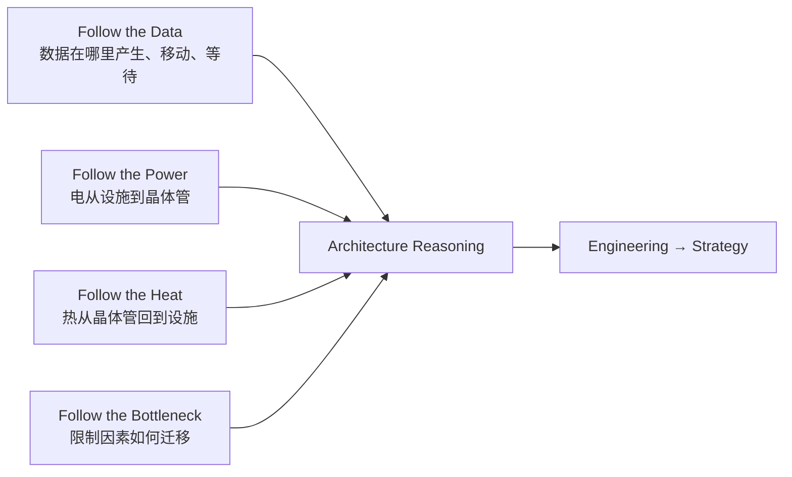

# AI 数据中心与半导体工程知识库

> 一套以中文为主、以工程推理为核心、面向半导体战略、Corporate Development 与投资人员的长期学习系统。

本项目不是半导体名词百科。它训练的是一种工作方法：面对陌生的芯片、系统或产品，先定位 workload 与 bottleneck，再理解 physical constraint、architecture choice、trade-off、second-order effect，最后把工程变化翻译成成本、供应链、竞争格局与战略价值。

## START HERE

如果你第一次进入知识库，请按以下顺序开始：

1. [阅读入口与使用方法](docs/00_start_here/index.md)
2. [AI Datacenter Engineering Core 学习路径](docs/01_learning_paths/ai_datacenter_core.md)
3. [一个现代 AI 数据中心到底是怎么工作的？](docs/20_rack_cluster_datacenter/modern_ai_datacenter.md)
4. [Follow the Data：一个 Token 的完整旅程](docs/00_start_here/follow_the_data.md)
5. [AI 芯片 Bottleneck Map](docs/00_start_here/follow_the_bottleneck.md)
6. [如何读懂一场 Hot Chips 芯片架构演讲](docs/29_hot_chips/how_to_read_architecture_presentation.md)

## 三条物理主线与一条约束主线



- **Follow the Data**：从 framework、compiler、kernel 到 register、cache、HBM、interconnect、NIC、switch 与 fiber。
- **Follow the Power**：从 utility、UPS、PDU、PSU、busbar、VRM、package 到 transistor。
- **Follow the Heat**：从 transistor、die、TIM、cold plate、coolant、CDU 到 facility water。
- **Follow the Bottleneck**：理解 Compute Wall、Memory Wall、Communication Wall、I/O Wall、Power Wall、Thermal Wall、Packaging Wall 与 Yield Wall 如何交替成为主导约束。

## 学习地图

| 入口 | 你要解决的问题 | 当前状态 |
|---|---|---|
| [Core Engineering](docs/02_engineering_foundations/index.md) | 补齐 clock、pipeline、RC、signal integrity 等必要基础 | 框架已建立 |
| [AI Compute](docs/06_gpu_accelerator/index.md) | GPU、Tensor Core 与 workload 为什么匹配 | 5 篇核心文章已完成 |
| [AI Workloads](docs/07_ai_workloads/index.md) | Training、Prefill、Decode、parallelism 如何改变硬件需求 | 3 篇核心文章已完成 |
| [Memory / HBM](docs/08_memory/index.md) | 为什么 memory hierarchy 必然存在 | Memory Hierarchy、DRAM、HBM 与 Roofline 已完成 |
| [Networking](docs/13_scale_out_networking/index.md) | collective traffic 如何映射 topology 与 silicon | Scale-up、AI Ethernet/RDMA、Switch/NIC/DPU 已完成 |
| [Optics](docs/15_optics/index.md) | electrical reach 为什么把系统推向 optics | Datacenter Optics 已完成 |
| [Packaging](docs/16_advanced_packaging/index.md) | die、HBM、routing、power、thermal 如何互相约束 | Advanced Packaging、Chiplet/3D 已完成 |
| [Power / Cooling / Rack](docs/18_power_delivery/index.md) | 电如何进入、热如何离开并限制 rack | Power Delivery、Thermal/Cooling、Modern AI Rack 已完成 |
| [Software / Hardware Co-design](docs/21_software_hardware_codesign/index.md) | compiler 与 runtime 如何兑现 silicon | 核心文章已完成 |
| [Manufacturing & Supply Chain](docs/22_manufacturing_supply_chain/index.md) | wafer 到 good system 的 constraint 在哪里 | 核心文章已完成 |
| [Engineer Language](docs/30_engineer_language/index.md) | 把工程师口语翻译为 metric 与追问 | 框架已建立 |
| [Engineering → Strategy](docs/26_engineering_to_strategy/index.md) | 把 bottleneck 变化翻译为 value capture | 核心文章已完成 |
| [Technical Diligence](docs/27_technical_diligence/index.md) | 从 physics 到 economics 检验技术主张 | Playbook 已完成 |

## 默认推理链

每篇核心文章都应尽量沿着以下链条展开，而不是从定义开始：

```text
Workload / Problem
        ↓
Observed Bottleneck
        ↓
Physical / Architectural Constraint
        ↓
Possible Engineering Solutions
        ↓
Why One Solution Was Chosen
        ↓
Implementation
        ↓
Trade-offs
        ↓
New Bottlenecks Created
        ↓
System / Cost / Manufacturing Impact
        ↓
Competitive / Strategic Implication
```

遇到任何新技术，优先问五个问题：

1. 它到底解决哪个 bottleneck？
2. 之前为什么解决不了？
3. 为什么选择这种 design，而不是更直觉的替代方案？
4. 优化了什么，又付出了什么？
5. bottleneck 移到哪里，谁因此获得或失去价值？

## 内容质量标准

核心文章不是“术语 + 定义 + 优点”的集合。每篇 major article 应包括：

- system position、architecture、dataflow 与 trade-off visuals；
- first-principles mechanism 与关键 equations；
- 至少 2–4 个 design alternatives；
- 至少三个“为什么不……？”；
- workload mapping、real product、second-order effects；
- engineer language、common misconceptions 与追问清单；
- Engineering → Strategy 与 Technical Diligence；
- 可追溯的 primary sources、事实状态与不确定性标签。

产品和标准事实使用以下标签：

- `[Primary Source]`：标准组织、论文、厂商技术文档或正式发布材料；
- `[Independent]`：可信的独立工程研究；
- `[Vendor Claim]`：尚未被独立验证的厂商表述；
- `[Estimate]`：基于公开输入的估算；
- `[Inference]`：由公开信息推导出的判断。

## Repository 导航

- [项目路线图](ROADMAP.md)
- [贡献与写作规范](CONTRIBUTING.md)
- [变更记录](CHANGELOG.md)
- [知识图谱数据](data/concepts.yaml)
- [产品数据库](data/products.yaml)
- [术语数据库](data/glossary.csv)
- [文章模板](docs/_templates/major_article.md)
- [引用规范](references/README.md)
- [开放问题](docs/33_open_questions/index.md)
- [测验](docs/32_quizzes/index.md)

## 当前建设阶段

第一阶段聚焦一组高质量 cornerstone articles，而不是铺开数百个浅页面。全栈 mental model、数据流、bottleneck reasoning、architecture presentation decoder、CPU、GPU、Matrix Multiplication、Tensor Core、Training/Inference、Prefill/Decode、Memory Hierarchy、DRAM、HBM、Roofline、Scale-up、AI Ethernet/RDMA、Datacenter Optics 与 Advanced Packaging 已建立与 Modern AI Rack 已建立，Phase 1 主链已闭环；当前进入 60–80 topics 的 Core Curriculum 深化；Switch/NIC/DPU、Chiplet/3D、Power Delivery 与 Thermal/Cooling 已完成。

详细里程碑与完成定义见 [ROADMAP.md](ROADMAP.md)。

## 本地预览（可选）

知识库采用 MkDocs Material。需要预览时可运行：

```bash
python -m pip install -r requirements.txt
mkdocs serve
```

内容本身以标准 Markdown、Mermaid 与 YAML 保存，不依赖特定笔记软件。

## License 与使用边界

当前仓库用于个人学习与研究。引用外部图片、论文和规格时必须遵守原始许可；优先绘制原创 schematic，并只摘录支持论点所必需的内容。