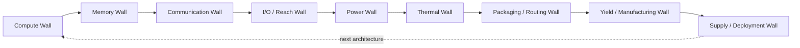
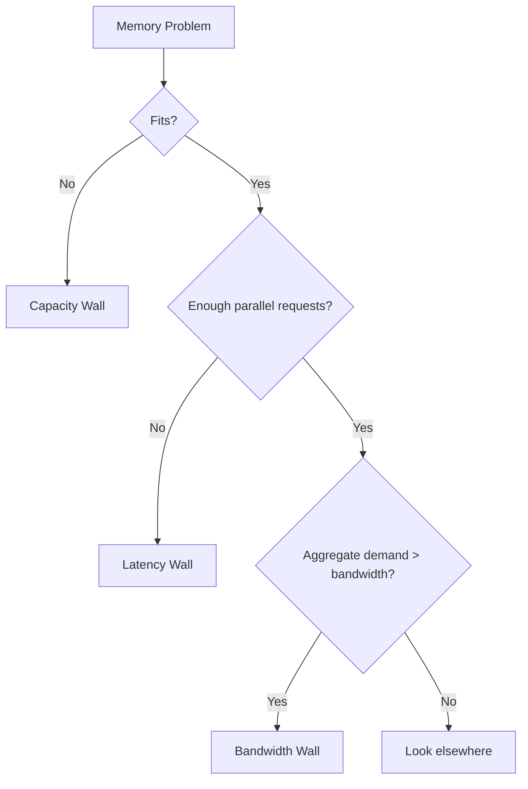
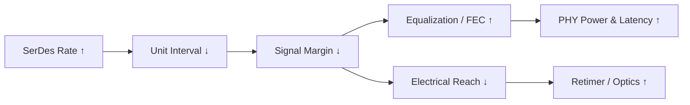
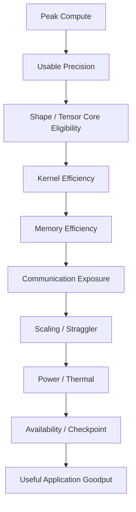

# AI 芯片的性能到底被什么限制？

> 第一次阅读：Sections 1–8，学会定位 bottleneck  
> 第二次阅读：Sections 9–17，理解各类 wall 如何互相转换  
> 深入阅读：Sections 18–25，做定量判断、benchmark 质疑与 Strategy Translation

## 1. 先告诉我为什么“最高 spec”经常没有意义

一颗芯片可以同时公布 FP4、FP8、BF16、HBM bandwidth、interconnect bandwidth 和 TDP。问题是：application 每一时刻只能沿一条具体 execution/data path 前进。只要其中一个必要资源无法及时供应，其余资源就会等待。

“Bottleneck”不是产品的永久标签，而是在**给定 workload、software、system boundary 与目标函数**下，最先限制结果的资源。同一 GPU 在大 batch prefill 中可能 compute-bound，在低 batch decode 中可能 memory-bandwidth-bound，在跨 rack MoE 中可能 network-bound，在 power cap 下又可能 frequency-bound。讨论 bottleneck 而不声明边界，几乎一定会产生误解。

目标函数也必须明确：

- 最大 tokens/s？
- 最小 time-to-first-token？
- 最小 p99 inter-token latency？
- 最短 time-to-train？
- 最大 tokens/J？
- 最大 tokens/rack？
- 最低 $/useful-token？
- 在 failure 下的最大 goodput？

不同目标会选择不同 architecture。

## 2. 一句话直觉

系统性能等于一组“屋顶”的下包络：compute、memory、communication、I/O、power、thermal、package、yield 和 software 中，当前最低的有效上限决定结果；抬高一个屋顶，只会让另一个屋顶开始显眼。

## 3. Master bottleneck map

箭头表示常见的 bottleneck shifting，不是唯一顺序。例如更多 cache 可缓解 HBM traffic，却增加 die area 和 yield pressure；chiplet 改善单 die yield，却增加 package interface、test 和 assembly yield；液冷缓解 thermal，却把问题推向 facility water、CDU、deployment 和 maintenance。

## 4. 定位 bottleneck 的四个前提

### 4.1 定义 system boundary

Kernel、GPU、node、rack、cluster、datacenter 的 bottleneck 不同。GPU kernel 可能 HBM-bound，但整个在线服务可能 scheduler/queueing-bound；node 内 collective 很快，跨 rack topology 可能主导。

### 4.2 定义 workload shape

至少记录 precision、batch、sequence length、model dimensions、sparsity、parallelism、message size 和 concurrency。省略 shape 的“2×”几乎不能迁移到客户 workload。

### 4.3 区分 peak、sustained 与 useful

Peak 是结构在理想条件下的理论速率；sustained 是特定 microbenchmark 能长期达到的速率；useful 是真实 application 最终完成目标工作的速率。三者之间有 instruction mix、layout、protocol overhead、sync、failure 与 software loss。

### 4.4 找证据，而不是凭 utilization 猜

低 compute utilization 可能由 memory、network、host launch、dependency、power throttle 或 load imbalance 引起。应同时看 timeline、stall reason、memory counters、network queue、power/temperature、kernel shape 与 scheduler event。

## 5. Roofline：第一轮定量筛查

Arithmetic Intensity（AI）是 operations 与某个 memory boundary 搬运 bytes 的比值：

[
AI = rac{Operations}{Bytes moved}
]

基本 Roofline：

[
Performance le min(Peak Compute, Bandwidth 	imes AI)
]

两条上限交点：

[
AI_{ridge} = rac{Peak Compute}{Bandwidth}
]

AI 低于 ridge point，第一阶判断偏 memory-bound；高于 ridge point，偏 compute-bound。注意“哪个 bandwidth”取决于 boundary：L1、L2、HBM、PCIe、network 都可画不同层级 Roofline。

[Primary Source] Roofline 模型由 Williams、Waterman、Patterson 提出，用计算峰值、memory bandwidth 与 operational intensity 构建 attainable performance 上界。[Berkeley Technical Report](https://www2.eecs.berkeley.edu/Pubs/TechRpts/2008/EECS-2008-134.pdf)

### Worked example

某教学系统 peak compute = 4 PFLOP/s，sustained HBM bandwidth = 5 TB/s：

[
AI_{ridge}=800 FLOP/byte
]

若 kernel AI = 200 FLOP/byte，memory roof 为 1 PFLOP/s，即使其他条件理想也只有 peak 的 25%。若下一代 compute 变为 8 PFLOP/s、bandwidth 变为 6 TB/s，ridge point 上升到约 1,333 FLOP/byte；同一 kernel 上限只从 1 提升到 1.2 PFLOP/s。**[Estimate]** 数字为教学假设，不对应具体产品。

这说明 compute 增长快于 bandwidth 时，更多 workload 会落入 memory-bound 区域。

## 6. Roofline 不能告诉你的事

Roofline 是上界，不是完整 simulator。它通常不直接捕获：

- dependent memory latency；
- small kernel launch overhead；
- branch/divergence；
- insufficient parallelism；
- bank conflicts、queueing 和 hotspots；
- network collective latency；
- power/thermal throttling；
- synchronization 与 straggler；
- shape/layout 导致 Tensor Core 不可用；
- failure 和 checkpoint；
- accuracy 限制 usable precision。

因此正确用法是“先用 Roofline 排除不可能，再用 timeline/counters 找真实损失”，不是看到点落在斜线附近就停止分析。

## 7. Compute Wall：什么时候 arithmetic 真正不够

Compute-bound 意味着执行单元已接近对该 instruction/precision 的可用吞吐，而 operands 能及时供应。常见于高 reuse、大 GEMM、适合 Tensor Core tile 的 workload。

Compute Wall 的限制包括：

- execution unit 数量与每周期 operations；
- frequency；
- instruction mix；
- usable precision；
- pipeline dependency；
- Tensor Core tile/shape；
- scheduler 发射能力；
- register/shared memory 供应；
- accuracy 和 numerics。

### 为什么不全部做成 Tensor Core？

Tensor Core 对特定矩阵 shape、precision 和 data layout 高效；control、address calculation、reduction、normalization、activation、sampling 和 irregular workload 仍需通用 ALU/scheduler。全部专用化会降低 programmability，并可能让非矩阵部分成为 Amdahl bottleneck。

### 为什么不无限提高 frequency？

[
P_{dynamic}approxalpha C V^2f
]

Frequency 上升增加 dynamic power，且为了 timing closure 可能需要更高 voltage，使功率更快上升；wire delay、clock distribution、thermal 与 variation 也限制 frequency。GPU 选择大量并行单元与较低 frequency，常是 throughput/power/area 的系统取舍。

## 8. Memory Wall：容量、带宽与 latency 是三堵不同的墙

### Capacity wall

Working set 放不下，必须 sharding、offload、recompute、quantize 或减少 batch/context。Capacity 不足会迫使数据跨更慢 boundary。

### Bandwidth wall

数据能放下，但单位时间搬不够。典型信号是 memory throughput 接近持续上限、compute stall on data、提高 compute 无收益。

### Latency wall

访问依赖串行、并行 request 不够，无法用 concurrency 隐藏 latency。Random lookup、pointer chasing、小 batch 或同步 load 更敏感。Bandwidth 未满也可能 latency-bound。

### 为什么不增加更多 HBM？

更多 stack/容量/带宽需要 package area、controller/PHY、routing、power 和 cooling；assembly complexity 与 supply concentration 上升。若瓶颈在 access pattern、L2、controller、kernel 或 latency，更多 nominal bandwidth 无用。

### 解决方法与代价

| 方法 | 优化 | 代价 / 新 bottleneck |
|---|---|---|
| 更大 cache | 减少 HBM traffic | die area、leakage、hit latency |
| 更多/更快 HBM | capacity/bandwidth | package、power、cost、yield |
| Quantization | bytes 减少 | accuracy、conversion、kernel support |
| Tiling/fusion | reuse 增加 | register/shared memory pressure |
| Recompute | capacity/traffic 某些维度改善 | compute 增加 |
| Offload/tiering | capacity 扩展 | latency、bandwidth、placement software |

## 9. Communication Wall：更多 GPU 为什么不线性加速

并行程序的 step time 可粗略拆成：

[
T_{step}=T_{compute}+T_{exposed communication}+T_{sync}+T_{input}+T_{checkpoint}
]

若增加 GPU 让 local compute 降低，但 collective message/latency 不同比例下降，communication 占比上升。Strong scaling 尤其明显：固定问题被切得更小，每 GPU compute 少了，通信表面/同步仍在。

Amdahl 直觉：

[
Speedup(N)=rac{1}{(1-p)+p/N}
]

其中 (p) 是可并行部分。真实 AI 还需把 communication 和 straggler 放入 serial/exposed fraction。

### Collective 不只是“网络流量”

All-Reduce、All-Gather、Reduce-Scatter、All-to-All 具有不同 traffic pattern。算法与 topology 必须匹配：ring、tree、hierarchical、in-network reduction 各有 message-size 与 scale 条件。端口带宽高但 bisection 不足，所有参与者同时通信时仍会堵塞。

### 为什么不加更多 links？

Link 消耗 SerDes area/power、package pins、routing、cable/optical modules 与 switch ports。更多 links 还需 topology 和 software 能够均匀利用，否则形成 stranded bandwidth。

## 10. Network Wall：带宽、latency、congestion、topology 四种问题

Network-bound 不是单一诊断：

1. **Serialization/bandwidth：**大消息 bytes / effective bandwidth。
2. **Fixed latency：**小消息、频繁 barrier、更多 hops。
3. **Congestion：**多个 flow 争同一 egress；queue 增长。
4. **Topology：**oversubscription、bisection、path diversity 与 failure reroute。

[
T_{message}approx T_{software}+T_{NIC}+T_{serialization}+T_{switch/queue}+T_{propagation}
]

更快 link 只降低其中一部分。小消息可能几乎不受 link rate 提升影响；拥堵时 queueing 可以远大于 propagation。

### 为什么 lossless network 很难？

避免 drop 往往依赖足够 buffer、priority flow control、ECN/rate control 和严格 configuration。Pause 可能传播，head-of-line blocking 可能扩大，feedback 有 delay。Lossless 不是“无等待”；它只是改变 overload 如何表现。

## 11. I/O 与 Reach Wall：SerDes rate 提高为何不是免费

提高 lane rate 可减少相同 aggregate bandwidth 所需 lanes，但 unit interval 变短、channel loss/crosstalk/jitter 相对更严重。工程响应包括 PAM4、FFE/CTLE/DFE、CDR、FEC、retimer 和更短 channel；代价是 PHY power、latency、test 与 optics 需求。

### 为什么不提高 clock 就好？

Channel 是 frequency-dependent system。更高 symbol rate 让高频 loss 和 reflection 更严重，receiver 需要从更闭合的 eye 恢复数据。Clock 加快不会修复 channel，反而压缩采样窗口。

## 12. Power Wall：算得出但供不起

芯片、node 和 rack 都有 power envelope。若 workload 触达 power limit，DVFS/power management 会降低 frequency 或限制并发。Peak spec 可能对应并非所有 units 同时全速的条件；不同 instruction mix 的 power density 也不同。

Power Wall 的证据包括：

- power cap active time；
- clocks below requested；
- voltage/current limit；
- PSU/PDU/rack headroom；
- workload-to-workload performance variability；
- transient-triggered throttle。

### 为什么提高 TDP 不一定提高系统性能？

更高 TDP 可能要求减少每 rack GPU 数、升级 cooling/power feed，或降低 deployment coverage。如果单 GPU 快 20%，但 rack 少放 20%，tokens/rack 未必改善。Strategy 分析应从 chip performance 转向 performance per rack、per MW 和 per deployable site。

## 13. Thermal Wall：功率相同，温度仍可能不同

[
T_j-T_{coolant}approx Pcdot R_	heta
]

平均功率相同，hotspot、die placement、TIM、cold plate contact、flow distribution 与 ambient/coolant condition 都会改变 junction temperature。Thermal throttling 可能是周期性或局部，平均频率掩盖尾部影响。

提高 cooling capability 的代价是 pump/fan power、CDU、facility water、leak detection、service 和 qualification。Cooling 能释放 silicon performance，却把 complexity 外移到 rack/facility。

## 14. Packaging Wall：逻辑设计完不等于产品可实现

AI package 要同时容纳 large compute die/chiplets、HBM、die-to-die interface、power/ground、clock、高速 I/O 与 mechanical/thermal path。限制包括：

- reticle 与 interposer/RDL size；
- routing density、layer count 和 escape；
- substrate warpage；
- microbump/hybrid-bond pitch；
- known-good-die 与 test coverage；
- power delivery impedance；
- thermal coupling；
- assembly yield 和 rework。

### 为什么 chiplet 不一定更便宜？

较小 die 可提高 die yield并复用 process node，但 die 数增加意味着更多 interfaces、PHY overhead、package steps、test、inventory matching 与 assembly yield risk。总成本是 known-good-die、package、yield、test 与 volume 的函数，不是“die 小”单变量。

### 为什么不全部 3D stack？

3D 提高 bandwidth density、缩短 wires，却恶化热移除、power delivery、test/rework 与 cumulative yield。Logic-on-logic 的 hotspot 比 memory-on-logic 更难；可制造不等于经济可量产。

## 15. Yield 与 Manufacturing Capacity Wall

简化 Poisson yield intuition：

[
Yapprox e^{-D_0A}
]

(D_0) 为 defect density，(A) 为 die area。Die 越大，遇到致命缺陷概率越高；真实 yield model 更复杂，还包括 defect clustering、parametric yield、redundancy 与 process maturity。

Package yield也会随 components 和 assembly steps变化。若每个关键组件良率分别为 (y_i)，粗略 cumulative yield 类似 (prod y_i)。Chiplet/HBM package 即使每个 die 都不错，assembly、bonding、interposer、substrate 和 test 仍可能主导。

Capacity wall 则是“设计可行但产不出来”：先进 wafer、HBM、CoWoS-class packaging、substrate、optical module、high-power rack、CDU 或 grid interconnect 任一 lead time 都可限制 shipped systems。

## 16. Software Wall：硬件资源存在但无法被表达或调度

Software bottleneck 包括：

- compiler 无法 fuse 或生成目标 instruction；
- library 不支持 shape/precision；
- kernel register pressure 或 layout mismatch；
- runtime launch/synchronization；
- collective algorithm 未感知 topology；
- scheduler placement 破坏 locality；
- memory fragmentation；
- framework graph break；
- fault recovery 与 checkpoint；
- customer code migration。

软件优化可能在不改变 silicon 的情况下显著提高 performance，这既说明 peak spec 的局限，也说明生态与 accumulated tuning 可形成 moat。但 moat 需要区分：API lock-in 容易观察，跨模型/shape 的持续 kernel quality、debug tools 与 production reliability 更难复制。

## 17. Bottleneck waterfall：从 Peak 到 Useful

Waterfall 不应机械相乘而不检查相关性，但它提供 audit trail。Vendor 说“2×”时，把 improvement 放到 waterfall 的具体层级，再问下游层是否同步改善。

## 18. Prefill vs Decode：同一芯片的瓶颈切换

| 维度 | Prefill | Decode |
|---|---|---|
| Token 并行性 | prompt 内大量 token | 每 sequence 每步少量 token |
| GEMM shape | 通常较大 | 小 batch 时较小 |
| Weight reuse | 较高 | 小 batch 较低 |
| KV 行为 | 计算并写入 | 反复读取并追加 |
| 常见目标 | time-to-first-token / throughput | inter-token latency / tokens/s |
| 常见瓶颈 | compute、attention memory traffic | HBM bandwidth/capacity、latency |
| 优化冲突 | batch 提效但增加 TTFT | batch 提效但增加 queueing/KV |

“FP4 peak 2×”更可能帮助可映射到 FP4 Tensor Core 且 compute-bound 的阶段。若 decode 已被 HBM traffic 限制，compute 增长只提高 idle capability。更低 precision 也可降低 weights bytes，从而间接缓解 bandwidth；需要区分 arithmetic 与 data footprint 两条效应。

## 19. Distributed training：bottleneck 随 parallelism 改变

- 增加 TP：降低单 GPU layer compute/weights，增加 layer-level collective。
- 增加 PP：降低每 stage layers，增加 activation transfer 和 bubble。
- 增加 DP：提高 global throughput，增加 gradient collective 与 global batch。
- 增加 EP：专家容量扩展，增加 All-to-All 和 load balance 风险。
- 增加 checkpoint frequency：提高 resilience，增加 I/O pause。

最优 parallelism 是 compute/memory/network/topology/model numerics 的 joint optimization。只比较单 GPU benchmark无法预测 time-to-train。

## 20. 如何实际诊断：六步方法

1. **声明目标与边界。**例如“8-GPU node 的 decode p99 inter-token latency”。
2. **画 timeline。**CPU、GPU kernels、memcpy、collectives、idle、power throttle 同轴展示。
3. **建 bytes/ops ledger。**按 HBM/L2/network boundary 估 operations 与 bytes。
4. **比较 ceilings。**Roofline、link serialization、power/thermal limits。
5. **做 perturbation。**改变 batch、clock、memory rate、network placement、precision；观察 slope。
6. **验证反事实。**如果是 HBM-bound，提高 compute 不应明显改善；若观察相反，模型遗漏了因素。

Perturbation 比单次 profile 更有力。真正 bottleneck 对相关资源变化应有可解释的敏感度。

## 21. Benchmark skepticism checklist

看到 performance chart，必须问：

- Which workload and version？
- Which precision？是否用了 sparsity/quantization，accuracy 是否等价？
- Batch、sequence length、model size？
- Kernel、node、rack 还是 end-to-end？
- Peak、sustained 还是 measured application？
- Power cap、cooling、frequency？
- Software/library/compiler 版本？
- Network topology、GPU count、placement？
- Baseline 是否同样优化？
- 是否包含 preprocessing、checkpoint、failure？
- 报 median、best run 还是 p99？
- 哪些信息没有披露？

缺少这些条件时，最安全的结论不是“结果无效”，而是“可迁移范围尚不确定”。

## 22. 为什么不……？

### 为什么不把所有 bottleneck 一起解决？

资源耦合且预算有限。更多 memory、links 和 cooling 占 area、package、power、cost；过度 provisioning 会产生闲置。Architecture 是在预期 workload distribution 上做平衡。

### 为什么不只看 utilization？

Utilization 是结果，不是原因。100% memory utilization 可能有效搬 payload，也可能 over-fetch；高 GPU utilization 指标可能包含非关键工作；低 utilization 可能来自 intentional latency SLA。必须联系 useful work。

### 为什么不以 microbenchmark 代表系统？

Microbenchmark刻意隔离一个 roof，可测上限，却排除了 software、contention、sync、failure 与 mixed workload。它是 calibration，不是 customer outcome。

### 为什么不相信 vendor 的 generational comparison？

可以信具体测量在其披露条件下成立，但不能自动外推。产品 evolution 的正确问题是：旧 bottleneck是什么、改了哪一层、哪些 metrics 未同比增长，因此新 bottleneck是什么。

## 23. Engineers actually say

- **“We moved the bottleneck.”** 优化生效，但下一资源成为限制；需量化新旧占比。
- **“We are not hitting the roof.”** 可能是 instruction/layout、latency、divergence、sync 或 power，非简单“代码差”。
- **“The backend is wider.”** 执行/issue/data path 某部分增宽；追问 frontend、register、memory 是否供得上。
- **“We cannot close timing.”** 关键路径在目标 voltage/frequency/process 下违反 timing，可能需要 pipeline、placement、routing 或频率妥协。
- **“Routing is the limiter.”** 逻辑面积可能还有余量，但 wires、congestion、pin escape 或 package layers 不够。
- **“Yield is ugly.”** 区分 defect、parametric、assembly、test escape 和 ramp maturity。
- **“The network is non-blocking.”** 追问流量模型、failure state 与端口配置。
- **“Performance is power-limited.”** 追问是 chip TDP、VRM、rack feed、cooling 还是 facility cap。

## 24. Engineering → Strategy

| Bottleneck | 直接获值环节 | 可能被挤压环节 | Moat 检验 |
|---|---|---|---|
| Compute Wall | accelerator architecture、process、compiler | 通用低利用 silicon | performance 是否跨 workload/软件持续？ |
| Memory Wall | HBM、controller、cache、packaging | 只有 compute peak 的产品 | capacity/bandwidth 是否可量产且软件能用？ |
| Communication Wall | scale-up fabric、NIC、switch、collective software | 单芯片优化 | topology + software 是否形成平台控制？ |
| I/O/Reach Wall | SerDes IP、retimer、optics | 长 PCB electrical path | power/bit、reach、test 与 interoperability？ |
| Power/Thermal | power silicon、VRM、liquid cooling、facility | 只优化 chip TDP | 性能是否以部署复杂度为代价？ |
| Packaging/Yield | foundry、advanced packaging、test、substrate | 超大 monolithic design | capacity、yield learning 与 second source？ |
| Software Wall | compiler/library/runtime ecosystem | 易替换硬件 | 优势是 lock-in 还是可验证生产力？ |

## 25. Technical Diligence：如何验证“突破瓶颈”的 startup

1. Claim 对应哪一堵 wall？用什么 workload 和 boundary 证明？
2. 方案是消除 work，还是把 work 移到 host/network/package？
3. 所有 hidden inputs：precision、accuracy、batch、power、cooling、software？
4. Silicon measurement 还是 simulation？样片频率、电压、面积、yield？
5. 关键 metric 的 sustained、p99 与 failure-state 表现？
6. 若 incumbent 增加 HBM/cache/links 或改 software，优势还剩多少？
7. 客户必须改模型、compiler、runtime、network 或 facility 吗？
8. 量产需要哪些独占 process/package/material/equipment？
9. 单点最难 scale 的资源是什么？volume 增长是否让它更糟？
10. 下一代 bottleneck 已在哪里出现？公司是否拥有解决它的能力？

## 五个必须记住的 takeaway

1. Bottleneck 必须绑定 workload、software、boundary 与目标函数。
2. Roofline 是识别 compute/memory 上界的第一步，不是完整答案。
3. Capacity、bandwidth、latency 是不同问题；network 的带宽、latency、congestion、topology 也必须分开。
4. 任何优化都会付出 area、power、cost、yield、latency 或 programmability，并移动 bottleneck。
5. 战略价值会向当前最稀缺、最难验证、最难扩容的系统环节迁移。

## 三个真正值得继续思考的问题

1. 当 AI compute throughput 继续快于 memory/network 成长，architecture 会更多依赖数据复用、sparsity 和 compression，还是把更多价值交给 HBM/optics/package？
2. Power Wall 成为普遍硬约束后，芯片公司与数据中心运营商之间谁拥有更大的系统优化控制权？
3. 一个暂时 bottleneck 带来的供应商利润，何时能转化为 durable moat，何时会被标准化、替代或 capacity expansion 消解？

## Sources

- [Primary Source] [Williams, Waterman, Patterson — Roofline Model](https://www2.eecs.berkeley.edu/Pubs/TechRpts/2008/EECS-2008-134.pdf)
- [Primary Source] [Lawrence Berkeley National Laboratory — Roofline Overview](https://amcr.lbl.gov/departments/computer-science-department/ppan/roofline-performance-model/)
- [Primary Source] [NVIDIA Hopper Tuning Guide](https://docs.nvidia.com/cuda/hopper-tuning-guide/index.html)
- [Primary Source] [OCP Open Systems for AI Whitepaper](https://www.opencompute.org/documents/ocp-open-systems-for-ai-whitepaper-v1-0-0-final-pdf)

## 基础概念桥接

先把 workload、system boundary、数据流、功率流、热流与 bottleneck 分开。任何“更快”都要说明测量起止点；任何“更省”都要说明分子、分母和被排除的成本。沿路径遇到新名词时，不先记结论，先问状态存在哪里、由谁移动、在哪一层等待。

延伸基础：[工程术语手册](../31_glossary/engineering_terms_handbook.md)；[工程度量与不确定性](../02_engineering_foundations/engineering_measurement_uncertainty.md)；[数字逻辑、处理器与加速器](../02_engineering_foundations/digital_compute_accelerator_vocabulary.md)。

## 进阶工程术语桥接

本篇进一步需要掌握：微操作、流水线冒险、并行度、shape、动态批处理、尾延迟、数量级与单位经济性。阅读这些术语时，不只记中英文对应，还要补齐系统位置、正常路径、饱和或失败路径、直接 counter、端到端结果、产品状态和证据等级。若工程会议出现“已解决”“无开销”“已量产”，应立即追问 workload、boundary、configuration、status/date、failure mode 与 falsifier。

延伸阅读：[进阶工程术语手册](../31_glossary/advanced_engineering_terms_handbook.md)。
