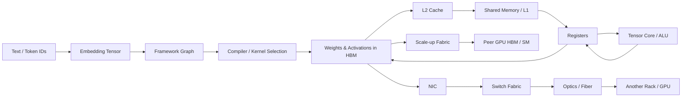
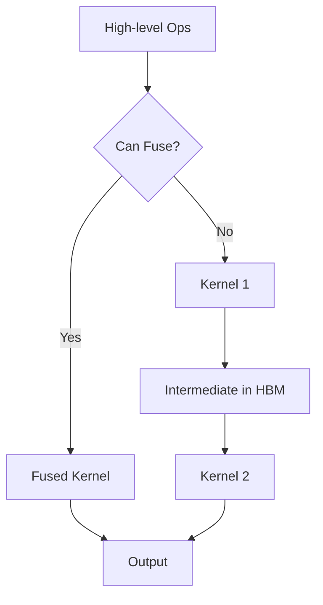
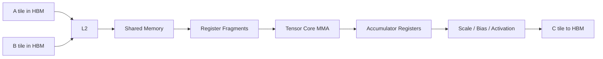
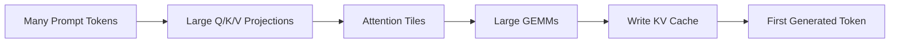
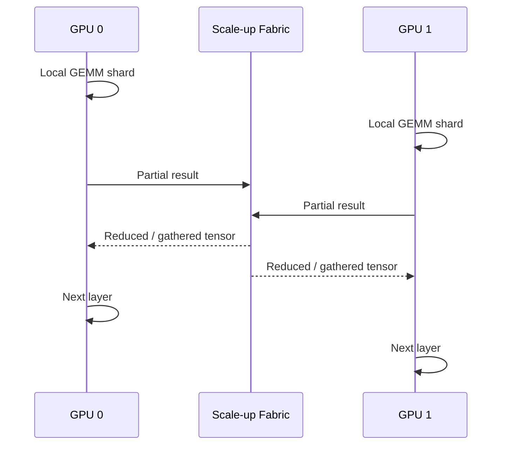
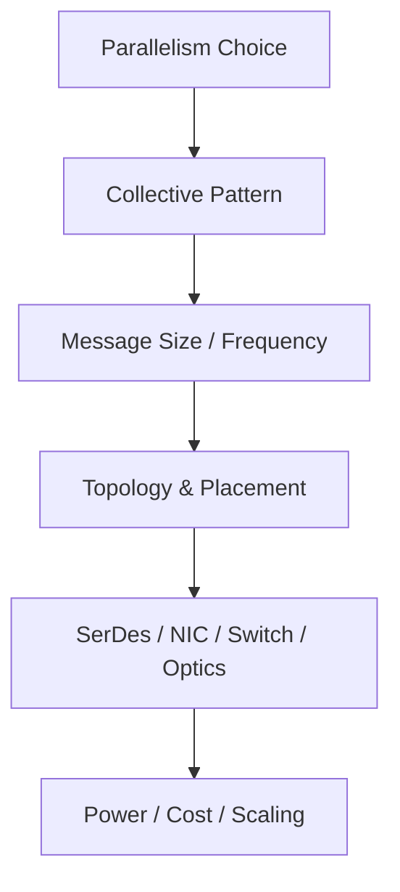
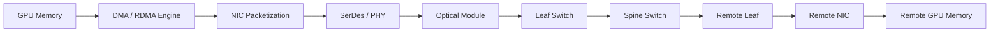

# Follow the Data：一个 Token 从模型到 GPU、HBM、网络和另一个 GPU 的完整旅程

> 第一次阅读：Sections 1–7，跟完整旅程走一遍  
> 第二次阅读：Sections 8–16，理解 Prefill、Decode 与分布式通信  
> 深入阅读：Sections 17–24，做数量级判断和 Strategy Translation

## 1. 先告诉我为什么要追踪一个 Token

看到“GPU 有 HBM”“系统有 800G network”“模型用了 Tensor Parallelism”并不等于理解系统。真正决定 performance 的是：**哪一批 bytes 在什么时候跨过哪一道边界，跨过去之后被复用几次，以及谁在等它。**

同一个 token 在用户界面里只是一个离散符号；进入模型后，它会触发 embedding lookup、矩阵乘法、attention、KV cache 读写、layer normalization、activation、collective communication 和 sampling。数据不会保持“一个 token”这种直观形态，而会被展开为不同 shape、precision 和 layout 的 tensor。每一次 layout conversion、cache miss、HBM access、跨 GPU transfer 或 synchronization，都可能让昂贵的 compute unit 停等。

因此 Follow the Data 的目标不是背诵 path，而是建立一套调试问题：

1. 数据的 producer 和 consumer 是谁？
2. state 保存在哪里？
3. 一次访问搬多少 byte？有效 payload 多少？
4. 数据会被复用几次？
5. 搬运能否与 compute overlap？
6. 哪个 boundary 的 bandwidth/latency 主导 critical path？
7. 为减少这次搬运，付出了多少 capacity、area、power 或 software complexity？

## 2. 一句话直觉

Token 的计算旅程就是不断改变数据的**位置、形状、精度和所有权**：软件把语义变成 kernel，kernel 把 tensor 切成 tile，tile 在 HBM、cache、shared memory 与 register 之间移动，部分结果再跨 GPU、NIC、switch 和 fiber 与其他 accelerator 汇合。

## 3. Master dataflow



不是每个 token 都逐级走完整条路径。Kernel 会批量处理许多 token；cache hit 会跳过 HBM；同一 node 的通信可能只走 scale-up；模型能放进单 GPU 时不会经过 network。图的用途是提醒我们：系统提供多个 data movement tier，software 必须选择路径。

## 4. Step 0：文本如何变成 token ID

Tokenizer 把输入文本映射为整数 ID。这里通常由 CPU 执行，计算量相对小，却可能影响端到端 latency：请求排队、tokenization、dynamic batching、prompt preprocessing 都发生在 GPU kernel 之前。如果只测 GPU execution，会遗漏用户实际感受到的时间。

一批 token ID 被送入 embedding table lookup，得到向量。Embedding 更像 memory gather，而不是大规模 dense GEMM：access pattern 和 table size 会影响 locality。随后 tensor 进入 Transformer layer，逐步执行 attention 和 MLP。

**第一条纪律：**不要把“model time”与“GPU kernel time”混为一谈。Queueing、CPU、data copy、scheduler、network 与 post-processing 都可能占 critical path。

## 5. Step 1：Framework 并不直接控制 transistor

PyTorch/JAX 等 framework 表达 tensor operation 和 graph。Operation 可能进入：

- compiler-generated fused kernel；
- vendor library 的 GEMM/attention；
- custom kernel；
- 没有优化的 fallback；
- CPU 或 device 间 copy。

Compiler 决定 fusion、shape specialization、precision、layout、memory allocation 和 launch sequence。两个数学上等价的 graph，可能因为 fusion 与 layout 不同产生完全不同的 HBM traffic。例如把多个 elementwise operations fuse 在一个 kernel 中，可以避免 intermediate tensor 多次写回 HBM；代价是更复杂 code generation、register pressure 或较差 shape coverage。



因此，software optimization 经常不是“让 arithmetic 更快”，而是删除不必要的数据往返。

## 6. Step 2：Kernel 把 tensor 切成 tile

以矩阵乘法 (C=A	imes B) 为例。把完整矩阵一次装入 register 不可能；kernel 将 A、B 切成 tile，每个 thread block/warp 负责一部分输出。常见路径：

1. 从 HBM 读取 A/B tile；
2. 经过 L2；
3. 搬入 shared memory；
4. 线程从 shared memory 取 fragment 到 register；
5. Tensor Core 执行 multiply-accumulate；
6. partial sum 在 register 中累积；
7. 输出经过可能的 epilogue 写回 HBM。



Tiling 的价值是 reuse。A 的一块可以与 B 的多列组合，B 的一块可以与 A 的多行组合。Reuse 越高，每个 HBM byte 支撑的 operations 越多，Arithmetic Intensity 越高。但 tile 越大，shared memory 和 register 使用越多，可能减少同时 resident 的 warps，降低 latency hiding。Kernel engineer 的工作是在 reuse、occupancy、instruction scheduling 和 layout 之间找平衡。

## 7. Step 3：Register 是最快层，但不是无限免费

Register 离 execution unit 最近，bandwidth 极高、latency 很低，却直接消耗 SM 内面积和 energy。每个 thread 使用更多 registers，可能减少同一 SM 可同时驻留的 threads/warps；若 register 不够，compiler 可能 spill 到 local memory，而 local memory 通常实际位于 device memory hierarchy，造成意外 HBM traffic。

听到“register pressure 太高”，真正含义常是：为了保存更多 live values 或做更大 tile，kernel 占用了过多 register，occupancy 或 spill 恶化。追问：

- 每 thread registers 数量？
- occupancy 是多少？
- spill load/store 有多少？
- 更低 occupancy 是否仍能靠 instruction-level parallelism 隐藏 latency？
- tile 变小后 memory traffic 增加多少？

## 8. Step 4：Shared Memory、L1 与 L2 在解决什么

On-chip memory 的核心作用是利用 temporal/spatial locality，减少 HBM traffic。Shared memory 由 programmer/compiler 显式管理，适合可预测 tile reuse 和线程协作；cache 由硬件自动管理，适合更通用 locality。L2 位于多个 SM 和 memory controller 之间，可复用跨 block 数据、合并访问并减轻 HBM。

“为什么不把 cache 做得无限大？”因为 SRAM area 和 leakage 昂贵，访问更大结构可能更慢、布线更难，且许多 streaming workload 没有足够 reuse。Cache capacity、associativity、banking、latency 与 bandwidth 之间存在 trade-off。

一次 L2 miss 才需要走到 HBM；但“L2 hit rate 高”也不自动意味着快。如果 hit 集中在少数 bank、request queue 堵塞、L2-to-SM bandwidth 不够，仍可能 stall。必须把 hit rate 与 sustained bandwidth、latency 和 stall reason 联合看。

## 9. Step 5：HBM 如何提供参数与 KV cache

HBM controller 将 address 映射到 stack、channel、pseudo-channel、bank、row 和 column。并行利用多个 channel/bank 才能接近高 bandwidth；不规则、小粒度或冲突访问会降低效率。Memory transaction 搬运的粒度可能大于实际需要的数据，形成 over-fetch。

在 Transformer 中，权重通常被多个 token/batch reuse；activation 生命周期随 layer 和训练策略变化；KV cache 在 decode 中随 sequence 增长并被反复读取。它们的 access pattern 不同：

- **Weights：**容量大，dense layer 中有规律；batch 较大时 reuse 增加。
- **Activations：**训练需为 backward 保存或重算；影响 capacity。
- **KV cache：**按 layer、head、sequence 保存；decode 每步读取历史 context，容易制造 bandwidth/capacity pressure。
- **Optimizer state：**训练中容量很大，但访问频率与 forward 不同。

内存优化不是只压缩一类数据。Quantization、checkpointing、paging、sharding 和 recomputation 分别改变 bytes、compute、latency 与 software complexity。

## 10. Prefill：为什么更像“大块加工”

Prefill 一次处理 prompt 中许多 token。大矩阵维度与 batch 给 GEMM/attention 更多并行性和 reuse，通常更容易提高 Tensor Core utilization。Query、Key、Value 对多 token 计算，可以形成较大的矩阵运算。

但长 sequence 的 attention 中间量和 KV 写入也会增长；是否 compute-bound 取决于具体 attention implementation、sequence、batch、precision、cache 与 fusion。FlashAttention 类方法的重要直觉是通过 tiling 和 online softmax 减少 HBM intermediate traffic，并非让数学运算本身消失。



Prefill 追求 throughput 时可 batch；交互式服务仍关心 time-to-first-token。更大 batch 提升 compute efficiency，却增加 queueing latency 和 memory usage。

## 11. Decode：为什么更容易 memory-bound 和 latency-sensitive

Decode 每一步只生成一个或少量新 token。每层需要读取权重，读取历史 KV cache，执行相对较小的矩阵运算，再写入新的 K/V。小 batch 时，权重被复用的次数少，Arithmetic Intensity 下降；大量 bytes 从 HBM 搬来，只完成有限 operations。

简化估算：若每生成一个 token 需要读取约 (W) bytes 的有效权重，而设备 sustained memory bandwidth 为 (B)，忽略其他开销的最低时间为：

[
t_{token} gtrsim rac{W}{B}
]

**[Estimate]** 假设有效读取 140 GB 权重、sustained bandwidth 4 TB/s，则仅权重搬运下限约 35 ms；真实系统还包括 KV、compute、collective、software 与未达到持续带宽的损失。这不是任何具体模型/产品预测，只展示为何低 batch decode 会受 memory traffic 限制。

提高 batch 可让同一批权重服务更多 sequences，增加 reuse 和 throughput，但每个请求可能排队更久，KV capacity 也增加。这就是 throughput 与 latency 的基本冲突。

## 12. 当模型放不进单 GPU：Tensor Parallelism

如果一层权重分散在多个 GPU，每个 GPU 计算局部结果，随后需要 collective 合并。以 column/row parallel linear layer 为例，某些切分产生 All-Gather，另一些产生 Reduce-Scatter/All-Reduce。数据在 GPU 内完成局部 GEMM 后，partial result 进入 scale-up fabric：



TP communication 可能每层发生，因此 latency 与 synchronization 重要。更大 TP degree 减少单 GPU weight capacity，却增加参与者、消息和 collective overhead。若 local GEMM 很小，compute time 缩短到无法掩盖 communication，scaling efficiency 急剧下降。

### 为什么不无限扩大 TP？

因为每个 shard 变小导致 Tensor Core efficiency 下降；collective 占比上升；更大 domain 需要更多 links/switches；任何 straggler 都拖慢同步。TP 是用通信换 capacity/compute，并不是免费并行。

## 13. Pipeline、Data 与 Expert Parallelism 如何改变路径

- **Data Parallelism（DP）**：不同 replica 处理不同 batch，backward 后 gradient All-Reduce/Reduce-Scatter。消息大但频率相对 layer-local TP 不同。
- **Pipeline Parallelism（PP）**：layers 分 stage，activation 在 stage 间传递；microbatch 用来填 pipeline，可能产生 bubble。
- **Expert Parallelism（EP）**：MoE tokens 根据 router 发往不同 experts，形成 All-to-All；traffic 易不均衡。
- **Sequence Parallelism（SP）**：沿 sequence 切分某些 state，改变 memory 与 collective。



看到“支持 10,000 GPU training”时，应立即问并行策略和 traffic matrix，而不是只看端口速度。

## 14. Scale-up 路径：从 GPU 到 peer GPU

局部 tensor 可能通过 GPU fabric port、PHY、copper trace/cable、switch ASIC，再到 peer GPU。每一段有 serialization、propagation、switching 与 protocol overhead。Effective bandwidth 取决于 topology 与 collective algorithm，例如 ring、tree、recursive doubling 或 topology-aware hierarchical collective。

Ring All-Reduce 在大消息下可有效利用 links，但要经过多个 phases；tree 对 latency 可能更友好；hierarchical algorithm 先在 node/rack 内 reduce，再跨 rack，可减少慢层级流量。不存在“最好的 collective algorithm”，只有对 message size、GPU count、topology 与 congestion 更合适的算法。

通信与计算 overlap 是关键：如果下一块 tensor 的 compute 可在上一块通信时进行，visible communication time 降低；如果 layer dependency 或 buffer 不允许，全部通信暴露在 critical path。

## 15. Scale-out 路径：GPU → NIC → Switch → Fiber

数据通常先由 communication library/runtime 发起，经 GPU memory、DMA/RDMA、PCIe 或直接路径到 NIC。NIC 将 payload 分段、加 protocol/header，经过 SerDes 到 cable/optical module，进入 leaf switch pipeline：parser、lookup、buffer、scheduler、switch fabric、egress；必要时经 spine，再到远端 leaf/NIC/GPU。



“800G NIC”是 line-rate label，不等于 application 获得 800 Gb/s：编码、FEC、packet header、transport、PCIe、DMA、message size、congestion 和 collective efficiency 都会降低 payload goodput。多个 NIC 也需要 GPU/NIC affinity 与 topology-aware placement，否则流量绕行或争用。

## 16. Switch 里发生了什么

Packet 到达 ingress 后，MAC/PCS 处理链路，parser 提取 headers，lookup 决定 egress，buffer 吸收短期速率差，scheduler 决定谁先发，switch fabric 把 packet 搬到目标 port。若多个 ingress 同时发往一个 egress，瞬时 arrival rate 大于 departure rate，queue 增长：

[
rac{dQ}{dt} approx R_{in}-R_{out}
]

当 (R_{in}>R_{out}) 持续存在，任何有限 buffer 最终都会满。Congestion control 不是“配置问题”，而是供需不匹配的物理结果。ECN、rate control、adaptive routing 或 pause 只能改变反馈与损失方式，不能让出口凭空变宽。

AI collective 的同步性会放大 incast；MoE All-to-All 可能造成动态热点。平均 link utilization 很低也可能出现 p99 queueing，因为拥堵在时间和端口上局部集中。

## 17. Optics：为什么数据最终变成光

随着 SerDes rate 提高，PCB/copper channel 的 insertion loss、reflection、crosstalk 和 equalization power 增加，electrical reach 下降。Optical transceiver 把 electrical lanes 经过 DSP/driver/modulator 变成光，通过 fiber 传输，再由 photodetector/TIA/DSP 恢复 electrical signal。

Optics 解决 reach 和 cable density，但引入 laser efficiency、E/O conversion、DSP power、connector cleanliness、thermal、manufacturing/test 与 field replacement。Pluggable 把 optics 留在 faceplate，service 成熟但 electrical trace 较长；LPO 减少 DSP 功耗但压缩 link margin 和 interoperability；CPO 把 optics 靠近 switch ASIC，缩短 electrical path，却让 package、laser、yield、repair 与生态更难。

### 为什么短距离不全部用 optics？

Copper 无需 E/O conversion，短距离常有更低成本和简单维护。边界随 data rate、reach、power/bit 和 deployment 改变，而不是由“光更先进”决定。

## 18. 一个 training step 的完整旅程

```mermaid
sequenceDiagram
    participant S as Storage
    participant C as CPU/Input Pipeline
    participant G as GPU/HBM
    participant P as Peer GPUs
    S->>C: Read & preprocess batch
    C->>G: Stage input
    G->>G: Forward kernels; save/recompute activations
    G->>P: TP/EP collectives during layers
    G->>G: Backward; produce gradients
    G->>P: DP Reduce-Scatter / All-Reduce
    P-->>G: Aggregated gradients
    G->>G: Optimizer update
    G->>S: Periodic checkpoint
```

Critical path 不一定相同。Input pipeline 慢时 GPU 开始前就等待；forward 中 TP communication 可主导；backward 若能与 gradient reduction overlap，visible network time 降低；checkpoint 若同步执行会周期性停止全部 compute。

判断 bottleneck 必须按 timeline，而不仅按总 bytes。两条路径可同时发生时，较慢者不一定全部暴露；同步点会把隐藏的 imbalance 变成全局等待。

## 19. 一个 inference request 的完整旅程

1. Request 进入 load balancer 与 scheduler。
2. Tokenization 和 admission control 判断是否加入现有 batch。
3. Prefill 读取 weights、计算 prompt、写 KV cache。
4. 每个 decode step 读取 weights/KV，生成 logits。
5. 若 model sharded，几乎每层可能 collective。
6. Sampling 选下一个 token，检查停止条件。
7. Token 流式返回，scheduler 重排 batch。
8. 请求结束，KV pages 回收或保留用于 prefix cache。

Continuous batching 提升 GPU utilization，但使 batch composition 动态变化；paged KV management 减少 fragmentation，却引入 page table/indirection；prefix caching 减少重复 prefill compute，却占 capacity、需要命中策略和一致性。每个软件优化都改变真实 dataflow。

## 20. Quantitative worked example：KV cache 的量级

简化 dense Transformer 中，每层为每个 token 保存 K 和 V。若 layers 为 (L)，KV heads 为 (H_{kv})，head dimension 为 (D)，每元素 bytes 为 (s)，则单 sequence：

[
KV Bytes approx 2 	imes L 	imes H_{kv}	imes D 	imes SequenceLength 	imes s
]

**[Estimate]** 假设 (L=80)、(H_{kv}=8)、(D=128)、sequence=16,384、每元素 2 bytes：

[
2	imes80	imes8	imes128	imes16{,}384	imes2
approx 5.0 GiB
]

这是单 sequence 的教学估算，忽略 allocator、alignment、metadata、quantization 和 parallel sharding。若并发 100 个 sequence，量级约 500 GiB，说明 capacity management 为什么决定服务 batch。使用 Multi-Query/Grouped-Query Attention、KV quantization、offload 或更小 context 可降低容量，但会影响模型质量、compute、latency 或软件复杂度。

## 21. Data movement ledger：分析陌生 workload 的表

| Boundary | 数据 | Bytes/step | Frequency | Reuse | 可 overlap？ | 测量方式 |
|---|---|---:|---:|---:|---|---|
| HBM → L2 | weights/KV/activation | 待测 | 每 kernel | shape-dependent | 部分 | memory counters |
| L2 → SM | tiles | 待测 | 高频 | cache-dependent | 部分 | cache/SM counters |
| GPU → GPU | partial result | 待测 | per layer/step | 低 | 视依赖 | collective trace |
| GPU → NIC | gradient/expert tokens | 待测 | per bucket/layer | 低 | 可能 | NIC/PCIe counters |
| Switch ingress → egress | packets | 待测 | bursty | 无 | N/A | queue telemetry |
| Node → storage | checkpoint | 很大 | 周期性 | N/A | 取决于 async | I/O trace |

真正的 performance review 应填这张 ledger，而不是列 vendor peak specs。

## 22. 为什么不……？

### 为什么不让所有 intermediate result 都留在 register？

Register 容量极小、生命周期受 compiler scheduling 限制，过多 live state 降低 occupancy 或 spill。层与 kernel 之间也无法把无限 state 保留在 register。

### 为什么不通过无限 cache 消除 HBM？

SRAM 面积、leakage、wire delay 与成本快速上升；working set 可能远大于 die；streaming access 没有足够 reuse。Cache 只能利用 locality，不能创造 locality。

### 为什么不总是增加 batch 提高 reuse？

Batch 增加 queueing 和 tail latency，消耗 KV/activation capacity，也可能违反实时 SLA。Training 中 global batch 过大还可能改变 optimization/accuracy。

### 为什么不把通信全 overlap 掉？

Overlap 需要独立 engine、buffer、依赖关系允许以及足够 compute window。若下一步必须等待 collective 结果，通信位于 critical path；争用 HBM/PCIe 还可能让 compute 和 communication 同时变慢。

### 为什么不把 KV cache offload 到便宜 memory？

远端/host/CXL memory 有更低带宽和更高 latency；搬运本身可能超过节省。Tiering 只在冷热分层明确、prefetch 可预测或 capacity 比 latency 更重要时有效。

## 23. Engineers actually say → 真正含义

- **“This kernel is memory-bound.”** 需要问哪一级 memory、实际 AI、sustained bandwidth 与 cache behavior。
- **“We fuse the epilogue.”** 暗示避免 intermediate HBM write/read，可能增加 register pressure。
- **“Communication is hidden.”** 追问 hidden percentage、message bucket、哪段仍在 critical path。
- **“The model is sharded.”** 追问按 tensor、pipeline、expert、sequence 还是 optimizer state；每种产生不同 traffic。
- **“We support zero-copy.”** 零 copy 不等于零 data movement，也不保证 target memory latency/bandwidth 合适。
- **“The link is saturated.”** 区分 payload goodput、line rate、单向/双向、持续/瞬时与是否均匀。
- **“We are latency-bound.”** 可能是 serialization、queueing、synchronization、small kernel launch 或 CPU scheduling。

## 24. Engineering → Strategy

| Data movement change | System effect | Economics | 战略问题 |
|---|---|---|---|
| 更强 kernel fusion | HBM traffic 减少 | 同 silicon 获得更多 useful work | Compiler/library know-how 是否可复制？ |
| 更大 HBM capacity | 更多模型/KV 本地化 | 高 BOM、package 与供应依赖 | HBM 与 packaging capacity 谁控？ |
| 更大 scale-up domain | TP/EP 留在高速域 | rack ASP 与 platform lock-in 上升 | 协议、switch、cable、software 是否封闭？ |
| 更高 scale-out bandwidth | 更大 cluster scaling | NIC/switch/optics content 上升 | Network 是 commodity 还是 co-designed moat？ |
| KV cache tiering | 提高并发 capacity | 可能降低 latency consistency | Customer workload 是否有足够冷热分层？ |
| Communication overlap | 改善 scaling efficiency | 减少闲置 GPU 成本 | 优势来自 silicon engine 还是 software schedule？ |

## 五个必须记住的 takeaway

1. Token 不是逐个在硬件里移动；真正移动的是具有 shape、precision 和 layout 的 tensor tile。
2. 计算效率的核心是让每个跨边界 byte 被复用更多次，并把必要搬运与 compute overlap。
3. Prefill 通常更容易形成大 GEMM；低 batch decode 更容易受 weights/KV bandwidth 与 latency 限制。
4. Parallelism strategy 决定 collective，collective 决定 traffic，traffic 决定 topology 和 silicon。
5. 数据移动路径同时决定 performance、energy、package、network BOM、software moat 与 supplier leverage。

## 三个真正值得继续思考的问题

1. 当 compute precision 降到 FP4/INT4 后，下一代系统的主要价值会来自更多 arithmetic，还是来自更聪明的 data movement？
2. KV cache 的 tiering、compression 与 recomputation 中，哪个更可能成为大规模 inference 的主流边界，为什么？
3. 如果 optics 逐步靠近 package，network 与 packaging 的产业边界会如何重画，谁承担 yield 和 field repair 风险？

## Sources

- [Primary Source] [NVIDIA Hopper Tuning Guide](https://docs.nvidia.com/cuda/hopper-tuning-guide/index.html)
- [Primary Source] [CUDA C++ Best Practices Guide](https://docs.nvidia.com/cuda/cuda-c-best-practices-guide/)
- [Primary Source] [Berkeley Roofline Model](https://www2.eecs.berkeley.edu/Pubs/TechRpts/2008/EECS-2008-134.pdf)
- [Primary Source / Vendor documentation] [NVIDIA DGX B200 Network Fabrics](https://docs.nvidia.com/dgx-superpod/reference-architecture-scalable-infrastructure-b200/latest/network-fabrics.html)


## 基础概念桥接

先把 workload、system boundary、数据流、功率流、热流与 bottleneck 分开。任何“更快”都要说明测量起止点；任何“更省”都要说明分子、分母和被排除的成本。沿路径遇到新名词时，不先记结论，先问状态存在哪里、由谁移动、在哪一层等待。

延伸基础：[工程术语手册](../31_glossary/engineering_terms_handbook.md)；[工程度量与不确定性](../02_engineering_foundations/engineering_measurement_uncertainty.md)；[数字逻辑、处理器与加速器](../02_engineering_foundations/digital_compute_accelerator_vocabulary.md)。
