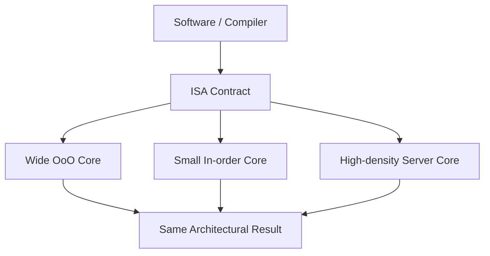
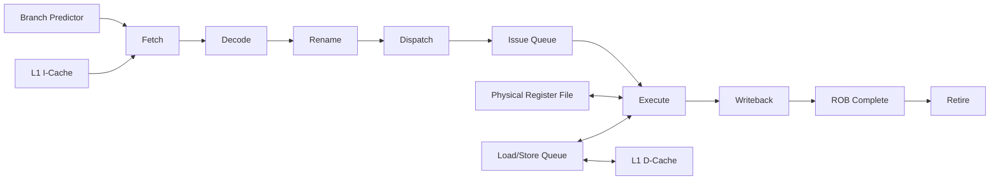
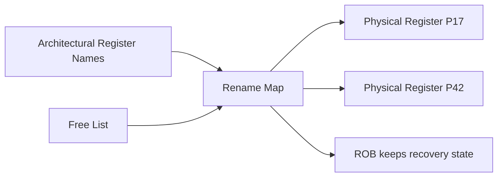
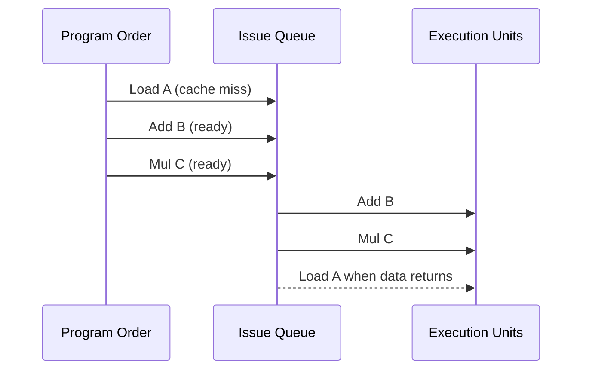
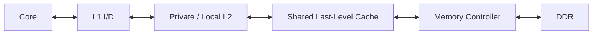
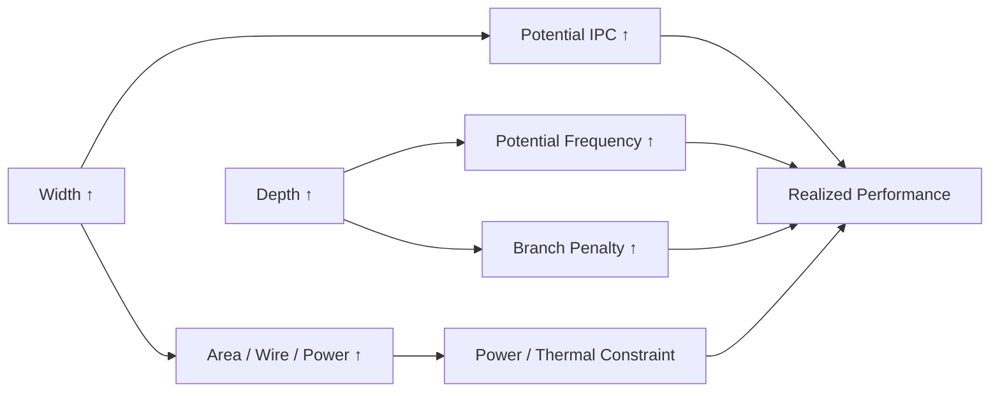

# CPU Architecture：一条 Instruction 如何穿过现代处理器

> 第一次阅读：Sections 1–9，跟一条 instruction 走完整条 pipeline  
> 第二次阅读：Sections 10–18，理解 OoO、cache、SMT 与 multicore  
> 深入阅读：Sections 19–26，做 bottleneck、产品与 Strategy 判断

## 阅读前后

**I should understand before：**知道 instruction、register、cache 和 DRAM 的基本含义。  
**I should understand after：**能解释 fetch、decode、rename、dispatch、issue、execute、retire；能区分 ISA 与 microarchitecture；能从 branch、dependency、cache miss、memory bandwidth、NUMA、power 找 CPU bottleneck；能理解 CPU 在 AI 数据中心为何仍是 control-plane 和 serial-performance 核心。

## 1. 先告诉我为什么需要复杂 CPU

最直觉的处理器是：取一条 instruction，算完，再取下一条。它逻辑清楚，却会被现实中的等待压垮。一次 DRAM access 可能跨越许多 CPU cycles；branch 的真实方向要等条件算出；后一条 instruction 可能依赖前一条结果；不同 operation 的 execution latency 也不同。如果所有工作严格串行，昂贵 execution units 大量时间都在空等。

现代高性能 CPU 的核心问题因此不是“怎样完成一条 instruction”，而是：

> 在不改变 program 可观察结果的前提下，怎样从单条串行 instruction stream 中找出足够多的独立工作，让 frontend、execution units 和 memory system 同时忙起来？

Branch prediction、speculation、superscalar、register rename、out-of-order execution、cache、prefetch 和 simultaneous multithreading（SMT）都是对这个问题的不同回答。它们优化 latency 与 single-thread performance，代价是 area、power、verification、security exposure 与 design complexity。

## 2. 一句话直觉

现代 CPU 像一家必须按订单顺序交付、却允许车间乱序生产的工厂：frontend 猜测接下来需要哪些订单，rename 消除假依赖，scheduler 把已备齐原料的工序先送去执行，ROB 最后按 program order 检查并交付。

## 3. ISA 不是 microarchitecture

Instruction Set Architecture（ISA）定义软件可见 contract：instructions、registers、addressing、exception、memory model 和 privilege。Microarchitecture 定义芯片如何实现这个 contract：pipeline 深度、decode 宽度、ROB 大小、execution ports、cache、predictor 和 interconnect。

同一 ISA 可以有窄小 in-order core，也可以有宽 superscalar OoO core；软件看到相同结果，performance、power、area 却完全不同。反过来，不同 ISA 的高性能 core 也可能采用相似的 frontend/OoO/cache 思路。



读产品 slide 时，看到 “Armv9” 或 “x86-64” 不能直接推断 IPC；要继续找 microarchitecture。

## 4. 一条 instruction 的完整旅程



每个厂商命名略有不同，stages 也可能拆得更细。重要的不是背 stage 数，而是理解三条逻辑：

1. **Frontend**持续提供正确路径上的 decoded work。
2. **Out-of-order backend**寻找 operands 已准备好的 independent operations。
3. **Retirement**恢复精确的 program-order state 与 exceptions。

## 5. Fetch：先猜未来才能保持吞吐

Program counter 指向下一条 instruction。Fetch unit 从 L1 instruction cache 取 instruction bytes；若 miss，则向更低 cache/DRAM 请求。问题是遇到 branch 时，真实 next PC 可能尚未知道。若停下来等，深 pipeline 会出现长 bubble。

Branch predictor预测：

- 是否 taken；
- target address；
- indirect branch target；
- function return address。

预测正确，pipeline 像 branch 不存在一样继续；预测错误，需要 squash wrong-path work、恢复 rename/state，再从正确地址 fetch。粗略代价：

[
T_{branch} approx Mispredictions 	imes Mispredict Penalty
]

Branch accuracy 已很高时，剩余百分点仍重要：例如 20-cycle penalty、每千条 instructions 多 5 次错判，就是约 100 cycles/千指令的潜在损失。**[Estimate]** 数字仅用于直觉，真实 penalty 随 core 与执行时点不同。

### 为什么不等 branch 算完再 fetch？

因为等候会让 frontend/backend 大量空闲。Speculation 用额外 energy 和错误工作换平均性能；这也扩大验证与安全复杂度。

## 6. Decode：复杂 ISA 如何变成内部工作

Fetch 到的是 ISA instructions，backend 常处理更规则的 micro-operations（µops）。Decode 识别 opcode、operands、immediates，并可能把复杂 instruction 拆成多个 µops。Decoded cache/µop cache 可绕过重复 decode，降低 latency 和 energy。

Decode width 表示每 cycle 理想情况下可进入 backend 的工作量，但不是 IPC 保证。Instruction cache miss、branch bubble、复杂 instruction、µop cache miss 或 backend backpressure 都会降低供给。

听到“frontend widened”，要追问：

- fetch/decode/µop cache 是否都同步？
- branch predictor 能否保持更宽路径正确？
- backend、ROB、register 和 execution ports 是否接得住？
- power budget 是否允许持续宽发射？

## 7. Rename：为什么 architectural registers 不够

ISA 只有有限 architectural register names。考虑：

```text
I1: R1 = R2 + R3
I2: R1 = R4 + R5
I3: R6 = R1 + R7
```

I1 与 I2 都写 R1，表面有 Write-After-Write；但 I2 不需要等待 I1 结果。Rename 将两次 R1 映射到不同 physical registers，消除 false dependency；I3 读取当前 mapping，即 I2 的 physical result。



True dependency（Read-After-Write）不能凭 rename 消除，因为 consumer 真需要 producer 数据。Rename 的代价是更大 physical register file、map tables、free list、recovery checkpoint 与 wiring。

## 8. Dispatch、Issue 与 Out-of-Order：谁准备好谁先做

Renamed µops 进入 ROB 和 issue queue。Scheduler 追踪 operands readiness 和 execution port availability。即使 program order 中某条 load 等 cache，后面的 independent add/multiply 可以先执行。

Intel optimization manual明确把 OoO 描述为：当某 µop 等数据或资源时，后续独立 µops 可先执行，从而覆盖部分 delay。[Primary Source: Intel Optimization Manual](https://www.intel.com/content/www/us/en/developer/articles/technical/intel64-and-ia32-architectures-optimization.html)



### 为什么 window 不无限大？

更大 ROB/issue queue 能看到更多 independent work，却增加 associative wakeup/select、physical register、wire delay、power、area 与 recovery cost。收益还依赖程序是否真有 instruction-level parallelism（ILP）。

## 9. Execution ports：多个 units 不等于所有 instruction 都能并行

Backend 包含整数 ALU、vector/FPU、branch unit、address generation unit、load/store pipes、crypto/AI extensions 等。Instruction 被映射到可执行它的 ports；若很多 µops 争同一 port，会发生 structural bottleneck。

关键参数：

| 参数 | 含义 | 容易误读 |
|---|---|---|
| Latency | producer 到 dependent consumer 可用的 cycles | 不等于 reciprocal throughput |
| Throughput | 连续独立 operations 可启动速率 | 需要足够独立工作 |
| Port availability | instruction 可去哪几个 ports | 总 port 数不等于该 instruction port 数 |
| Vector width | 一条 instruction 处理的数据宽度 | 受频率、power、layout、尾部影响 |
| Frequency | cycles/s | IPC 可能随 microarchitecture/workload变化 |

CPU performance 常近似：

[
Performance propto IPC 	imes Frequency
]

但 IPC 是 workload 与 microarchitecture 的结果，不是产品固定常数。

## 10. Load/Store：memory ordering 让“乱序”变难

Load/store 需要生成 virtual address、做 TLB translation、检查 cache，并维护 program memory semantics。Load/Store Queue（LSQ）追踪尚未退休的 memory operations，处理：

- load 是否依赖更早 store；
- store-to-load forwarding；
- memory disambiguation；
- ordering 与 fence；
- exception；
- cache miss 和 replay。

CPU 有时预测一个 load 与更早 store 不 alias，让 load 先执行；预测错则 replay。过度保守会失去并行，过度激进会增加错判与复杂度。

### 为什么 memory latency 不能完全被 OoO 隐藏？

ROB/window 有限，dependent chain 可能没有独立 work，memory-level parallelism不足，或多个 misses 占满 buffers。Long-latency DRAM 仍可耗尽可见并行度。

## 11. Cache hierarchy：CPU 用 locality 对抗 wire 和 DRAM



平均访问时间可用：

[
AMAT = Hit Time_{L1} + MissRate_{L1}	imes MissPenalty_{L1}
]

更完整模型逐层展开。大 cache 降 miss rate，但增加 area、leakage、hit latency 与 coherence traffic。Cache line 利用 spatial locality，却会 over-fetch；prefetch 提前搬数据，却可能污染 cache、浪费 bandwidth。

### 为什么不能只加大 L1？

L1 必须在高 frequency 下快速访问、支持多 ports 和低 latency。容量越大，tag/data array 与 wires 越难维持 timing。Hierarchy 用小快 + 大慢组合，而不是单一巨大 SRAM。

## 12. Retirement：乱序执行，顺序提交

ROB 保存 program order、完成状态、exception 与 recovery information。只有最老且已完成的 instruction 才能 retire，把 speculative result 变成 architectural state。若老 instruction cache miss，后面很多工作即使算完也无法越过它退休，形成 head-of-line blocking。

Precise exception 要求系统看起来像 instruction 顺序执行到 fault point；错误路径的工作不能留下 architectural effect。Retirement 是“性能乱序、语义顺序”的关键边界。

## 13. Pipeline 深度、宽度和 frequency 的 trade-off

更深 pipeline 可缩短每 stage combinational path、提高 clock，但增加 branch mispredict penalty、bypass stages、pipeline register power 和设计复杂度。更宽 pipeline 每 cycle 处理更多 work，却需要更宽 fetch/decode/rename/issue/retire、更大 register ports 和更多 wires。



“更宽”只有在 frontend、ILP、memory 和 power都配合时有效。

## 14. SMT：用另一个 thread 填空档

SMT 让一个 physical core 保留多个 architectural thread contexts。当 thread A 因 cache miss或dependency停顿，thread B 可使用空闲 execution slots。它提高 throughput/利用率，但 threads 共享 frontend、ROB/queue、cache、execution ports 和 bandwidth，可能互相干扰。

### 为什么不无限增加 hardware threads？

每个 context 需要 state；shared resources有限；更多 threads 增加 contention、QoS 和 security complexity。SMT 更擅长填短期空洞，不会增加底层 execution/memory capacity。

## 15. Multicore、LLC、coherence 与 NUMA

增加 cores 后，每个 core 不再独立。它们共享 LLC slices、memory controllers、on-die mesh/ring、socket links 和 DRAM bandwidth。Cache coherence维护多个 private caches 对 shared memory 的一致视图，带来 directory/snoop traffic 和 state transitions。

多 socket 或 chiplet server 常呈 Non-Uniform Memory Access（NUMA）：访问 local memory 比 remote socket/die memory 更快、更省 bandwidth。Software placement、thread affinity、memory allocation 和 NIC/GPU locality会影响性能。

[Primary Source] Intel 的 NUMA 指南指出 data location和 cache层级会改变访问成本，OoO只能覆盖部分延迟。[Intel NUMA Guide](https://www.intel.com/content/www/us/en/developer/articles/technical/hardware-and-software-approach-for-using-numa-systems.html)

### 为什么不把所有 cores 接到一个统一大 cache？

Port、wire、coherence、latency、power 和 physical distance 不可忽略。Distributed LLC/mesh提高规模，却让访问延迟随位置变化；software “看起来统一”不代表物理均匀。

## 16. CPU 在 AI 数据中心做什么

GPU 负责大量并行 arithmetic，CPU 仍承担：

- OS、container、security 与 orchestration；
- request parsing、tokenization、sampling 和 business logic；
- data preprocessing、decompression、storage stack；
- accelerator launch、driver/runtime control；
- network/control-plane 与异常处理；
- serial/branch-heavy work；
- memory capacity、CXL/PCIe root 与 I/O management。

CPU bottleneck会表现为 GPU gaps：kernel launch不足、input pipeline慢、NIC interrupts或data preparation跟不上。只看 GPU utilization会误诊。

## 17. Workload mapping

| Workload | CPU 更看重什么 | 常见 bottleneck |
|---|---|---|
| Online inference control | single-thread latency、branch、cache | frontend、tail latency |
| Data preprocessing | vector、memory、compression | bandwidth、NUMA |
| Database | branch、cache、memory-level parallelism | cache miss、lock、NUMA |
| Storage/network stack | I/O、copy、packet processing | memory/PCIe、interrupt |
| HPC host/control | serial fraction、MPI runtime | Amdahl、NUMA |
| General cloud | density、QoS、virtualization | shared cache/bandwidth |

## 18. Real product archetypes

- **Intel Xeon P-core 路线：**强调高单线程/每核性能、宽 OoO 与 server platform；现代产品还结合 tile、mesh、DDR/PCIe/CXL 和专用 accelerators。具体 generation 必须查相应 optimization manual。
- **AMD EPYC Zen/chiplet 路线：**用 Core Complex Dies 与 I/O die 扩展 core count、memory/I/O；软件需理解 NUMA/topology。AMD 为 Zen generations发布 Software Optimization Guide。[Primary Source: AMD uProf resource links](https://docs.amd.com/r/en-US/57368-uProf-user-guide/Useful-URLs)
- **Arm Neoverse V/N 路线：**V-series偏 per-thread/vector performance，N-series偏 scale-out efficiency。Arm 公布 Neoverse V2为 Armv9、OoO、superscalar并支持 SVE2。[Primary Source: Arm Neoverse V2](https://developer.arm.com/compute-ip/neoverse-v2)

这些不是简单“谁更快”的排名，而是 core、uncore、memory、I/O、power、software ecosystem 与 customer workload的不同平衡。

## 19. Bottleneck 诊断

| 现象 | 可能原因 | 继续看 |
|---|---|---|
| IPC 低、frontend stalled | I-cache/µop cache/branch | branch MPKI、fetch bubbles |
| Backend bound | port contention/dependency | port utilization、critical chain |
| Memory bound | cache/DRAM/NUMA | MPKI、MLP、bandwidth、latency |
| Retiring 低但 execution忙 | wrong-path/replay | mispredict、machine clears |
| Frequency低 | power/thermal/vector throttle | clocks、power cap、temperature |
| 多线程不scale | shared cache/memory/lock | NUMA、coherence、contention |
| GPU等待CPU | launch/input/control | CPU timeline、queue depth |

Top-down methodology 的价值是先把 slots 分为 retiring、bad speculation、frontend bound、backend bound，再下钻；具体 counters依产品而异。

## 20. 为什么不……？

### 为什么 CPU 不设计成几千个小 core？

Serial code、branch-heavy control、OS、latency和软件兼容需要强 single-thread core；几千小 core 的 memory/coherence/programming负担很高。GPU选择不同 contract，因为目标 workload不同。

### 为什么不把 ROB 做得无限大？

更大 window带来 associative scheduling、physical registers、recovery、wire与power成本；程序ILP和memory parallelism终会饱和。

### 为什么不让 instruction 完成后立即提交？

Precise exceptions和program order semantics要求老 instruction先确认。否则错误路径或较年轻操作可能留下不可撤销状态。

### 为什么不把所有专用 accelerator都塞进 CPU？

专用单元占 area、power、verification和软件维护；使用率低时浪费。集成与外置之间要权衡 latency、bandwidth、flexibility、process node和产品组合。

### 为什么不以 GHz 比较 CPU？

Performance约为 IPC×frequency，IPC依 workload；memory、core count、power和software也影响系统结果。更高 GHz甚至可能来自更少 cores active或更高功率。

## 21. Engineers actually say

- **“Frontend-bound.”** 正确路径 µops供不够；看 I-cache、µop cache、decode和branch。
- **“Backend-bound.”** operands/resources不够；区分 core execution与memory。
- **“The ROB is full.”** 老 miss/dependency阻止退休，window无法接收新 work。
- **“We have a dependency chain.”** latency无法用独立instructions隐藏。
- **“The load was replayed.”** memory ordering、alias、cache或资源条件导致重新执行。
- **“IPC regressed.”** 不能只看 frequency；需按 stalls、instruction mix比较。
- **“Remote NUMA is killing us.”** thread/data/device placement跨物理域。
- **“We cannot feed the accelerator.”** host preprocessing、I/O或launch成为系统 bottleneck。

## 22. 听到这些话要追问

1. IPC 是按 core、thread还是socket？instruction mix相同吗？
2. Branch MPKI和mispredict penalty？
3. Frontend supply、decode/rename/retire width分别多少？
4. ROB、load/store buffers在目标 workload中是否饱和？
5. Cache miss来自capacity、conflict还是coherence？
6. Memory-level parallelism和sustained bandwidth？
7. NUMA placement和remote access比例？
8. Vector/AI instructions是否改变 frequency/power？
9. SMT提高throughput多少，tail latency和QoS付出什么？
10. CPU瓶颈是否使GPU/NIC/SSD等待？

## 23. Common misconceptions

1. **“OoO改变程序顺序。”**它改变内部执行时间，不改变architectural可观察语义。
2. **“Cache hit就一定快。”**hit level、bank/port contention和physical distance都重要。
3. **“更多 cores线性提高性能。”**serial fraction、memory/coherence/NUMA和power会限制。
4. **“ISA决定性能。”**ISA是contract；microarchitecture、compiler和system共同决定。
5. **“CPU与GPU竞争同一工作。”**现代系统更常是分工与co-design，CPU bottleneck可让GPU闲置。

## 24. Engineering → Strategy

| Engineering | System effect | Business effect | Strategic implication |
|---|---|---|---|
| 更宽OoO/大cache | single-thread与latency提升 | die/power成本上升 | 高价值serial/control workload获益 |
| 高密度小core | throughput/W与core density | per-thread可能较弱 | cloud TCO与SKU分层 |
| Chiplet/tile | core/I/O扩展、yield组合 | package/NUMA复杂 | packaging和uncore IP成为moat |
| 更强memory/PCIe/CXL | feed accelerators与I/O | platform BOM/attach上升 | CPU保留system root控制点 |
| ISA/software ecosystem | migration与optimization | switching cost | moat不只在core IPC |
| Specialized accelerators | offload常见服务 | die利用率与软件依赖 | workload coverage决定价值 |

## 25. Technical Diligence

- Claimed IPC来自branch、width、cache还是benchmark mix？
- Frequency是在多少active cores、power和vector mix下？
- Core、LLC、memory、I/O哪个先scale out？
- Chiplet boundary是否制造NUMA/coherence latency？
- Compiler和OS scheduler需要什么改变？
- Performance counter evidence能否解释改善？
- 客户真实workload是否有足够ILP/locality？
- Die area、power、verification和yield代价？
- Security mitigation是否改变performance？
- 相对incumbent，创新是可复制block还是跨generation know-how？

## 26. Takeaways 与开放问题

### 五个必须记住的 takeaway

1. CPU用预测、rename、OoO和cache从串行stream中提取并行。
2. 内部可以乱序执行，但ROB保证顺序retire与precise state。
3. Width、depth、frequency、window和cache都不是免费资源。
4. Multicore后，coherence、NUMA、memory与power比单core更重要。
5. 在AI数据中心，CPU决定control、I/O、serial fraction和accelerator供给。

### 三个值得继续思考的问题

1. 当更多data-center functions被DPU/accelerator offload，CPU的durable control point在哪里？
2. 更强P-core与更多E-core的最优组合，应由hardware决定还是scheduler/workload决定？
3. Chiplet扩展core count后，未来CPU moat会从core microarchitecture迁移到uncore、package与software吗？

## Sources

- [Primary Source] [Intel 64 and IA-32 Optimization Reference Manuals](https://www.intel.com/content/www/us/en/developer/articles/technical/intel64-and-ia32-architectures-optimization.html)
- [Primary Source] [Intel Software Developer Manuals](https://www.intel.com/content/www/us/en/support/articles/000006715/processors.html)
- [Primary Source] [Intel NUMA Hardware and Software Guide](https://www.intel.com/content/www/us/en/developer/articles/technical/hardware-and-software-approach-for-using-numa-systems.html)
- [Primary Source] [AMD Software Optimization Guide resources](https://docs.amd.com/r/en-US/57368-uProf-user-guide/Useful-URLs)
- [Primary Source] [Arm Neoverse V2 Product Support](https://developer.arm.com/compute-ip/neoverse-v2)


## 基础概念桥接

先区分 core、thread、instruction、cycle、IPC、frequency、cache miss 和 branch misprediction。CPU 擅长低延迟控制和复杂分支，不等于所有阶段都应留在 CPU。主机 orchestration、NUMA、I/O 与 accelerator feeding 也属于端到端关键路径。

延伸基础：[工程术语手册](../31_glossary/engineering_terms_handbook.md)；[工程度量与不确定性](../02_engineering_foundations/engineering_measurement_uncertainty.md)；[数字逻辑、处理器与加速器](../02_engineering_foundations/digital_compute_accelerator_vocabulary.md)。
