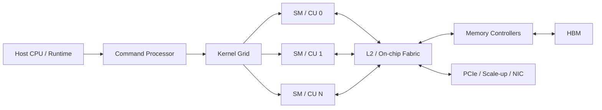
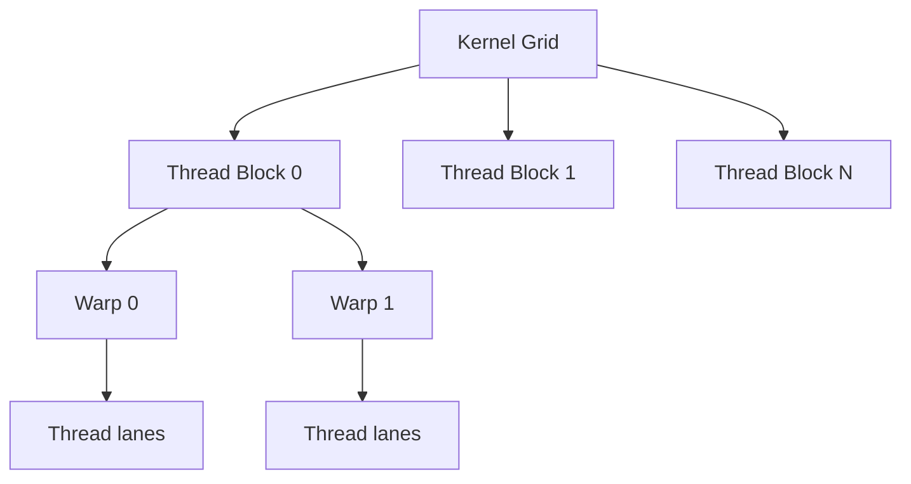
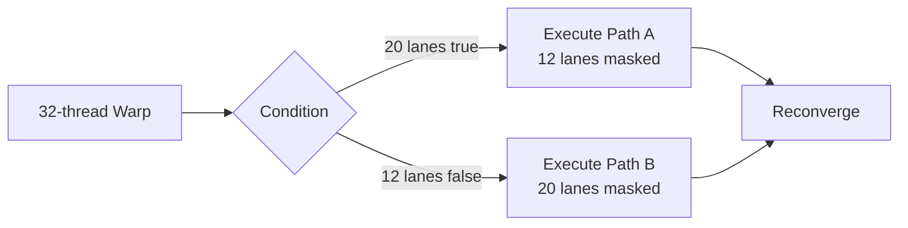
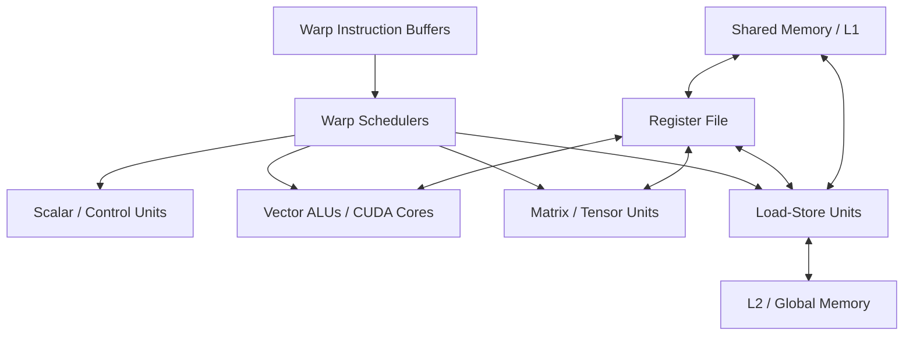
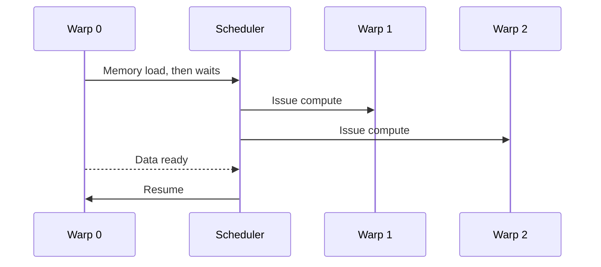
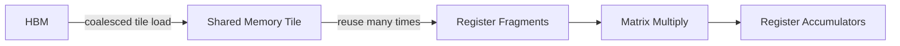
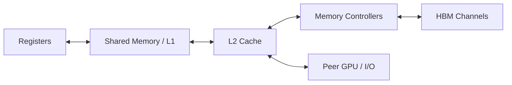
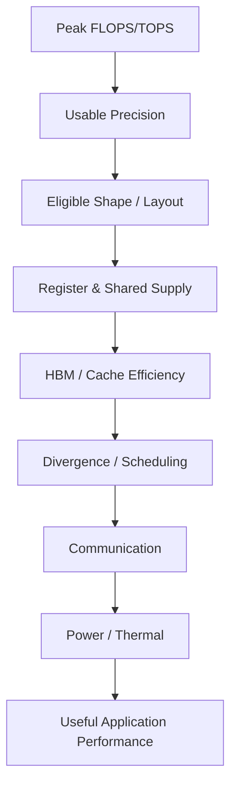

# GPU Architecture：为什么大量 Thread、Warp、SM 与 Memory Hierarchy 适合 AI

> 第一次阅读：Sections 1–9，建立 thread → warp → block → SM mental model  
> 第二次阅读：Sections 10–18，理解 register、occupancy、divergence 与 data movement  
> 深入阅读：Sections 19–26，连接 workload、产品、Strategy 与 diligence

## 阅读前后

**I should understand before：**知道 CPU pipeline、cache、matrix multiplication 和 parallelism 的基本概念。  
**I should understand after：**能解释 GPU 为什么不是“很多小 CPU”；能追踪一个 kernel 从 grid 到 SM、register、shared memory、L2、HBM；能判断 occupancy、divergence、coalescing、Tensor Core 和 bandwidth 的 trade-off；能把 GPU architecture变化翻译成 package、power、software与系统价值。

## 1. 先告诉我为什么需要 GPU

CPU花大量transistors与energy去减少单个thread的等待：branch prediction、speculation、large OoO window、复杂cache和低latency。对于大量彼此独立、执行相似operation的数据并行工作，另一种选择是：

> 不为每个thread建立昂贵的低延迟机器，而是保留成千上万thread state；当一组thread等待memory时，快速切换到另一组ready threads，用并行度隐藏latency。

GPU用更多execution lanes、更多hardware threads、更大的aggregate register file和高bandwidth memory换取throughput。它假设workload能被切成大量相似tasks，并容忍单个thread latency不如CPU。

AI的dense linear algebra、convolution、attention、embedding及elementwise operations具有大量tensor-level/data-level parallelism，因此能利用这种architecture。但“AI适合GPU”不是因为core多这么简单，而是因为：

- 大量independent operations；
- 相似control flow可用SIMT；
- tensor tile有data reuse；
- lower precision提高compute density与降低bytes；
- software能把graph映射成kernel；
- HBM与scale-up fabric能供应/交换数据。

## 2. 一句话直觉

CPU努力让少数threads尽快完成；GPU努力让海量threads持续有一批可执行。它用occupancy隐藏latency，用SIMT摊薄control成本，用memory hierarchy与tiling提高每个byte的复用，用Tensor Core加速规则矩阵块。

## 3. GPU在系统哪里



Host发起kernel与memory operations；GPU work distributor把thread blocks分配到SM/CU；SM执行warps/wavefronts；L2和memory controllers连接HBM；I/O连接host、peer GPU和network。

NVIDIA叫Streaming Multiprocessor（SM），AMD常叫Compute Unit（CU）并以wavefront组织threads；术语不同但问题相似：如何让大量lanes得到ready instructions和data。

## 4. Programming hierarchy：Grid、Block、Warp、Thread



- **Thread：**程序员看到的scalar execution context，有自己的register state与thread ID。
- **Warp/wavefront：**hardware一起调度/执行的一组threads。CUDA常以32 threads为warp。
- **Thread block/workgroup：**可在同一SM/CU上通过shared memory和barrier协作的threads。
- **Grid：**一次kernel launch的所有blocks，通常可扩展到整个GPU。

[Primary Source] CUDA Programming Guide说明threads组成blocks和grids，并讨论warp execution、divergence与synchronization。[CUDA SIMT Kernels](https://docs.nvidia.com/cuda/cuda-programming-guide/02-basics/writing-cuda-kernels.html)

Block必须能独立调度，否则GPU无法把blocks动态分布到不同SM，也难以扩展到不同SM数量的产品。

## 5. SIMT：软件像写thread，硬件像执行vector group

Single Instruction, Multiple Threads（SIMT）允许每个thread拥有自己的register和control state，但hardware通常让warp lanes执行同一instruction。若所有lanes走相同路径，control成本被摊薄；若发生data-dependent divergence，路径需要分段执行，非当前路径lanes被mask。



Divergence损失取决于路径长度和active lanes，不是遇到if就固定减半。不同warps走不同路径不互相mask；问题发生在同一warp内部。

### 为什么GPU不做CPU式branch prediction和OoO？

每个thread都配复杂predictor/OoO会消耗巨大area/power，减少lanes和throughput。GPU依赖大量warps切换隐藏stall；适合规则并行workload，不适合所有control-heavy serial code。CUDA文档明确指出SM instruction issue与CPU speculative OoO不同。[Primary Source: CUDA Programming Guide PDF](https://docs.nvidia.com/cuda/cuda-programming-guide/pdf/cuda-programming-guide.pdf)

## 6. SM/CU内部有什么



主要blocks：

- Warp scheduler：从ready warps选择instruction。
- Register file：保存大量thread state与operands。
- Vector/scalar ALU：整数、FP、address、control与elementwise。
- Tensor/Matrix units：执行小矩阵multiply-accumulate。
- Load/store units：地址生成、coalescing与memory requests。
- Shared memory/L1：block内software-managed reuse与cache。
- Special-function units：transcendental或special operations。

AMD ROCm文档将VALU、SALU、VGPR、LDS与scheduler列为CDNA CU的关键pipeline/resources。[Primary Source: AMD ROCm CU](https://rocm.docs.amd.com/projects/omniperf/en/docs-6.2.1/conceptual/compute-unit.html)

## 7. Warp scheduling：GPU怎样隐藏latency

某warp发出HBM load后可能等数百cycles。其register state留在SM，不需要OS context switch；scheduler在下一cycles选择其他ready warp。只要ready warps足够，execution units持续有工作。



Latency hiding不等于latency消失。若所有warps同时等memory、dependency或barrier，SM仍会idle。需要足够occupancy、independent work与memory-level parallelism。

## 8. Register file：为什么GPU需要巨大register容量

每个resident thread需要registers。成千上万thread contexts常使aggregate register file成为SM面积/energy的重要部分。Register为Tensor/ALU提供operands与accumulators，避免更慢memory。

但register使用形成资源约束：

[
Resident Threads le rac{Registers per SM}{Registers per Thread}
]

还要同时满足max warps、blocks和shared memory限制。Kernel增大tile或保存更多intermediate会提高reuse，却可能降低resident warps。

### 为什么不减少register让occupancy最高？

过度压register可能造成spill到local/global memory，增加traffic；较低occupancy若有足够ILP与software pipeline仍可能更快。Occupancy是必要资源指标，不是optimization目标本身。

## 9. Occupancy：能驻留不等于能做有效工作

Occupancy通常表示active warps相对hardware maximum的比例。限制因素包括：

- registers/thread；
- shared memory/block；
- threads/block；
- blocks/SM；
- architecture max warps；
- thread-block cluster资源。

[Primary Source] Hopper tuning guide列出register、shared memory、blocks与cluster size对occupancy的限制。[NVIDIA Hopper Tuning Guide](https://docs.nvidia.com/cuda/hopper-tuning-guide/index.html)

高occupancy可隐藏latency，但也可能：

- 共享cache/bandwidth更拥挤；
- 每thread资源太少；
- 更多warps都在等同一bottleneck；
- kernel本身没有足够work；
- synchronization变多。

正确问题是“有多少ready warps能让目标pipelines忙”，不是“occupancy是否100%”。

## 10. Shared Memory/LDS：程序员管理的on-chip reuse

Shared memory（AMD称LDS）位于SM/CU附近，同block/workgroup threads可协作访问。典型GEMM：

1. threads协同从HBM/L2加载A/B tile；
2. 写入shared memory；
3. barrier确认tile就绪；
4. 多次从shared读取到register；
5. 执行matrix operations；
6. double buffering时并行加载下一tile。



Shared memory不是自动cache；软件承担layout、bank conflict、lifetime和synchronization。好处是predictable locality，代价是programming complexity与capacity占用。

## 11. Memory coalescing：很多threads如何变成少量transactions

Warp lanes访问相邻、对齐addresses时，hardware可合并为较少memory transactions。若addresses分散，可能为少量有效bytes发出多个transactions，降低effective bandwidth。

[
Efficiency approx rac{Useful Bytes}{Transferred Bytes}
]

**[Estimate]** 若warp有效读取128 bytes，却因分散访问产生512 bytes transactions，payload efficiency约25%；真实transaction粒度依architecture/cache。Nominal HBM bandwidth不变，application却只获得一小部分。

### 为什么不让每个thread独立发小request？

Per-request metadata、address、queue和DRAM burst有固定成本。合并提高channel效率；代价是software要care layout与thread mapping。

## 12. Memory hierarchy与data path



GPU面向throughput，memory hierarchy不仅减少latency，更重要是放大bandwidth与reuse。L2 hit避免HBM；shared/register tile让同一HBM byte服务多次MMA；asynchronous copy/TMA让data movement与compute overlap。

如果compute增长快于HBM，machine balance上升，kernel需要更高Arithmetic Intensity才能compute-bound。GPU architecture因此越来越像data-movement architecture。

## 13. Tensor Core与通用lanes为什么共存

AI graph不只GEMM。还包含normalization、activation、softmax、reduction、routing、index、sampling、address和control。Tensor Core针对规则matrix tile高吞吐；vector/scalar units处理其余operations与数据准备。

### 为什么不全部使用Tensor Core？

- shape/layout可能不满足；
- precision/accumulation要求不同；
- 小problem无法填满tile；
- irregular/sparse pattern可能不适合；
- epilogue/control仍需通用units；
- feeding Tensor Core需要load/store、shared/register。

优化Tensor Core后，non-matmul fraction会成为Amdahl bottleneck，这推动fusion、special function和data-movement engines。

## 14. Synchronization与barrier：合作的价格

Block内threads共享tile时需barrier避免读到未完成数据。多个blocks/GPUs之间同步更贵。Barrier等待最慢participant，放大load imbalance和memory variance。

Pipeline bubble可能来自：

- producer未填shared buffer；
- consumer等待MMA result；
- barrier前不同warps工作不均；
- collective结果未到；
- kernel launch边界。

Warp specialization让部分warps负责data movement、另一些负责compute，以software pipeline overlap；但增加schedule、buffer和correctness复杂度。

## 15. GPU performance waterfall



“Tensor Core active高”也不保证end-to-end快；可能HBM、collective、CPU或tail operations主导。要看整个timeline和critical path。

## 16. GPU vs CPU：两种latency处理哲学

| 维度 | CPU | GPU |
|---|---|---|
| 目标 | 少数threads低latency/高serial性能 | 大量threads高throughput |
| Latency hiding | OoO、speculation、cache | warp switching、occupancy |
| Control | 强branch prediction | SIMT，divergence有代价 |
| Register | 少数threads、复杂rename | 大量thread state |
| Memory | 大cache、低latency优化 | 高bandwidth、coalescing、tiling |
| Execution | 通用、wide superscalar | 大量vector/matrix lanes |
| 最适合 | branch/serial/control | regular data/tensor parallel |

两者coexist因为workload由serial control和parallel kernels共同构成。

## 17. Training、Prefill、Decode映射

- **Training：**大GEMM、activation/gradient、high parallelism；compute、HBM capacity、collective都重要。
- **Prefill：**多tokens形成较大matrices，较容易提高Tensor Core utilization；attention traffic随sequence增长。
- **Decode：**小batch下weight/KV movement占比高，Tensor Core可能吃不满；latency与HBM更重要。
- **MoE：**experts提供compute sparsity，但routing与All-to-All造成load/network问题。
- **Recommendation：**embedding random access和capacity可主导。
- **HPC：**FP64、memory access和numerical behavior决定，不一定与AI低precision相同。

## 18. Real architecture examples

### NVIDIA Hopper-style SM

CUDA/Hopper公开文档描述warp、SM、register、shared memory、TMA和thread block clusters。TMA把tensor从global搬到shared并减少SM/register参与，体现“compute增长后data movement engine成为关键”。[Primary Source](https://docs.nvidia.com/cuda/hopper-tuning-guide/index.html)

### AMD CDNA Compute Unit

ROCm文档展示wavefront、VALU、SALU、VGPR与LDS；AMD CDNA面向HPC/AI并加入Matrix Core与Infinity fabric。术语不同，但同样围绕大量wavefront、memory hierarchy与matrix acceleration。[Primary Source: AMD CDNA](https://www.amd.com/en/technologies/cdna.html)

### Google TPU对照

TPU更domain-specific：TensorCore包含MXU、vector和scalar units，systolic array让data在MAC之间流动以提高reuse。[Primary Source: Google Cloud TPU Architecture](https://docs.cloud.google.com/tpu/docs/system-architecture-tpu-vm?hl=en) 它说明GPU并非唯一AI architecture；programmability与specialization位于不同点。

## 19. Product evolution的正确读法

```text
More Matrix Throughput
→ Need more operand supply
→ Larger/faster shared/register/data engines
→ More HBM bandwidth/capacity
→ Larger package/power/cooling
→ More multi-GPU communication
→ New bottleneck moves to memory/network/system
```

例如新generation FP4 peak大幅增长时，要比较HBM、L2、scale-up、power与software support增长率。未同比增长者可能成为新限制。

## 20. Bottleneck诊断

| 症状 | 可能原因 | Metric/实验 |
|---|---|---|
| SM busy低 | grid小、CPU launch、dependency | timeline、blocks/SM |
| Occupancy低 | register/shared/block limit | resource report |
| Occupancy高但IPC低 | all warps stalled | stall reasons |
| HBM高、Tensor低 | memory-bound | AI、bytes、cache |
| Tensor高但app慢 | non-matmul/communication | kernel breakdown |
| Branch efficiency低 | warp divergence | active mask/path |
| Shared吞吐差 | bank conflicts/barrier | bank/conflict counters |
| Scale差 | collective/topology | exposed comm、link/queue |
| Clocks下降 | power/thermal | power cap、temperature |

## 21. 为什么不……？

### 为什么GPU不直接做成几万个CPU core？

CPU core的OoO、predictor、cache和rename成本太高，会挤掉lanes/register/HBM interfaces；GPU用规则parallelism换throughput。

### 为什么不把cache做得无限大？

SRAM area/leakage/wire昂贵，AI working set巨大；streaming data未必复用。Software-managed tiling比盲目cache更可预测。

### 为什么不追求100% occupancy？

最高occupancy可能牺牲tile、register reuse和ILP，甚至spill。目标是useful throughput。

### 为什么不无限增加SM？

更多SM需要HBM、L2/NoC、power、package和parallel work。供给不增长，SM只会starve。

### 为什么GPU frequency通常低于高性能CPU？

大量lanes同时switch带来power density；更高frequency可能需更高voltage。GPU偏向parallel throughput，CPU偏serial latency，最优power point不同。

## 22. Engineers actually say

- **“We are occupancy-limited.”** Register/shared/block资源限制resident warps；未必就是performance root cause。
- **“The warps are diverging.”** 同warp不同path被serial/mask执行。
- **“Loads are not coalesced.”** useful bytes/transaction低。
- **“Tensor Cores are starving.”** operands没及时到register，可能HBM/shared/TMA/schedule问题。
- **“We spill registers.”** live state超过allocation，额外memory traffic。
- **“There are bank conflicts.”** shared memory requests争bank，被serialize。
- **“Kernel launch-bound.”** work太小或host/runtime gap占比高。
- **“Communication is exposed.”** overlap不足，collective在critical path。

## 23. 我应该追问工程师什么

1. Target workload的kernel breakdown和top shapes？
2. SM/CU主要stall reasons？
3. Register/thread、shared/block和实际occupancy？
4. Tensor/matrix units active与eligible operations比例？
5. HBM bytes、L2 hit、coalescing和sustained bandwidth？
6. Data movement和compute overlap多少？
7. Divergence来自算法还是thread mapping？
8. Prefill/decode不同batch下bound如何切换？
9. Multi-GPU collective暴露多少，topology是否匹配？
10. Power cap下frequency与throughput曲线？
11. Compiler/library版本能否覆盖客户shapes？
12. 新architecture解决旧bottleneck后，哪个pipeline先饱和？

## 24. Common misconceptions

1. **CUDA core/stream processor数量可直接跨architecture比较。**每lane能力、frequency、instruction mix和组织不同。
2. **GPU只有compute cores。**Register、scheduler、cache、NoC、controller、PHY和data engines决定能否利用compute。
3. **Peak FLOPS就是模型性能。**precision、shape、memory、communication、software和power层层漏损。
4. **Divergence让整个GPU停住。**影响同warp path efficiency，不同warps仍可调度。
5. **HBM越多所有workload越快。**Capacity与bandwidth不同，access pattern/controller/software可能主导。

## 25. Engineering → Strategy

| Engineering change | System effect | Business effect | Strategic implication |
|---|---|---|---|
| 更多matrix throughput | memory/network需求上升 | HBM/package/fabric BOM增加 | value向系统瓶颈迁移 |
| 大register/shared/data engine | kernel效率和reuse提高 | die area/power | microarchitecture+compiler co-design moat |
| 更大HBM capacity | 大模型/KV本地化 | memory供应依赖 | HBM allocation和package capacity控制 |
| 更大scale-up domain | 更大TP/EP留在高速域 | rack ASP/lock-in | platform control point |
| Chiplet GPU | scale/yield组合 | package/test复杂 | advanced packaging/IP重要 |
| 软件kernel覆盖 | utilization提高 | switching cost/TCO | ecosystem可比单代silicon更durable |

## 26. Technical Diligence与takeaways

### Diligence

- 真实silicon还是simulation？
- Peak来自何precision、sparsity、clock与operation counting？
- 客户workload中eligible matrix fraction？
- Sustained HBM和matrix utilization？
- Compiler/kernel对shape coverage如何？
- Register/shared/NoC是否feed得上？
- Package、HBM、power/cooling和yield？
- Multi-GPU scale curve及network assumption？
- Porting effort、debug/profiling与failure recovery？
- Incumbent通过software/next generation能否复制？

### 五个必须记住的takeaway

1. GPU用大量warps切换而非复杂OoO隐藏latency。
2. SIMT高效依赖同warp控制一致、memory coalescing和足够parallelism。
3. Register/shared memory决定tile reuse，也限制occupancy。
4. Tensor Core只是pipeline一段；data movement常决定利用率。
5. GPU竞争已从die扩展到HBM、package、fabric、cooling与software。

### 三个开放问题

1. 当matrix peak继续快于HBM增长，GPU会更像compute machine还是data-movement machine？
2. Domain-specific TPU式设计与programmable GPU之间，软件成熟度多大程度能抵消hardware efficiency差异？
3. Chiplet、rack-scale fabric和liquid cooling结合后，“一颗GPU”的产品边界是否仍有战略意义？

## Sources

- [Primary Source] [CUDA Programming Guide — SIMT Kernels](https://docs.nvidia.com/cuda/cuda-programming-guide/02-basics/writing-cuda-kernels.html)
- [Primary Source] [CUDA Programming Guide PDF](https://docs.nvidia.com/cuda/cuda-programming-guide/pdf/cuda-programming-guide.pdf)
- [Primary Source] [NVIDIA Hopper Tuning Guide](https://docs.nvidia.com/cuda/hopper-tuning-guide/index.html)
- [Primary Source] [AMD ROCm Compute Unit](https://rocm.docs.amd.com/projects/omniperf/en/docs-6.2.1/conceptual/compute-unit.html)
- [Primary Source] [AMD CDNA Architecture](https://www.amd.com/en/technologies/cdna.html)
- [Primary Source] [Google Cloud TPU System Architecture](https://docs.cloud.google.com/tpu/docs/system-architecture-tpu-vm?hl=en)


## 基础概念桥接

先区分 thread、warp、block、SM、occupancy、utilization、register、shared memory 和 HBM。线程很多不等于计算单元忙碌；shape、tiling、coalescing、fusion 与 kernel coverage 决定峰值能否兑现。低精度或稀疏还必须通过质量约束。

延伸基础：[工程术语手册](../31_glossary/engineering_terms_handbook.md)；[工程度量与不确定性](../02_engineering_foundations/engineering_measurement_uncertainty.md)；[数字逻辑、处理器与加速器](../02_engineering_foundations/digital_compute_accelerator_vocabulary.md)。
