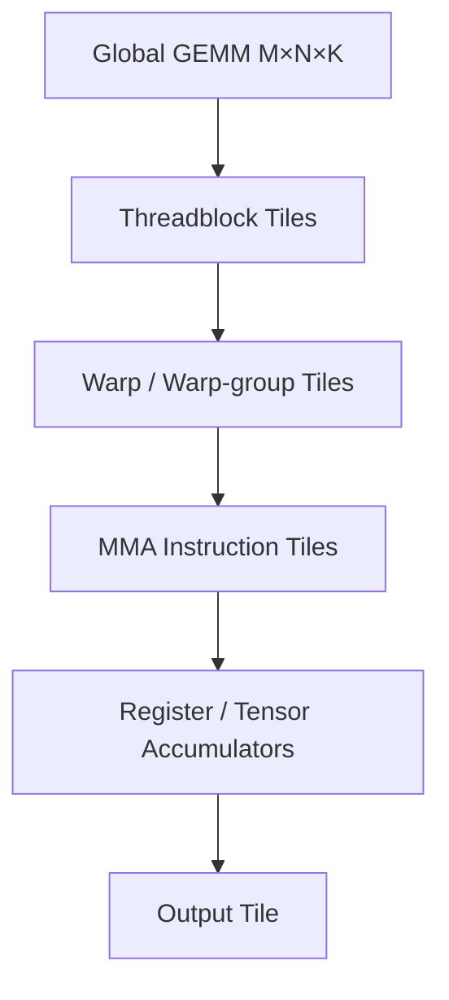
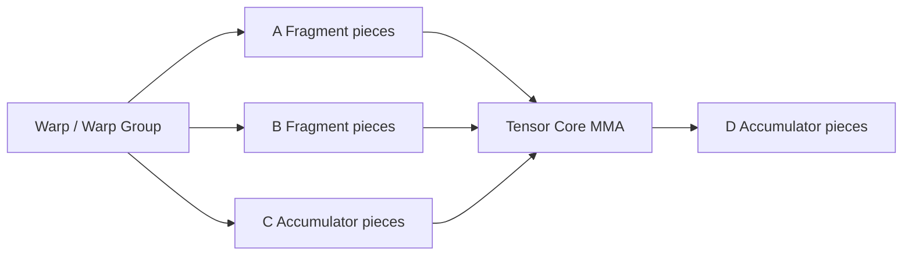
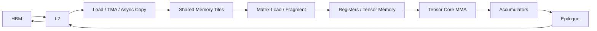
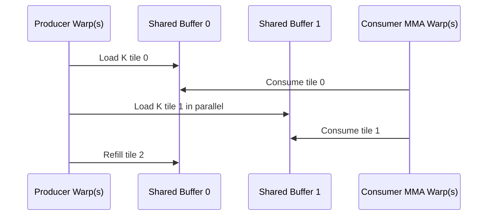
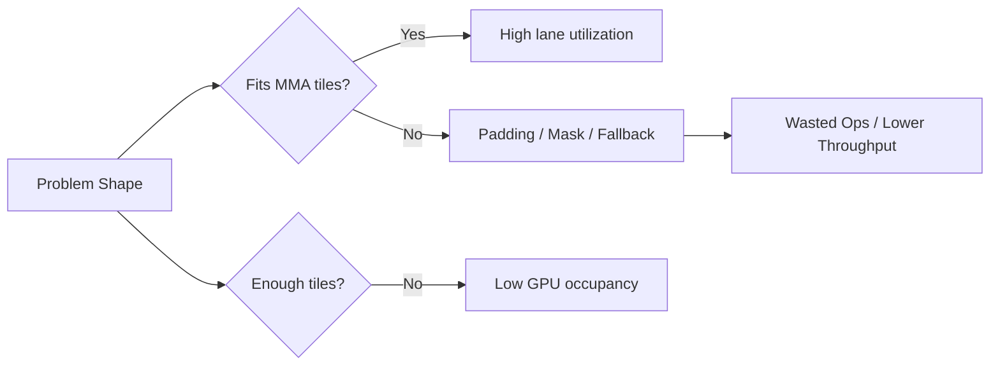
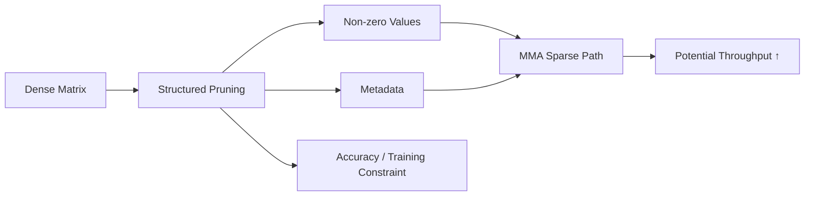
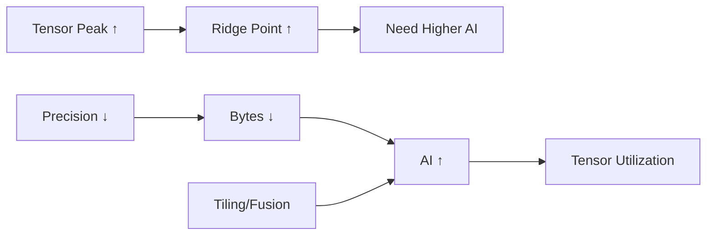

# Tensor Core：小矩阵乘法单元如何变成 AI Compute Engine

> 第一次阅读：Sections 1–8，理解MMA与matrix fragment  
> 第二次阅读：Sections 9–17，理解data pipeline、precision与利用率  
> 深入阅读：Sections 18–25，判断generation claim、software与Strategy

## 阅读前后

**I should understand before：**知道GPU thread/warp/SM、GEMM三重循环与tiling。  
**I should understand after：**能解释Tensor Core不是“一个完整神经网络core”，而是执行小tile MMA的专用datapath；能追踪HBM→shared→register/fragment→MMA→accumulator；能理解mixed precision、shape、warp collaboration、TMA/software pipeline与bottleneck；能质疑Tensor TOPS/FLOPS。

## 1. 先告诉我为什么需要专用matrix unit

通用FP/vector ALU可以逐元素执行multiply和add，但GEMM中相同control、address和instruction pattern重复数十亿次。若hardware知道operation是小矩阵 (D=A	imes B+C)，可以：

- 用一条/少量instructions描述许多MAC；
- 在lanes/PEs之间共享control；
- 为matrix fragments设计data path；
- 提高multiplier/accumulator density；
- 使用低precision inputs和较高precision accumulate；
- 减少instruction fetch/decode/register access energy。

Tensor Core解决的是**规则小矩阵块的高吞吐与能效**。它不负责完整GEMM的所有HBM loads、tiling、synchronization、epilogue和multi-GPU communication；那些由SM、memory system与software共同完成。

## 2. 一句话直觉

Tensor Core是一台只会高效处理固定形状matrix multiply-accumulate tile的发动机。Kernel必须持续把正确layout/precision的A、B fragments送到发动机，并把partial C保存在accumulators；没有data pipeline，发动机再多也会starve。

## 3. MMA到底做什么

Matrix Multiply-Accumulate：

[
D = A	imes B + C
]

这里A/B/C/D是小matrix fragments，不是整个model matrix。Hardware instruction支持特定(m	imes n	imes k) shape与types。完整GEMM通过大量MMA tiles覆盖M/N/K：



PTX ISA公开`wmma`、`mma`、`wgmma.mma_async`等matrix operations，说明matrix instructions在warp或warp-group范围协作。[Primary Source: NVIDIA PTX ISA](https://docs.nvidia.com/cuda/parallel-thread-execution/index.html?highlight=mma)

## 4. 为什么是一组threads共同执行

一个thread没有足够register ports、lanes和bandwidth高效处理整个tile。Hardware让warp或warp-group的threads共同持有fragments、发出collective matrix instruction。Software看到各thread持有fragment的一部分，但mapping可能architecture-specific。



这也意味着：

- 参与threads必须遵守collective semantics；
- layout/alignment必须匹配；
- divergence或错误同步会破坏correctness/performance；
- fragment mapping不应被当作稳定software ABI。

## 5. Tensor Core在SM dataflow哪里



每一箭头都可能成为bottleneck。Tensor Core peak增长而shared bandwidth、register delivery、L2/HBM或producer warps不增长，利用率会下降。

Hopper的Tensor Memory Accelerator允许tensor在global/shared间异步搬运，并减少SM instructions与register用于地址/数据搬运；这是compute unit更快后，architecture把transistors投入feeding engine的例子。[Primary Source: Hopper Tuning Guide](https://docs.nvidia.com/cuda/hopper-tuning-guide/index.html)

## 6. Mainloop：load、compute、double buffer

高性能GEMM mainloop沿K迭代：

1. Producer加载下一A/B tile到shared buffer。
2. Consumer从当前buffer取fragments。
3. 发出MMA，partial C在accumulator。
4. Barrier/transaction确认buffer状态。
5. 切换buffer，重复。



Double/multi-stage buffering用额外shared capacity换latency hiding。Stages太少，MMA等data；太多，占shared/register并降低occupancy。

[Primary Source] CUTLASS文档描述producer warp group用TMA加载、consumer warp group执行MMA，并以pipeline/barrier协调。[CUTLASS Efficient GEMM](https://docs.nvidia.com/cutlass/latest/media/docs/cpp/efficient_gemm.html)

## 7. Mixed Precision：multiply与accumulate为何不同

低precision input提高storage与multiplier density，但连续加和容易累积error/overflow。常见设计：

```text
FP8 / FP16 / BF16 inputs
          ↓ multiply
FP16 / FP32 or format-specific accumulator
          ↓ scale / epilogue
Output precision
```

关键问题：

- input exponent/mantissa/range；
- accumulator type；
- rounding；
- saturation/overflow；
- per-tensor/per-channel/block scaling；
- stochastic rounding；
- model calibration/training stability。

“FP4 Tensor Core throughput”只有在scale metadata、conversion、accuracy和kernel support全链成立时有意义。

## 8. Peak throughput怎样计算与误读

粗略：

[
Peak Ops/s = MMA units 	imes MMA ops/cycle 	imes Frequency
]

但必须声明：

- FMA算1还是2 ops；
- dense还是sparse/effective；
- input/accumulate types；
- boost/typical frequency；
- 单SM、die、package还是rack；
- 是否把多个dies合并；
- sparsity pattern；
- power condition。

### 教学例

若一个MMA tile完成 (m	imes n	imes k) multiplies和adds，按FMA=2 operations：

[
Ops/MMA approx 2mnk
]

**[Estimate]** 对16×16×16 tile是8192 operations。实际instruction shape、issue rate和内部实现依architecture；不能用此例推具体产品。

## 9. Tile shape与padding

Hardware支持有限shapes。Global M/N/K不整除时需predication/padding；skinny GEMM无法提供足够tiles；K太小则mainloop短，setup/epilogue占比大。



Vendor peak通常基于最友好shape。客户应该要求shape sweep，不是单一large GEMM。

## 10. Layout与shared memory bank conflict

Matrix fragments需要特定row/column-major、interleaving、alignment和swizzle。Layout目标：

- global loads coalesced；
- shared writes/reads无bank conflict；
- matrix load instruction匹配；
- Tensor Core fragments正确；
- epilogue写回连续。

同一数学matrix可能有多种physical layouts。Layout transform若独立执行会增加HBM traffic；高性能kernel常在load/store iterator中融合。

“支持某datatype”不等于任意layout/shape都能使用Tensor Core fast path。

## 11. Register、shared memory与occupancy trade-off

更大MMA tile/更多accumulators提高reuse和instruction-level parallelism，却占register；更多pipeline stages占shared。Resident blocks/warps下降。

[
Blocks_{resident}le
minleft(
rac{Registers_{SM}}{Registers_{block}},
rac{Shared_{SM}}{Shared_{block}},
BlockLimit

ight)
]

低occupancy未必差：producer-consumer pipeline和large tile可能已隐藏latency；但若memory variance或barrier暴露，更多warps有帮助。

Kernel tuning是多目标优化：

```text
Tile reuse ↑
↔ Register/Shared use ↑
↔ Occupancy ↓
↔ Latency hiding变化
↔ Tensor Core utilization
```

## 12. Warp specialization与异步MMA

早期/简单kernel让同一warps轮流load与compute；新design可让producer warps专门搬data、consumer warp-group专门MMA。Asynchronous MMA允许提交work、commit group、wait group，以扩大pipeline。

优势：

- 地址/搬运和matrix compute并行；
- 不同warps使用更适合的register allocation；
- 专用data engine减轻general units。

代价：

- barrier/proxy memory semantics复杂；
- load/compute比例需平衡；
- small problem overhead；
- architecture-specific software；
- debugging与portability。

PTX ISA中的`wgmma.mma_async`、fence/commit/wait体现这种更显式的software-hardware co-design。[Primary Source: PTX ISA Contents](https://docs.nvidia.com/cuda/parallel-thread-execution/contents.html)

## 13. Sparsity Tensor Core：跳过零为什么很难

如果A或B大量为零，理论上可少算。但unstructured sparsity需要indices、irregular load和load balancing。Structured sparsity规定小group内固定non-zero数量，让hardware用metadata选择有效values，保持规则schedule。



Sparse peak是**[Vendor Claim]**层面的能力，real application需验证模型能达到pattern、accuracy、metadata overhead和software end-to-end speedup。

## 14. Tensor Core为何也支持多种precision

AI与HPC需要不同numerics：

- FP64：scientific accuracy；
- TF32/FP32 variants：兼顾existing FP32 software与matrix throughput；
- BF16/FP16：training；
- FP8：training/inference；
- FP4/INT4/INT8：inference或特定training；
- mixed/block-scaled types：更细粒度range management。

增加formats需要decode/datapath、conversion、scale handling、verification和software。Format很多不代表所有product/SKU/operation shape等价支持。

## 15. Tensor Core与Roofline

Tensor Core抬高compute roof：

[
P_{attainable}lemin(P_{tensor peak}, B_{memory}	imes AI)
]

如果AI不变，compute roof越高，更多kernel落到memory slope。Lower precision同时降低bytes，可能把点向右移/提高effective bandwidth；tiling/fusion提高reuse也向右移。



因此“Tensor Core数量更多”必须与HBM、L2、shared、TMA和kernel AI一起读。

## 16. Prefill、Decode与Tensor Core

### Prefill

多tokens使M维较大，QKV/MLP GEMMs更容易形成足够tiles，Tensor Core利用率较高。Attention仍有softmax和memory traffic。

### Decode

低batch时M小，weight read占主导，Tensor Core launch/shape利用率低。提高batch可提升reuse/throughput，却增加queueing和KV capacity。

### Training

Forward、activation gradient、weight gradient提供large GEMMs；Tensor Core利用率高，但activation、optimizer、collective和numerical stability重要。

### MoE

每个expert GEMM可能小且size不均；grouped GEMM和scheduler决定Tensor Core是否吃满，network All-to-All可能先主导。

## 17. Non-matrix Amdahl wall

假设model time中90%可由Tensor Core加速，Tensor部分加速10×：

[
Speedup=rac{1}{0.1+0.9/10}approx5.26
]

**[Estimate]** 即使Tensor路径10×，整体不到10×。当matrix更快，softmax、normalization、routing、memory、communication、launch和CPU占比上升。这推动：

- fused attention；
- fused epilogue；
- special function/reduction；
- persistent kernels；
- in-network collective；
- data movement acceleration。

## 18. Real product/architecture examples

### NVIDIA Tensor Cores

CUDA/PTX/CUTLASS公开warp/warp-group MMA、mixed precision和pipeline abstractions。Hopper增加TMA与thread block clusters，说明feeding/synchronization成为重点。Blackwell及后续公开PTX支持更多matrix/tensor instructions，但具体产品claim必须按SKU和software核对。

### AMD Matrix Cores

AMD CDNA将Matrix Core与VALU/SALU/LDS/HBM/Infinity fabric结合，支持HPC与AI datatypes。[Primary Source: AMD CDNA](https://www.amd.com/en/technologies/cdna.html) 这说明“Tensor Core”是NVIDIA命名，通用概念是matrix engine/MMA datapath。

### Google TPU MXU

TPU把systolic MXU作为更domain-specific核心，并配vector/scalar units处理non-matrix work。[Primary Source](https://docs.cloud.google.com/tpu/docs/system-architecture-tpu-vm?hl=en) GPU与TPU差异在programmability、dataflow和system/software contract，不只是MAC数量。

## 19. Product evolution如何读

```text
Matrix datapath throughput ↑
→ Operand bytes/cycle demand ↑
→ Register/shared/TMA/L2/HBM response
→ Lower precision + scaling
→ Package/power/thermal response
→ More GPUs to scale model
→ Collective/network becomes visible
```

逐代对比至少列：

- dense/sparse每precision peak；
- accumulator semantics；
- supported shapes；
- data movement engines；
- shared/register/L2/HBM；
- scale-up bandwidth；
- power；
- software availability；
- real workload utilization。

## 20. Bottleneck诊断

| 现象 | 可能原因 | 证据 |
|---|---|---|
| Tensor active低、SM active高 | non-matmul/fallback | instruction mix |
| Tensor active低、memory高 | low AI | bytes、HBM |
| Tensor stalls | operand pipeline | shared/TMA/barrier |
| Large GEMM快、小GEMM慢 | tiles不足/overhead | shape sweep |
| Padding高 | shape不整除 | useful vs issued MMA |
| Occupancy低 | accumulators/stages | register/shared report |
| 精度切换无speedup | conversion/fallback/memory | kernel path |
| Sparse无2× | pattern/metadata/non-sparse fraction | end-to-end profile |
| Multi-GPU不scale | collective exposed | communication timeline |

## 21. 为什么不……？

### 为什么不把GPU全部面积做Tensor Core？

Graph含大量非matrix和data movement；没有scheduler/register/shared/load-store/ALU，Tensor Core无法被feed或完成epilogue/control。

### 为什么不让Tensor Core直接读HBM？

HBM latency/energy和bandwidth无法为每个MAC直接供数。必须用L2/shared/register或systolic reuse放大每个HBM byte。

### 为什么不支持任意matrix shape？

完全灵活crossbar/control代价会损失density与frequency。固定/有限shapes换效率，software负责tiling。

### 为什么不永远使用最低precision？

Accuracy、range、training stability、outlier和accumulation要求不同；scale/conversion也有cost。

### 为什么不把MMA tile做得无限大？

大tile需要更多wires、registers、accumulators，降低利用小shape能力、frequency、yield和programmability。层级tiling让小hardware tile组合成大problem。

## 22. Engineers actually say

- **“MMA issue is saturated.”** Matrix pipeline已满，继续加compute无益。
- **“The math pipe is starved.”** Operands或ready warps不足。
- **“We use warp-group MMA.”** 多warp协作、更大tile/async semantics。
- **“The accumulator footprint is too large.”** Register/tensor memory限制occupancy。
- **“We fell off the Tensor Core path.”** Datatype、layout、alignment或shape导致fallback。
- **“Producer warps cannot keep up.”** TMA/load/shared pipeline慢于consumer。
- **“Sparse speedup is not end-to-end.”** 非稀疏部分、metadata或memory限制。
- **“The epilogue dominates.”** Mainloop太快/shape小，post-processing占比上升。

## 23. 我应该追问工程师什么

1. MMA shapes、issue rate与accumulator types？
2. Peak的operation-count和sparsity口径？
3. 客户top shapes有多少走native fast path？
4. Padding/fallback比例？
5. Producer-consumer stages与barrier overhead？
6. Register/shared/tensor-memory footprint？
7. Tensor Core active和stall reasons？
8. HBM/L2/shared每级sustained traffic？
9. Precision scaling、accuracy和conversion cost？
10. Sparse pattern、training method和end-to-end gain？
11. Small batch decode如何提高tiles/reuse？
12. 新Tensor throughput后下一个bottleneck在哪里？

## 24. Common misconceptions

1. **Tensor Core是独立完整core。**它是SM/CU内matrix datapath的一部分。
2. **一个Tensor Core一次算完整layer。**实际执行小fragments，software层级tiling。
3. **更多Tensor Cores线性加速模型。**Feeding、shape、non-matrix、memory与network限制。
4. **支持FP4等于所有模型可无损FP4。**Numerics和software决定可用性。
5. **Sparse peak就是实际2×。**结构、metadata、coverage与Amdahl决定。

## 25. Strategy、Diligence与takeaways

### Engineering → Strategy

| Engineering | Product/System | Business | Strategic implication |
|---|---|---|---|
| Matrix peak提高 | memory/feed压力 | spec differentiation | 若利用率低，moat短暂 |
| TMA/data engine | utilization提高 | software co-design | architecture+compiler know-how |
| 新low precision | bytes/compute改善 | inference/training TCO | quantization ecosystem控制 |
| Warp-group async | 大tile/overlap | kernel复杂 | library maturity是switching cost |
| Sparse path | potential throughput | 模型约束 | adoption而非silicon决定价值 |
| HBM/package同步扩展 | sustained AI性能 | BOM/supply上升 | value向memory/package迁移 |

### Technical Diligence

- Matrix array是实际silicon还是simulation？
- Sustained matrix utilization、power与frequency？
- Datatype/accumulator/accuracy contract？
- Shape coverage与fallback？
- On-chip buffer和data movement architecture？
- Compiler/library是否自动生成高性能pipeline？
- HBM/package/thermal/yield是否可量产？
- End-to-end model与equal-quality baseline？
- Incumbent通过新instruction或software能否复制？
- 真正IP在array、physical design、compiler、kernel还是numerics？

### 五个必须记住的takeaway

1. Tensor Core执行小tile (D=AB+C)，不是完整model。
2. 高性能来自MMA与HBM→shared→fragment→accumulator pipeline共同作用。
3. Fixed shapes/mixed precision换density，software承担tiling与numerics。
4. Compute roof抬高后，memory、shape和non-matrix部分更容易主导。
5. Durable moat常在matrix hardware、data movement、compiler/library和validated numerics的组合。

### 三个开放问题

1. Matrix units继续扩大后，on-chip network/register/shared delivery会否成为主导area/power？
2. Block-scaled FP4/FP6等格式的竞争，最终由hardware density还是model/software ecosystem决定？
3. GPU与TPU式matrix engines趋同后，差异化会不会主要转向scale-up、memory和compiler？

## Sources

- [Primary Source] [NVIDIA PTX ISA — Matrix/Tensor Instructions](https://docs.nvidia.com/cuda/parallel-thread-execution/index.html?highlight=mma)
- [Primary Source] [NVIDIA PTX ISA Contents — WGMMA and TensorCore families](https://docs.nvidia.com/cuda/parallel-thread-execution/contents.html)
- [Primary Source] [NVIDIA CUTLASS Efficient GEMM](https://docs.nvidia.com/cutlass/latest/media/docs/cpp/efficient_gemm.html)
- [Primary Source] [NVIDIA Hopper Tuning Guide](https://docs.nvidia.com/cuda/hopper-tuning-guide/index.html)
- [Primary Source] [AMD CDNA Architecture](https://www.amd.com/en/technologies/cdna.html)
- [Primary Source] [Google Cloud TPU Architecture](https://docs.cloud.google.com/tpu/docs/system-architecture-tpu-vm?hl=en)
