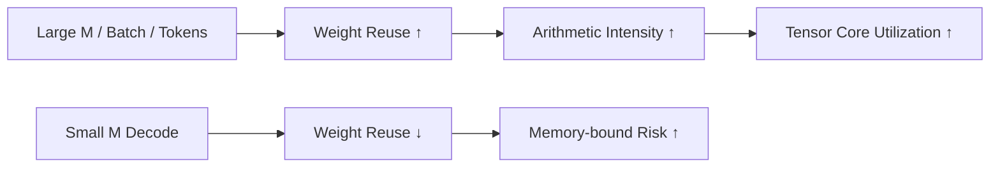
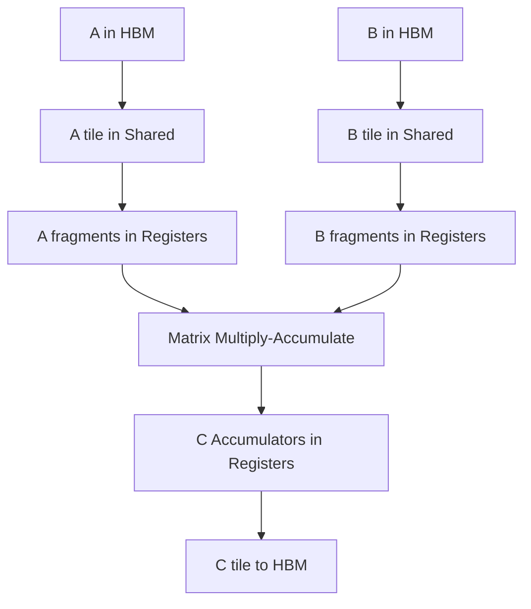
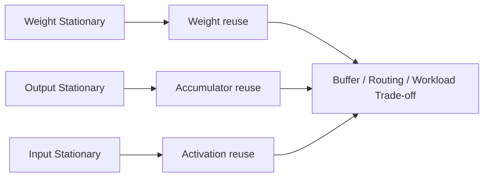
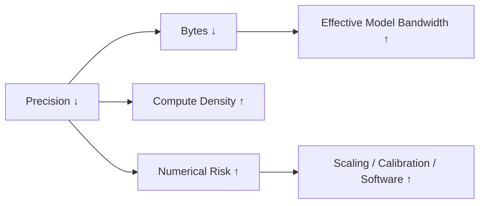
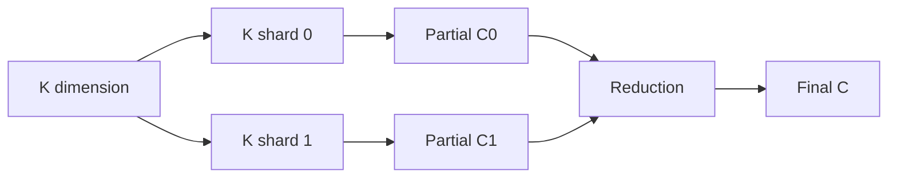

# 为什么 Matrix Multiplication 主导 AI

> 第一次阅读：Sections 1–8，理解模型为什么变成矩阵乘  
> 第二次阅读：Sections 9–17，理解GEMM怎样映射GPU  
> 深入阅读：Sections 18–25，判断shape、precision、bottleneck与战略价值

## 阅读前后

**I should understand before：**知道vector、matrix、Transformer和GPU的基本概念。  
**I should understand after：**能从linear layer、attention和batch推导matrix shapes；能计算GEMM operations与第一阶Arithmetic Intensity；能解释tiling、data reuse和为什么Tensor Core需要memory hierarchy；能判断何时“AI以矩阵乘为主”会失效。

## 1. 先告诉我问题：AI为什么需要重复做同一种运算

Neural network的核心是学习大量参数，使输入经过多层线性组合与非线性变换后产生有用表示。对单个output neuron：

[
y_j = sum_i x_i w_{ij} + b_j
]

一个output是dot product；多个outputs把weight vectors排在一起，就得到matrix multiplication：

[
Y = XW + b
]

当X包含多个tokens/samples，W包含整层weights，几百万个scalar multiply-add会组成规则、可批量执行的GEMM。Convolution可通过implicit GEMM或其他dataflow实现；Transformer的Q/K/V projections、attention score、attention-value product和MLP都大量落到matrix multiplication。

Matrix multiplication主导AI，不是数学家偏爱matrix，而是因为它同时满足三件事：

1. **表达能力：**learned linear transformations是模型building block。
2. **并行性：**大量output elements/partial products可同时算。
3. **数据复用：**同一A/B元素参与多个outputs，适合on-chip reuse与专用hardware。

## 2. 一句话直觉

GEMM把“许多神经元对许多输入做加权求和”变成规则三重循环；hardware通过tiling让每个从HBM搬来的元素在register/shared memory中被重复使用，从而把昂贵data movement摊到大量multiply-accumulate上。

## 3. 从vector到matrix

### Dot product

[
c = sum_{k=1}^{K} a_k b_k
]

K次multiply与约K次add。若FMA计为2 operations，约(2K) FLOPs。

### Matrix-vector（GEMV）

[
y = Wx
]

W的每一row与x做dot product。x可在rows间复用，但W通常每次都要读；低batch inference常接近GEMV，Arithmetic Intensity低。

### Matrix-matrix（GEMM）

[
C_{M	imes N}=A_{M	imes K}B_{K	imes N}
]

每个C元素是长度K的dot product，总operations约：

[
FLOPs approx 2MNK
]

A元素沿N方向复用，B元素沿M方向复用。M/N大时，reuse显著高于GEMV。

## 4. Transformer哪里在做matrix multiplication

设batch×sequence合并为token count (T)，hidden dimension (D)。

### Q/K/V projections

[
Q=XW_Q,quad K=XW_K,quad V=XW_V
]

常见shapes：

[
[T,D]	imes[D,D]
ightarrow[T,D]
]

### Attention score

每个head：

[
S=QK^T
]

[
[T,d_h]	imes[d_h,T]
ightarrow[T,T]
]

### Attention加权

[
O=softmax(S)V
]

[
[T,T]	imes[T,d_h]
ightarrow[T,d_h]
]

### MLP

[
H=phi(XW_1),quad Y=HW_2
]

通常intermediate dimension大于D，因此MLP GEMMs可能占大量compute。

[Primary Source] Transformer原始论文将attention写为 (softmax(QK^T/sqrt{d_k})V)，并用multi-head projections构建model。[Attention Is All You Need](https://proceedings.neurips.cc/paper/7181-attention-is-all-you-need.pdf)

## 5. 为什么batch/sequence改变hardware behavior

相同W下，X的rows越多，weights被更多tokens复用。Prefill或training通常有较大T，GEMM的M维更大；低batch decode每step每sequence新增一个token，M可能很小，operation更像GEMV或skinny GEMM。



因此同一model的Prefill和Decode需要不同hardware/serving策略。把Prefill benchmark的TFLOPS外推到single-request decode通常错误。

## 6. GEMM是三重循环，但naive实现很慢

```text
for m in M:
  for n in N:
    acc = 0
    for k in K:
      acc += A[m,k] * B[k,n]
    C[m,n] = acc
```

Naive版本若每次inner loop都从global memory读A/B，会重复搬相同元素。Arithmetic是规则的，真正挑战是memory traffic、layout与parallel reduction。

Blocked/tiled GEMM把M/N/K切块：



[Primary Source] NVIDIA CUTLASS文档将GEMM描述为层级tiling，映射到threadblocks、warps、Tensor Cores、shared memory和registers。[CUTLASS Efficient GEMM](https://docs.nvidia.com/cutlass/latest/media/docs/cpp/efficient_gemm.html)

## 7. Tiling为什么提高Arithmetic Intensity

假设计算一个(m_t	imes n_t) output tile，沿K方向处理(k_t)块。每stage读取：

- A tile：(m_tk_t) elements；
- B tile：(k_tn_t) elements；
- 执行约(2m_tn_tk_t) operations。

忽略C和overhead，stage Arithmetic Intensity约：

[
AI approx rac{2m_tn_tk_t}{s(m_tk_t+k_tn_t)}
=rac{2m_tn_t}{s(m_t+n_t)}
]

其中s为bytes/element。增大(m_t,n_t)提高reuse/AI，但需要更多shared memory和register accumulators，可能降低occupancy或增加spill。

**[Estimate]** 若(m_t=n_t=128)、FP16输入(s=2)，则上式约64 FLOP/byte；这是tile-level简化，不含C、cache、layout与实际transactions。

## 8. Dataflow：什么留在原地

Matrix accelerator常按“什么数据尽量不动”区分dataflow：

- **Output-stationary：**partial sums留在PE/register，A/B流过。
- **Weight-stationary：**weights留在本地，activations流过。
- **Input-stationary：**inputs留在本地，weights/partials流过。
- **Row-stationary/混合：**平衡多类reuse。



没有普遍最佳dataflow。Training、decode、convolution、attention和稀疏shape的reuse方向不同；buffer capacity和interconnect决定可实现性。

## 9. Systolic array：把data movement变成计算节奏

Systolic array让A/B values在邻近processing elements之间按节拍流动，每个PE执行MAC并传递data/partial。它减少全局broadcast与register file访问，适合规则matrix。

Google TPU论文描述第一代TPU核心为65,536个8-bit MAC的Matrix Multiply Unit和software-managed on-chip memory。[Primary Source: Google Research TPU paper](https://research.google/pubs/in-datacenter-performance-analysis-of-a-tensor-processing-unit/) Google Cloud文档也解释parameters从HBM进入MXU后在systolic array中传递。[TPU Architecture](https://docs.cloud.google.com/tpu/docs/system-architecture-tpu-vm?hl=en)

代价是：

- fill/drain latency；
- 小matrix或边缘tile利用率低；
- layout/schedule要求；
- irregular sparsity难以均匀；
- dataflow灵活性有限。

## 10. Matrix shape决定利用率

Hardware matrix instruction处理固定或有限tile shapes。若M/N/K不是tile倍数，edge需要mask/padding；若某维很小，许多lanes空闲。

Utilization简化为：

[
Tile Utilization approx rac{Useful Elements}{Allocated Tile Elements}
]

**[Estimate]** 若hardware以16×16 tile处理17×17 output，简单padding需4个tiles共1024 positions，useful 289，几何利用率约28%；真实library会选择更好tiling/并行方式，但说明shape敏感。

Grouped/batched GEMM可把多个小problems组织起来提高occupancy，但不同shapes、pointers和schedules增加dispatch复杂度。

## 11. Precision为什么同时影响compute和memory

将FP16降到FP8/FP4：

- 每element bytes下降；
- 同样register/shared/HBM可容纳更多elements；
- memory traffic下降；
- multiplier/accumulator datapath可提高density；
- energy/op可能下降。

但需要处理scale、range、rounding、accumulation和accuracy。常见是低precision multiply + 较高precision accumulate。Conversion、dequantization和scale metadata也有cost。



Peak低precision throughput只有在模型能保持quality且kernel真正使用对应path时有意义。

## 12. GEMM的memory ledger

对于(C=AB)，理想算法下：

- A：(MK) elements；
- B：(KN) elements；
- C：至少(MN) write，若beta不为0还需read；
- operations：约(2MNK)。

最理想AI（每个matrix仅从主memory读取一次）：

[
AI_{ideal}approxrac{2MNK}{s(MK+KN+MN)}
]

真实traffic更高，因为cache容量、tile重复、alignment、workspace、split-K reduction、epilogue与layout conversion。

当M很小（decode），(MK) activation相对小但(KN) weights仍大，weight read主导；当M大，weights被更多rows amortize。

## 13. Epilogue：GEMM之后为什么要fusion

GEMM output常接bias、activation、scale、residual或quantization。若每个op独立kernel：

```text
GEMM write C to HBM
→ read C for bias, write
→ read for activation, write
→ read for quantization, write
```

Fused epilogue在accumulator/register或on-chip tile上完成，减少HBM round trips。代价是register pressure、code specialization、compiler/library complexity和fusion boundary。

“GEMM优化”因此不仅是MMA mainloop，也包括producer loads、software pipeline、epilogue和threadblock scheduling。

## 14. Split-K、parallel reduction与small shapes

若M/N tiles不足以占满GPU，可沿K拆分，让多个blocks计算partial C，再reduce。它增加parallelism，却需要额外partial storage、atomic或reduction kernel。



Small-batch inference常用persistent kernels、grouped GEMM、kernel fusion或跨requests batching提高利用率；每种都在latency、fairness、complexity和memory之间trade。

## 15. 为什么AI不是100% GEMM

Transformer还包含：

- softmax与reduction；
- normalization；
- activation；
- embedding/gather/scatter；
- KV cache management；
- routing与All-to-All；
- sampling；
- optimizer；
- data movement与collective；
- control与CPU工作。

当GEMM变得极快，这些non-GEMM部分按Amdahl定律占比上升。Fusion和specialized units试图降低它们，但不规则memory/control很难全部矩阵化。

## 16. Training、Prefill、Decode对比

| 阶段 | 常见GEMM shape特征 | Reuse | 主要风险 |
|---|---|---|---|
| Training | M/N/K较大、forward/backward | 高 | compute、activation、collective |
| Prefill | 多prompt tokens形成较大M | 中高 | attention traffic、TTFT |
| Decode低batch | M很小、weights大 | 低 | HBM bandwidth/latency |
| Decode高batch | M增加 | 提高 | KV capacity、queueing |
| MoE | 多个expert小/不均匀GEMM | 分散 | grouped scheduling、All-to-All |
| Recommendation | embedding+MLP | 混合 | gather/memory capacity |

## 17. Roofline判断

GEMM是否compute-bound取决于实际AI与machine balance：

[
P le min(P_{peak}, B_{memory}	imes AI)
]

大square GEMM有高AI，容易compute-bound；skinny GEMM/GEMV低AI，容易memory-bound。Cache/shared/register改变观察boundary的bytes，因此可画hierarchical Roofline。

如果新GPU matrix peak提高2×、HBM只提高30%，ridge point上升；过去刚好compute-bound的shape可能转为memory-bound。**[Inference]** 这正是generation comparison需比较各resource增长率的原因。

## 18. 为什么不使用其他数学形式？

### 为什么不逐neuron计算？

逐个scalar无法摊薄instruction/control和memory overhead，也难利用vector/matrix hardware。Batching成matrix暴露parallelism与reuse。

### 为什么不把所有模型改成convolution？

Convolution具有locality和translation structure，但语言/sequence、global interactions与learned projections需要不同表达。Convolution本身也常lower为GEMM或specialized tensor operation。

### 为什么不全用sparse matrix？

Sparsity减少理论operations/bytes，但index metadata、irregular access、load balance和hardware support会吃掉收益。只有结构化、足够高、可预测的sparsity更容易变成real speedup。

### 为什么不把weights全部放on-chip SRAM？

现代模型远大于合理die SRAM；SRAM area/leakage昂贵。需要HBM、cache、tiling和distributed sharding。

## 19. Real architecture mapping

- **NVIDIA GPU + CUTLASS：**threadblock/warp/MMA层级tiling，shared/register reuse和software pipeline。
- **Google TPU MXU：**更明确的systolic matrix engine与software-managed memory，牺牲部分generality换efficiency。
- **AMD CDNA Matrix Cores：**在GPU compute units与HBM/Infinity fabric体系中加入matrix primitives，保持HPC/AI programmability。

三者共同点是：matrix compute并非独立unit，必须与data movement、buffer、precision和software mapping共同设计。

## 20. Engineers actually say

- **“This is a skinny GEMM.”** 某维很小，tile/weight reuse和parallelism差。
- **“We are padding-bound.”** 实际shape与tile不匹配，大量无效operations。
- **“The epilogue is fused.”** 避免C往返HBM，可能增加register/code复杂。
- **“K is split.”** 沿reduction维增加parallelism，需合并partials。
- **“The weights are stationary.”** dataflow让weights留在local storage复用。
- **“We cannot feed MMA.”** loads/layout/shared/register pipeline不足。
- **“This falls back to SIMT.”** shape/type/layout未走matrix instruction fast path。
- **“The batch is too small.”** weight reuse和可并行tiles不足。

## 21. 我应该追问工程师什么

1. Top GEMM shapes的M/N/K分布？
2. Training、prefill、decode分别占多少time？
3. Tensor/matrix instruction eligibility？
4. Padding和edge tile浪费？
5. Actual AI与HBM/L2/shared bytes？
6. Tiling选择受register还是shared限制？
7. Producer/consumer overlap多少？
8. Epilogue/fusion减少多少traffic？
9. Small/irregular shapes用grouped、persistent还是split-K？
10. Precision降低后accuracy、scale和accumulation？
11. Multi-GPU sharding如何改变local shapes？
12. Library/compiler coverage是否依赖固定model？

## 22. Common misconceptions

1. **Matrix multiplication只是大量scalar multiply。**真正性能来自层级data reuse、parallel schedule和memory pipeline。
2. **FLOPs固定就性能固定。**Shape、layout、precision、tile与traffic决定实现效率。
3. **Batch越大永远越好。**Throughput上升但latency、capacity和optimization dynamics可能恶化。
4. **Sparsity等比例加速。**Metadata、irregularity与hardware support决定real speedup。
5. **Tensor Core加速整个模型。**只有eligible matrix fraction受益，其他operations会成为新瓶颈。

## 23. Engineering → Strategy

| Engineering变化 | System效果 | Business效果 | Strategic implication |
|---|---|---|---|
| 更强matrix engine | peak AI compute上升 | 需更多HBM/fabric | 价值向data movement迁移 |
| 更低precision | compute+effective bandwidth提高 | 软件/accuracy验证成本 | quantization know-how与tooling |
| 更强tiling/fusion | 同silicon利用率提高 | 延长hardware价值 | library/compiler moat |
| Small GEMM优化 | decode latency/throughput提高 | inference TCO改善 | serving software与scheduler控制 |
| Systolic specialization | energy/area效率 | workload flexibility降低 | product-market fit决定moat |
| Structured sparsity | 跳过无效work | 模型训练约束 | ecosystem adoption是关键 |

## 24. Technical Diligence

- Claim的GEMM shapes是否代表客户？
- 比较的是dense、sparse、何precision？
- MAC/FMA operation counting口径？
- On-chip buffers与dataflow如何减少bytes？
- Sustained utilization而非peak？
- Edge shapes、small batch和fallback表现？
- Compiler/library是否自动映射？
- Accuracy和training stability？
- HBM、package、power和thermal代价？
- 创新是matrix array本身，还是mapping/schedule/software know-how？

## 25. Takeaways与开放问题

### 五个必须记住的takeaway

1. Neural layer把大量weighted sums自然组织成matrix multiplication。
2. GEMM价值来自规则parallelism和A/B/C的data reuse，不只是operations多。
3. Tiling在HBM、shared和register间交换reuse、occupancy与complexity。
4. Shape和batch决定matrix hardware能否吃满，decode与prefill差异巨大。
5. Matrix engine越快，data movement、non-GEMM ops和software越重要。

### 三个开放问题

1. 未来LLM architecture若增加state-space、retrieval或dynamic routing，GEMM占比会怎样变化？
2. Lower precision与sparsity继续提高后，真正稀缺的是arithmetic还是可复用data？
3. 对inference，最大moat会在matrix silicon、memory architecture还是continuous batching/kernel software？

## Sources

- [Primary Source] [Attention Is All You Need — NeurIPS](https://proceedings.neurips.cc/paper/7181-attention-is-all-you-need.pdf)
- [Primary Source] [NVIDIA CUTLASS — Efficient GEMM](https://docs.nvidia.com/cutlass/latest/media/docs/cpp/efficient_gemm.html)
- [Primary Source] [NVIDIA CUTLASS GEMM API](https://docs.nvidia.com/cutlass/latest/media/docs/cpp/gemm_api_3x.html)
- [Primary Source] [Google Research — In-Datacenter TPU](https://research.google/pubs/in-datacenter-performance-analysis-of-a-tensor-processing-unit/)
- [Primary Source] [Google Cloud TPU Architecture](https://docs.cloud.google.com/tpu/docs/system-architecture-tpu-vm?hl=en)
- [Primary Source] [Berkeley Roofline Model](https://www2.eecs.berkeley.edu/Pubs/TechRpts/2008/EECS-2008-134.pdf)


## 基础概念桥接

先区分 thread、warp、block、SM、occupancy、utilization、register、shared memory 和 HBM。线程很多不等于计算单元忙碌；shape、tiling、coalescing、fusion 与 kernel coverage 决定峰值能否兑现。低精度或稀疏还必须通过质量约束。

延伸基础：[工程术语手册](../31_glossary/engineering_terms_handbook.md)；[工程度量与不确定性](../02_engineering_foundations/engineering_measurement_uncertainty.md)；[数字逻辑、处理器与加速器](../02_engineering_foundations/digital_compute_accelerator_vocabulary.md)。


## 进阶工程术语桥接

本篇进一步需要掌握：微操作、流水线冒险、并行度、shape、动态批处理、尾延迟、数量级与单位经济性。阅读这些术语时，不只记中英文对应，还要补齐系统位置、正常路径、饱和或失败路径、直接 counter、端到端结果、产品状态和证据等级。若工程会议出现“已解决”“无开销”“已量产”，应立即追问 workload、boundary、configuration、status/date、failure mode 与 falsifier。

延伸阅读：[进阶工程术语手册](../31_glossary/advanced_engineering_terms_handbook.md)。
