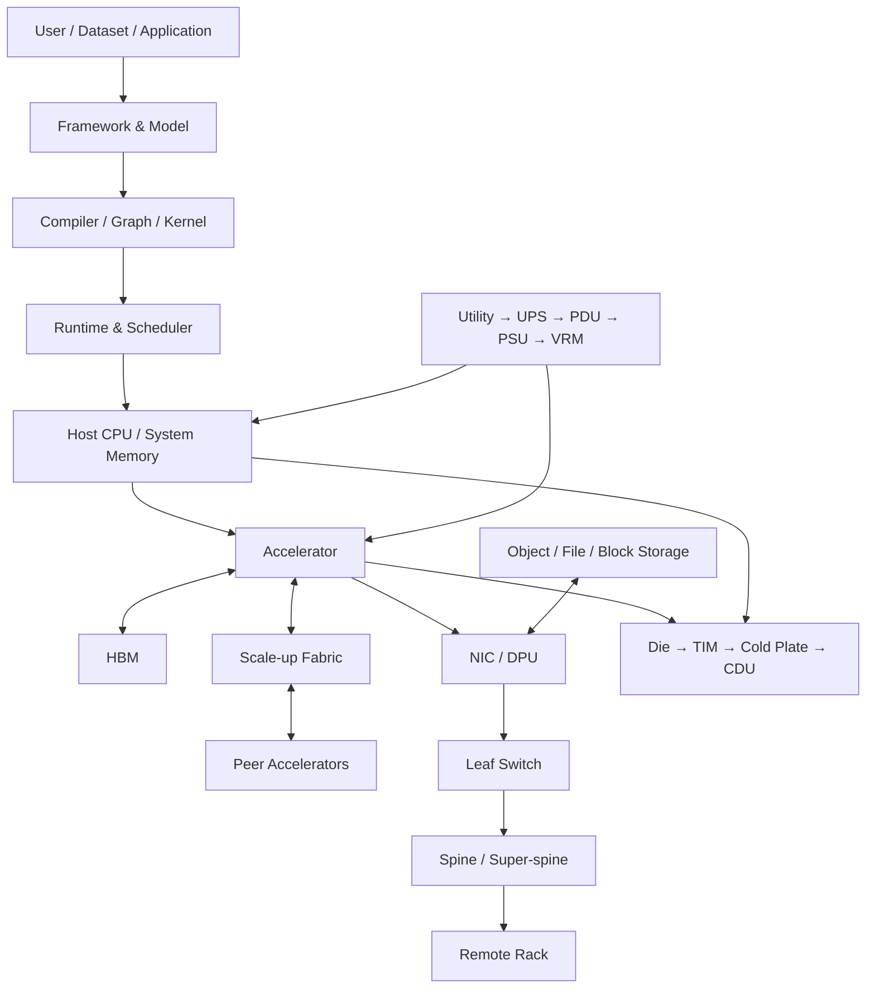
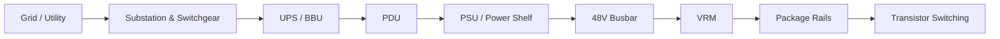
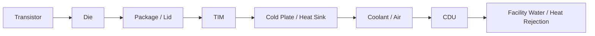
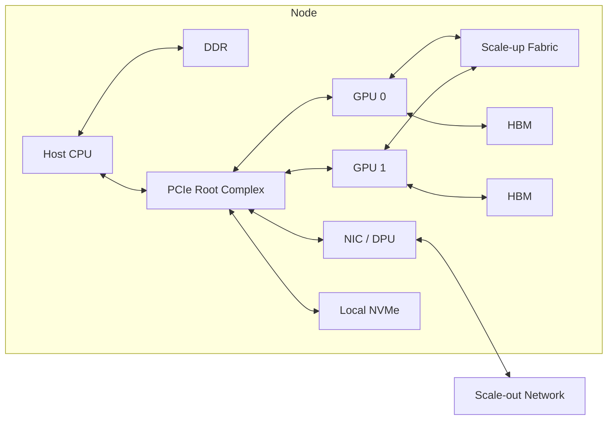
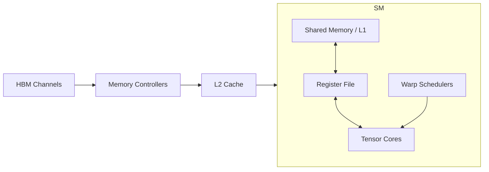
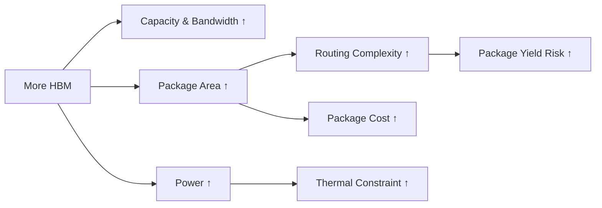
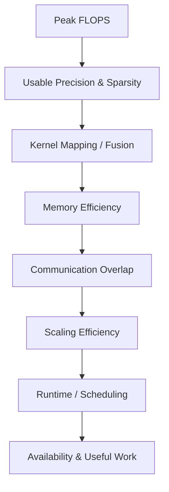
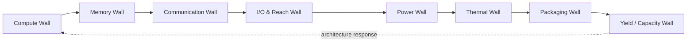

# 一个现代 AI 数据中心到底是怎么工作的？

> 第一次阅读：Sections 1–8，建立全栈地图  
> 第二次阅读：Sections 9–17，理解带宽、功率与系统设计  
> 深入阅读：Sections 18–26，训练产品判断与 Strategy Lens

## 阅读前后

**I should understand before：**知道 CPU、GPU、HBM、NIC、switch、optical transceiver 的基本产业含义即可。  
**I should understand after：**能够把一次 AI workload 拆成 compute、memory、communication、storage、power、thermal 与 software 路径；能够解释为什么“更快的 GPU”不是孤立芯片问题；能够从 rack diagram 找出可能的 bottleneck 和价值控制点。

## 1. 先告诉我为什么需要“AI 数据中心 architecture”

单颗 accelerator 可以有惊人的 peak FLOPS，却不能独立完成现代大模型的训练和大规模在线推理。原因不是“模型太大”这么简单，而是至少有四种资源不能同时无限扩张：

1. **参数、activation、optimizer state 和 KV cache 必须有地方保存。**最快的 SRAM 太贵、太占 die area；HBM 更大但更慢；跨 GPU 取数据更慢；远端 storage 又慢几个层级。
2. **一个 GPU 算不完时，工作必须切分。**切分会产生 All-Reduce、All-Gather、Reduce-Scatter、All-to-All 或 pipeline transfer。新增 GPU 同时新增通信与同步。
3. **电和热有物理路径。**utility power 必须经过 switchgear、UPS、PDU、PSU、busbar、VRM 到达 package；绝大多数电最终成为热，再经过 die、TIM、cold plate、coolant 与 CDU 离开。
4. **软件必须让所有资源同时有用。**kernel、compiler、runtime、communication library、scheduler、checkpoint 与故障恢复任何一层不匹配，昂贵 silicon 都会等待。

因此，现代 AI 数据中心不是“一大群 GPU”，而是一台跨越 silicon、package、board、rack、network、facility 与 software 的分布式计算机。它的设计目标不是让每个部件的 spec 最大，而是让目标 workload 在给定成本、功率与可靠性约束下获得最高的**有用吞吐量**。

## 2. 一句话直觉

把 AI 数据中心想成一座高度同步的工厂：Tensor Core 是加工设备，HBM 是设备旁的物料架，scale-up fabric 是车间内输送带，scale-out network 是厂区物流，storage 是仓库；power 是工厂供能，cooling 是排废系统，software 是生产计划。只增加加工设备而不增加物料、物流和供能，设备只会更频繁地停等。

## 3. 它在整个系统哪里？

这张图最重要的不是方框名称，而是边界。问“bandwidth 是多少”之前必须先问是哪条边：SM 到 L2、L2 到 HBM、GPU 到 GPU、NIC 到 switch，还是 storage 到 node？不同边界的带宽不能直接相加，也不能互相替代。

## 4. 三条流同时发生

### Follow the Data

训练样本从 storage 进入 host 或直接进入加速器可访问的 buffer；framework 把模型转为 graph，compiler 和 library 选择 kernel；kernel 把 tile 从 HBM 搬入 cache/shared memory/register，Tensor Core 计算后写回。跨设备并行时，结果经 scale-up 或 NIC 进入 peer GPU。一次 forward/backward 完成后，gradient 可能 All-Reduce，optimizer 更新参数，checkpoint 再写回 storage。

### Follow the Power

每一级都有 conversion loss、current limit、transient response 与 redundancy requirement。平均功率低于上限不代表安全：大量 GPU 同时进入高负载会造成 fast transient；供电网络必须在电压 droop、保护策略和成本之间平衡。

### Follow the Heat

热阻链中任何界面都可能主导 junction temperature。更强 cooling 可以允许更高持续功率，但会增加 facility complexity、泵功、漏液管理、维护与部署限制。Cooling 不是事后配套；当单 package 和 rack power density 上升时，它会直接决定可用 frequency、module spacing、cable routing 与 serviceability。

## 5. 从 workload 开始，而不是从 GPU 开始

“AI workload”并非单一负载。不同阶段对系统要求不同：

| Workload | 主要数据状态 | 常见主导约束 | 系统设计重点 |
|---|---|---|---|
| LLM training | 参数、activation、gradient、optimizer state | compute + HBM capacity/bandwidth + collective | 高利用率、同步效率、checkpoint |
| Inference prefill | 输入 token、weights、activation | 大 GEMM，常能提高 Arithmetic Intensity | compute throughput、batching |
| Inference decode | weights、KV cache、单步 token | HBM bandwidth/capacity、latency | memory traffic、tail latency |
| MoE | experts、routing state | capacity + All-to-All | topology、load balance、congestion |
| Recommendation | embedding tables、features | memory capacity、random access、network | tiering、cache、latency |
| HPC | problem-specific arrays | compute / memory / communication 均可能 | precision、numerics、collectives |

因此，同一套系统可以在 training benchmark 上表现优秀，却在低 batch decode 中利用率很低。硬件没有“绝对性能”；只有对特定 workload、软件和约束的匹配程度。

## 6. Accelerator node：芯片不是最小系统

典型 accelerator node 至少包含 host CPU、system memory、若干 accelerator、baseboard、scale-up interconnect、NIC/DPU、local NVMe、BMC、PSU 与 cooling。Host CPU 负责 control-plane、data preparation、OS 与部分 I/O；accelerator 执行大规模并行 kernel；NIC 把远端通信从 host memory path 中缩短或 offload；BMC 管理 power、thermal、firmware 和故障。

这里有两个容易忽略的事实。第一，PCIe 的用途和 scale-up fabric 不完全相同：host I/O、storage、NIC attachment 与紧耦合 GPU collective 的 latency/bandwidth/coherence requirement 不同。第二，local NVMe 通常不是 HBM 的“廉价替代”；它更适合 staging、cache、checkpoint 或 out-of-core 路径，访问粒度和 latency 相差巨大。

## 7. 芯片内部：为什么 FLOPS 需要数据供应

一个简化 GPU data path 是：

Tensor Core 只有在 operands 按正确布局及时进入 register 时才工作。搬运通常经历 HBM → memory controller → L2 → shared memory/L1 → register。Compiler 和 kernel 通过 tiling 提高数据复用，用 asynchronous copy 把搬运与计算 overlap。若 tile 太小，复用不足；太大则消耗 shared memory/register、降低 occupancy。增加 compute units 会抬高对 memory、scheduler、register file 和 on-chip network 的要求。

NVIDIA 的 Hopper tuning guide 明确把 coalesced access、减少 host-device transfer、控制 divergence 和 occupancy 列为关键 tuning 项，并描述 Tensor Memory Accelerator 通过异步数据搬运减少 SM instruction/register 占用。[Primary Source: NVIDIA Hopper Tuning Guide](https://docs.nvidia.com/cuda/hopper-tuning-guide/index.html)

## 8. HBM：不是容量附件，而是 package architecture

HBM 通过宽接口在相对较低 per-pin rate 下提供高带宽，但代价是多层 DRAM stack、TSV、microbump/hybrid bonding、interposer/RDL、memory PHY、controller、package assembly 与 thermal coupling。增加 HBM stack 可能同时引起：

“为什么不无限加 HBM？”至少有六个答案：package perimeter/area、routing escape、interposer/reticle constraints、PHY area、power delivery、thermal 与成本。即使物理上能放下，workload 也未必能利用额外带宽；memory controller、L2、address mapping 或 kernel access pattern 可能先成为瓶颈。

## 9. Scale-up：把多个 accelerator 当成更大的计算域

Scale-up 追求高 bandwidth、低 latency 和紧耦合 collective，常在 node、tray 或 rack 范围内连接 accelerator。它的价值不是“线更快”，而是改变软件可以接受的 parallelism granularity：Tensor Parallelism 每层都可能通信，对 latency 和同步敏感；扩大快速 domain 可减少跨较慢 scale-out network 的流量。

但 domain 越大，问题越复杂：

- switch radix、link count、cable/trace reach 与 routing 增加；
- collective algorithm 必须匹配 topology；
- fault domain 与 serviceability 扩大；
- 每个 GPU 可获得的 bisection bandwidth 未必随 GPU 数线性增加；
- fabric power 与 switch tray 占用挤压 compute density。

[Primary Source] NVIDIA 的 GB200 multi-node guide 把 GB200 NVL72 描述为 72-GPU NVLink domain，并公开 36 Grace CPU、72 Blackwell GPU 和 liquid-cooled rack-scale 构成；这些是产品架构事实，但该文档中的倍数性能仍应视为 **[Vendor Claim]**，必须回到 workload、precision、batch 和 baseline。[NVIDIA GB200 NVL72 Guide](https://docs.nvidia.com/multi-node-nvlink-systems/multi-node-tuning-guide/overview.html)

## 10. Scale-out：当故障、距离与规模成为现实

跨 node/rack 扩展通常依赖 NIC、switch 与 optical link。Packet network 支持更大规模、灵活 routing 和独立故障处理，但引入 serialization、queueing、congestion、protocol processing、retransmission/flow control 与 topology oversubscription。

一个训练 step 的 communication time 可用第一阶模型表示：

[
T_{comm} approx alpha cdot N_{messages} + rac{Bytes}{B_{effective}} + T_{contention}
]

其中 (alpha) 是每条消息的 fixed latency，(B_{effective}) 不是端口 label，而是考虑 protocol overhead、topology、concurrent flows 与 software efficiency 后的有效带宽。小消息更怕 latency；大 tensor 更怕带宽；incast 或 All-to-All 更容易受 contention 影响。

### 为什么不使用一个巨大 switch？

Radix、SerDes power、package I/O、switch fabric、buffer、yield、cabling 与 fault domain 都限制单芯片/单机箱规模。多级 Clos 用更多 hops 换取可扩展性与 path diversity。代价是布线、管理和 congestion control 更复杂。

### 为什么不让 packet 永远走最短路径？

最短路径可能同时被很多 flow 选择，形成 hot spot。Adaptive routing 可以绕开拥堵，但需要及时、稳定的 congestion signal；错误或滞后的反馈可能造成 oscillation、out-of-order 与新的不公平。

## 11. Storage：训练数据不是只读一次

训练需要反复读取数据、周期性写 checkpoint，并在 failure 后恢复；模型、dataset、tokenized shard、optimizer state 与日志的访问模式不同。Storage 路径可能包括 object store、parallel file system、block storage、local NVMe cache 和 host memory staging。

Storage bottleneck 往往具有 burst 特征：steady-state compute 看似不受影响，但所有 rank 同时 checkpoint 会造成同步停顿；job restart 又造成读取峰值。优化方法包括 staggered checkpoint、asynchronous write、local staging、compression 与 topology-aware placement，但每一种都会增加一致性、恢复逻辑或额外容量。

[Primary Source] NVIDIA 的 DGX B200 reference architecture 将 local NVMe 描述为 caching/staging，并指出 checkpoint 可达到 TB 级、同步写会阻塞 forward progress。[NVIDIA Storage Architecture](https://docs.nvidia.com/dgx-superpod/reference-architecture-scalable-infrastructure-b200/latest/storage-architecture.html)

## 12. Software stack：硬件峰值如何逐层漏损

Framework 决定 graph 与 tensor semantics；compiler 决定 fusion、layout 与 code generation；library 提供 GEMM、attention、collectives；runtime 负责 launch、stream、memory 与 synchronization；driver/firmware 管理设备；scheduler 决定 placement；orchestrator 处理 failure 与资源隔离。任一层的 fallback、shape mismatch、unfused op、excessive synchronization 或 load imbalance 都会制造 bubble。

这解释了为什么同一颗芯片在不同 software release 上 application performance 会变化，也解释了 software ecosystem 为什么可能构成 switching cost：客户依赖的不只是 API，而是经过验证的 kernel、debugging、profiling、distributed runtime 与 operational know-how。

## 13. Power delivery：平均功率不是唯一问题

[
P = VI,qquad P_{dynamic} approx alpha C V^2 f
]

降低电压对 dynamic power 很有效，但会压缩 timing margin；提高 frequency 近似线性增加 switching activity，对所需电压的影响又可能让功率超线性上升。大电流意味着 busbar、connector、VRM、package bump 与 on-die PDN 必须控制 resistive loss 与 voltage droop。

Rack power architecture还要处理 redundancy：N+1/2N 增加 capital cost 和闲置容量，却降低单点故障风险。Power capping 可在 facility envelope 内放更多设备，但如果所有 job 同时触顶，frequency throttling 会改变 latency 和 scaling consistency。

[Primary Source] OCP 的 Open Systems for AI whitepaper讨论了 48V DC busbar、rack-level BBU/PSU 位置变化与高功率 AI rack 的 liquid cooling interface，显示 power/cooling/supporting infrastructure 会与 accelerator density 直接竞争空间。[OCP Open Systems for AI](https://www.opencompute.org/documents/ocp-open-systems-for-ai-whitepaper-v1-0-0-final-pdf)

## 14. Thermal：冷却能力如何反向塑造 silicon

Junction temperature 可用简化 steady-state 模型理解：

[
T_j approx T_{coolant} + P cdot R_{	heta,total}
]

真实系统还需要考虑 spatial hotspot、transient、flow distribution、TIM aging 与 control loop。提高 coolant flow 可以降低某些热阻，却增加 pump power、pressure drop、vibration 和 leakage risk。降低 inlet temperature 也不是免费：facility chiller energy 和 condensation management 可能恶化。

当 cooling 成为 architecture input，芯片团队可能改变 voltage/frequency curve、die placement、HBM distance、package lid、power density、thermal sensor 与 throttling strategy；rack 团队则调整 tray spacing、manifold、quick disconnect、CDU 与 service procedure。

## 15. Control plane 与 reliability：不做数学也会损失吞吐

大集群中，单部件 failure rate 即使很低，乘以数万设备后也会频繁发生。训练任务若依赖所有 rank 同步，任一 straggler 或 failure 都可能让其余 GPU 等待。系统需要 health monitoring、ECC、link retry、checkpoint、job restart、spare capacity 与 topology-aware rescheduling。

可靠性不是与性能独立的“运维话题”：

- 更强 error correction 增加 latency、area 或 bandwidth overhead；
- 更频繁 checkpoint 消耗 storage/network；
- 更高 temperature 加速 aging；
- 更大 scale-up domain 可能扩大故障影响；
- aggressive power capping 可能制造 performance variability。

真正目标是 **goodput**：单位墙钟时间完成并可用的训练 token 或 inference request，而不是设备在无故障短窗口里的峰值。

## 16. Quantitative worked example：峰值为何不是结果

假设某 accelerator 的 peak compute 为 2 PFLOP/s，HBM bandwidth 为 4 TB/s。其 machine balance 为：

[
AI_{ridge} = rac{2{,}000 	ext{TFLOP/s}}{4 	ext{TB/s}}
= 500 	ext{FLOP/byte}
]

若 kernel 的 Arithmetic Intensity 只有 100 FLOP/byte，理想 Roofline 上限约为：

[
P le min(2 	ext{PFLOP/s}, 4 	ext{TB/s}	imes100 	ext{FLOP/byte})
= 0.4 	ext{PFLOP/s}
]

也就是即使忽略所有其他 overhead，也只能达到 peak 的 20%。**[Estimate]** 这是教学数字，不对应具体产品；真实分析必须使用实际 memory traffic、cache hit、precision 与持续带宽。Roofline 的原始工作把 attainable performance 表达为 peak compute 与 bandwidth × Arithmetic Intensity 的较小值。[Primary Source: Berkeley Roofline paper](https://www2.eecs.berkeley.edu/Pubs/TechRpts/2008/EECS-2008-134.pdf)

如果换代将 peak compute 提高 2×，bandwidth 只提高 25%，同一低-AI kernel 的理论上限只提高约 25%。Marketing 的“2× compute”并没有错，但它回答了错误的问题。

## 17. Bottleneck map：限制因素如何迁移

这不是固定历史顺序，而是 causal loop。更低 precision 提高 compute throughput，同时降低 memory bytes，但可能让 network collective 和 accuracy management 更突出；更多 HBM 缓解 capacity/bandwidth，却扩大 package 和 thermal 难题；更大 scale-up domain 降低部分 scale-out traffic，却增加 fabric power、cabling 与 fault-domain complexity；液冷释放 power envelope，又可能让 facility deployment 和 supply chain 成为新瓶颈。

## 18. Design Space：不是所有集群都应长得一样

| 方案 | 优化目标 | 主要代价 | 适用条件 |
|---|---|---|---|
| 少量高端 accelerator + 大 scale-up domain | 单 job 性能、紧耦合 parallelism | 高 package/rack/fabric 成本 | 大模型训练、低通信容忍 |
| 更多较小 accelerator + scale-out | 模块化、采购灵活、故障隔离 | 通信与软件复杂度 | 可切分 workload、成本敏感 |
| 高 HBM capacity node | 大模型/KV cache locality | package、功率、供应限制 | memory-bound / capacity-bound |
| CXL/host memory tiering | 容量池化与弹性 | latency、bandwidth、software placement | 冷数据、capacity 优先 |
| Air cooling | 部署与维护简单 | power density 上限 | 较低 rack density |
| Direct liquid cooling | 更高持续功率与密度 | facility、service、leak management | 高功率 rack-scale system |

Approaches 共存，因为客户优化的目标不同：time-to-train、tokens/s、tokens/J、tail latency、CapEx、deployment speed、availability 与 software risk 不可能同时最大化。

## 19. 为什么不……？

### 为什么不把所有数据都放进 HBM？

HBM capacity 受 package area、stack availability、cost、power 与 yield 约束；许多数据的 reuse 不足以证明占用最昂贵 memory tier 合理。Memory hierarchy 的本质是用软件/硬件管理 locality，把少量高价值 working set 放在更快层级。

### 为什么不直接增加更多 GPU？

如果 parallel fraction、collective time、load imbalance 或 serial section 不变，新增 GPU 的 marginal utilization 会下降。更大系统还提高 failure probability、network cost 与 scheduling fragmentation。应先问 strong scaling 还是 weak scaling，以及 communication/computation 能否 overlap。

### 为什么不把 scale-up 扩到整个数据中心？

低 latency、高 bandwidth fabric 的 electrical reach、port count、cabling、power、cost 与 fault semantics 难以无限扩大。Scale-out packet network 用更松耦合语义换规模、routing 和故障管理。二者不是命名差异，而是不同 engineering contract。

### 为什么不全部使用 optics？

Optics 解决 reach 和带宽密度的一部分问题，但 E/O conversion、laser、DSP、packaging、connector、test、repair 与 thermal 带来成本和功耗。短距离 copper 在成本、latency 与成熟度上仍可能更优；边界会随 SerDes rate、reach 与 integration 改变。

### 为什么不把功率上限设得更高？

从 grid interconnect、switchgear、UPS、PDU、busbar、connector、VRM、cooling 到噪声与许可，整条链都需要扩容。提高单 GPU power 还可能降低每瓦性能或压缩同一 rack 的 GPU 数；最优点取决于 facility 与 workload，而非 silicon 单点。

## 20. Engineers actually say

- **“The GPUs are starving.”** 通常指 operands 供应不足，需进一步区分 HBM、cache、interconnect、kernel launch 还是 dependency。
- **“We are network-bound.”** 可能是带宽、latency、congestion、topology、collective algorithm 或 overlap 失败，不能停在这句话。
- **“The rack is power-limited.”** 说明更多 IT gear 不能在当前 feed/redundancy/cooling envelope 下同时满载。
- **“We have bubbles.”** Pipeline 或执行资源出现空闲槽，来源可能是 data dependency、memory stall、barrier、imbalance 或 host launch。
- **“It scales to 1,024 GPUs.”** 只说明能运行，不说明 scaling efficiency、goodput 或成本合理。
- **“The fabric is non-blocking.”** 必须追问在哪个 traffic model、port configuration 和 failure state 下。

## 21. 听到这些话应该看什么 metric？

| 工程语言 | 首先看 | 然后排除 |
|---|---|---|
| bandwidth-bound | bytes/s、AI、cache hit、memory stall | access pattern、compression、controller |
| latency-sensitive | p50/p99、queue depth、message size | batching、software synchronization |
| oversubscribed | bisection bandwidth、uplink/downlink ratio | traffic locality、failure reroute |
| thermally constrained | junction temp、throttle time、coolant ΔT | sensor placement、flow imbalance |
| utilization low | SM active、Tensor Core active、stall reason | input pipeline、network、scheduler |
| checkpoint dominates | write bandwidth、pause time、frequency | staggering、async path、recovery SLA |

## 22. 我应该追问工程师什么？

1. 目标 workload 的 training/inference、batch、sequence length、parallelism 与 precision 是什么？
2. 报告的 performance 是 peak、kernel、node、cluster 还是 end-to-end goodput？
3. HBM capacity 与 sustained bandwidth 哪个先限制？实际 memory traffic 如何测量？
4. DP/TP/PP/EP 分别产生什么 collective？消息大小分布是什么？
5. Communication 能与 compute overlap 多少？不能 overlap 的 critical path 在哪里？
6. 正常和 failure state 下的 oversubscription/bisection bandwidth 是多少？
7. Scale-up domain 扩大后，故障和 service 的 blast radius 如何变化？
8. Rack 的 average、peak、transient power 与 redundancy assumption 是什么？
9. Cooling loop 的 inlet、flow、pressure、ΔT、throttling 与维护边界是什么？
10. 最常见的 straggler/failure 是 silicon、network、storage、software 还是 facility？
11. 一次 software release 能改变多少 utilization？哪些 kernel 仍 fallback？
12. 哪个供应商或 capacity 是 roadmap 的最长 lead-time item？

## 23. Common misconceptions

**误区一：数据中心性能等于 GPU 数 × 单 GPU FLOPS。**这忽略 memory、communication、serial fraction、failure 与 utilization。

**误区二：bandwidth 越高，latency 一定越低。**Bandwidth 是单位时间吞吐，latency 是单次等待；可通过更多 lanes 提高 bandwidth 而不显著降低 fixed latency，queueing 还可能让 latency 上升。

**误区三：液冷只影响 facilities vendor。**Cooling envelope 会改变 silicon power point、package、rack density、service model 与客户部署速度，因而影响 accelerator 可售市场。

**误区四：更多 HBM 总能解决 decode。**若 KV/weights access、scheduler、batching、memory controller 或 software path 不匹配，额外 capacity/bandwidth 不一定转化为 tokens/s；成本却确定增加。

**误区五：网络“无损”意味着没有 congestion。**避免 packet drop 不等于没有 queueing、head-of-line blocking 或 pause propagation；lossless design 本身需要精细 traffic engineering。

## 24. Engineering → Strategy

| Engineering change | System effect | Product effect | Business effect | Strategic implication |
|---|---|---|---|---|
| Compute throughput 增长快于 HBM | memory-bound workload 占比上升 | 更强调 cache/HBM/software | HBM 与 packaging BOM 上升 | 价值向 memory/package capacity 迁移 |
| 扩大 scale-up domain | 更多紧耦合 parallelism 留在高速域 | rack-scale platform | 更高整机 ASP 与验证复杂度 | 平台控制、switching cost 增强 |
| SerDes rate 提高、reach 下降 | retimer/optics 更靠近 compute | I/O power 与 cable 变化 | optics content 增加 | optical/PHY/IP 控制点上升 |
| 单 package power 上升 | liquid cooling 与高功率 rack | deployment qualification 更难 | facility retrofit 成本上升 | 可部署 capacity 成为瓶颈 |
| 软件改善 overlap/fusion | silicon utilization 提高 | 同硬件性能提升 | 延长平台生命、降低 TCO | ecosystem moat 可能强于单代 spec |
| 大规模故障更频繁 | checkpoint/resilience overhead | goodput 低于 benchmark | 运营 know-how 重要 | hyperscaler integration 能力获值 |

## 25. Technical Diligence：看一家 AI infrastructure 公司

- **Physics**：功率、热、信号与 reach claim 是否符合量级？测试边界是什么？
- **Architecture**：创新位于 compute、memory、data movement、network、package 还是 software？是否只是把成本移到系统别处？
- **Silicon**：有 tape-out silicon、FPGA emulation 还是 simulation？频率、面积、power、yield 数据处于什么成熟度？
- **Package**：HBM、substrate、interposer、assembly、test 与 cooling 是否有量产路径？
- **Software**：真实模型能否运行？需要改 framework、compiler、kernel、runtime 或 customer code 多少？
- **Manufacturing**：关键供应商、lead time、qualification、second source 与 capacity reservation 是什么？
- **Economics**：比较的是 chip、node、rack 还是 complete cluster 的 $/useful-token 与 energy/useful-token？
- **Competition**：incumbent 能否通过下一代产品、软件优化或捆绑复制结果？
- **Moat**：专利之外是否存在 physical design、firmware、validation、manufacturing recipe、customer integration 与 dataset know-how？
- **Roadmap**：如果 HBM、SerDes、process 或 cooling assumption 延迟一代，产品价值是否仍成立？

## 26. 五个必须记住的 takeaway

1. 现代 AI 数据中心是一台跨 silicon 到 facility 的分布式计算机，不是一堆独立 GPU。
2. 有用性能取决于 compute、memory、communication、software、power、thermal 与 reliability 的共同最小值。
3. 数据移动往往比 arithmetic 更决定 energy、latency 与系统结构。
4. 每次提升都会移动 bottleneck；“新瓶颈在哪里”比“哪项 spec 最大”更重要。
5. 战略价值通常流向最难扩容、最难验证、最强 ecosystem 或最接近系统控制面的环节。

## 三个真正值得继续思考的问题

1. 当 rack-scale domain 继续扩大，scale-up 的经济边界最终由哪一项决定：SerDes/optics、switch power、software parallelism、fault domain，还是 serviceability？
2. 如果未来 memory capacity 和 bandwidth 继续昂贵，价值会更多流向 HBM/package，还是流向减少数据移动的 architecture 与 software？
3. 当 facility power 成为硬约束，竞争指标会不会从 peak FLOPS 转向 tokens/J、tokens/rack 与可部署 MW 的 time-to-capacity？

## Sources

- [Primary Source] [NVIDIA Hopper Tuning Guide](https://docs.nvidia.com/cuda/hopper-tuning-guide/index.html)
- [Primary Source / Vendor architecture documentation] [NVIDIA GB200 Multi-Node Tuning Guide](https://docs.nvidia.com/multi-node-nvlink-systems/multi-node-tuning-guide/overview.html)
- [Primary Source / Vendor reference architecture] [NVIDIA DGX B200 Storage Architecture](https://docs.nvidia.com/dgx-superpod/reference-architecture-scalable-infrastructure-b200/latest/storage-architecture.html)
- [Primary Source] [Open Compute Project — Open Systems for AI Whitepaper](https://www.opencompute.org/documents/ocp-open-systems-for-ai-whitepaper-v1-0-0-final-pdf)
- [Primary Source] [Williams, Waterman, Patterson — Roofline Model](https://www2.eecs.berkeley.edu/Pubs/TechRpts/2008/EECS-2008-134.pdf)

## 基础概念桥接

先把 rack 当成计算机：compute、memory、network、power、cooling、firmware、controls 与 operations 共同决定 useful work。nameplate 数量不等于 commissioned capacity；安装、验收、故障恢复、spares 与维护窗口必须进入 TCO。

延伸基础：[工程术语手册](../31_glossary/engineering_terms_handbook.md)；[工程度量与不确定性](../02_engineering_foundations/engineering_measurement_uncertainty.md)；[数字逻辑、处理器与加速器](../02_engineering_foundations/digital_compute_accelerator_vocabulary.md)。

## 进阶工程术语桥接

本篇进一步需要掌握：graph lowering、autotuning、ABI、firmware、observability、canary、fault injection 与 blast radius。阅读这些术语时，不只记中英文对应，还要补齐系统位置、正常路径、饱和或失败路径、直接 counter、端到端结果、产品状态和证据等级。若工程会议出现“已解决”“无开销”“已量产”，应立即追问 workload、boundary、configuration、status/date、failure mode 与 falsifier。

延伸阅读：[进阶工程术语手册](../31_glossary/advanced_engineering_terms_handbook.md)。
