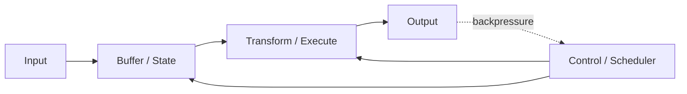
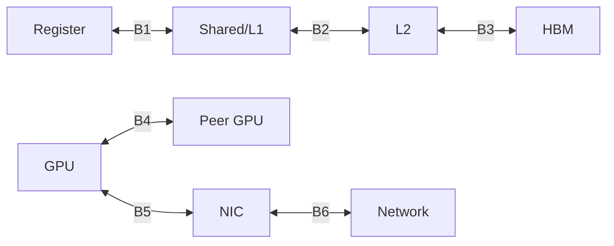
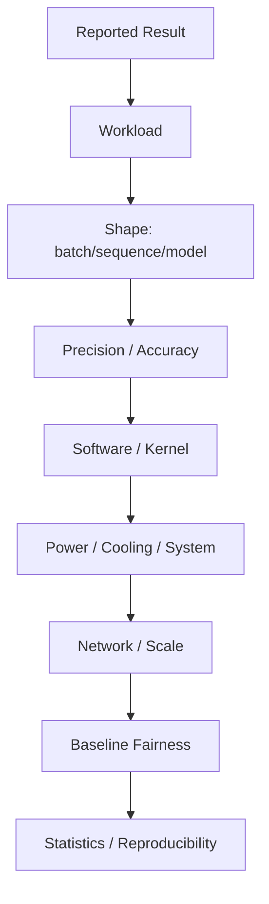
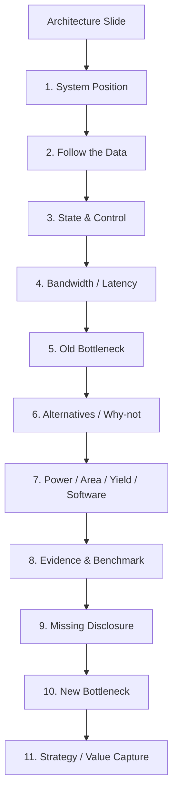

# 如何读懂一场 Hot Chips 芯片架构演讲

> 第一次阅读：Sections 1–7，学会不被陌生 block 吓住  
> 第二次阅读：Sections 8–16，逐类解码 slide  
> 深入阅读：Sections 17–24，建立 benchmark、manufacturing 与 Strategy Lens

## 1. 先告诉我问题：为什么听懂每个词仍可能没看懂演讲

芯片架构演讲通常只有约半小时，presenter 需要在有限 slides 中同时讲 workload、产品定位、block diagram、process、memory、interconnect、power 和 benchmark。每张图都经过高度压缩，而且厂商自然会选择最能表现产品的 framing。

困难不在于术语多，而在于 slide 经常省略连接条件：

- 方框画了 compute unit，却没画 data 如何供应；
- 标了 peak throughput，却没说 precision、sparsity、frequency 和 utilization；
- 画了 memory bandwidth，却没说 sustained、capacity 与 access pattern；
- 画了 scale-up topology，却没说 collective、oversubscription 与 failure；
- 画了 package，却没说 yield、power delivery、thermal 和 assembly；
- 展示 benchmark，却没说 baseline tuning、software、batch 和 system boundary；
- 说“shipping”，却没说 volume、customer deployment 和 roadmap dependency。

真正的阅读能力不是当场知道所有答案，而是迅速把陌生信息放进一个**可质疑的因果模型**。

## 2. 一句话直觉

读 architecture slide 时，不要按 presenter 的 bullet 顺序记忆；把每一页重新翻译成：

```text
Old Bottleneck
→ Physical / Architectural Constraint
→ New Block or Interface
→ Claimed Improvement
→ Paid Cost
→ Missing Disclosure
→ New Bottleneck
```

## 3. 会前：建立最低 prerequisite，而不是读完整教材

演讲前 30 分钟做三件事：

1. **确定产品 boundary。**CPU、GPU、accelerator、switch、NIC、memory、optics、package 还是 rack？
2. **找上一代。**上一代最大 bottleneck、公开 block diagram、关键 spec 与 software contract 是什么？
3. **列五项先验。**Workload、dataflow、memory hierarchy、I/O/topology、power/package。

会前模板：

| 项目 | 一句话记录 |
|---|---|
| Target workload | 训练、推理、HPC、networking？shape/precision？ |
| Previous bottleneck | compute、memory、network、power、software？ |
| State | 参数、cache、queue、routing table 存在哪里？ |
| Data path | 主要 bytes 从哪里到哪里？ |
| Control path | 谁调度、谁同步、谁处理 exception？ |
| Manufacturing | process、die count、package、HBM？ |
| Missing question | 最想知道但上一代没披露什么？ |

不要在会前背所有 acronym。目标是让新信息有“挂钩点”。

## 4. 开场定位 slide：先找 presenter 在优化什么

Product positioning 常用“AI era”“breakthrough”“world’s fastest”等语言。先忽略形容词，提取：

- 目标客户和 workload；
- system boundary；
- 比较 baseline；
- 优化函数；
- constraints。

如果 presenter 说“为 generative AI inference 设计”，追问是 prefill 还是 decode、batch、sequence、model size、latency SLA。如果说“rack-scale”，追问 rack 是否是 scale-up domain，还是只是机械集合。

### 读出隐含战略

定位 slide 还在定义竞争边界。把比较从 chip 改成 rack，可能表示公司在 scale-up switch、CPU、network、cooling 与 software 上拥有更多控制；把比较从 performance 改成 TCO，可能表示 silicon peak 并非唯一优势，或需要把高 ASP 合理化。

## 5. Architecture block diagram：用六个问题拆每个 block

对每个方框问：

1. **Function：**它完成什么 transformation？
2. **State：**它保存什么，容量多大，生命周期多长？
3. **Input/Output：**数据宽度、方向、频率与 access pattern？
4. **Control：**谁发指令、仲裁、处理 backpressure？
5. **Reason：**删掉它会发生什么？上一代为什么没有/不够？
6. **Cost：**area、power、latency、routing、verification、software？



陌生 block 的名字不重要。先判断它更像 compute、storage、movement、control、conversion 还是 protection。然后沿 arrows 找 producer/consumer。

### 图上没有箭头怎么办？

依据相邻 blocks 提出假设，但标记 **[Inference]**。不要把图形位置当物理 floorplan；marketing block diagram 往往按叙事布局，不按 die layout。等待 die photo/floorplan 或 technical paper 验证。

## 6. Frontend、backend、memory：看 CPU/GPU 图的通用方法

对于 CPU：

```text
Fetch → Decode → Rename → Dispatch → Issue → Execute → Retire
                     ↘ Register / Load-Store / Cache
```

Frontend 宽度增加若 branch prediction、instruction cache 或 backend 不配合，会产生 supply imbalance；backend units 增加若 register file、scheduler、load/store 与 memory 不配合，会闲置。

对于 GPU：

```text
Command/Work Distributor
→ SM / Compute Array
→ Warp Scheduler
→ Register / Shared Memory
→ Tensor Core / ALU
↔ L2 / Memory Controller / HBM
```

看到“更多 Tensor Cores”，立即找 register、shared memory、L2、HBM 和 scheduler 是否同步变化。若没有披露，记录为 missing disclosure，而不是假设保持不变。

## 7. Bandwidth number：先画 boundary

“8 TB/s”只有在知道端点后才有含义：



检查：

- aggregate 还是 per direction？
- raw line rate 还是 payload？
- peak 还是 sustained？
- read、write 还是 bidirectional sum？
- sparse/compressed data 是否按“等效”口径？
- 所有 ports 是否可同时达到？
- topology/bisection 是否支持？
- 哪个 workload 能产生足够 parallel request？

### 为什么 bandwidth 增加不自动降低 latency？

增加 lanes 或并行 channels 提高 aggregate throughput，但一次 request 的 fixed latency、serialization、queueing 和 dependency 可能不变。对于小 message 或 pointer chasing，bandwidth 未饱和也会慢。

## 8. Compute number：拆 precision、稀疏、频率与利用率

看到 FLOPS/TOPS，至少记：

[
Peak = Units 	imes Ops/cycle 	imes Frequency
]

然后问：

- FP64/FP32/TF32/BF16/FP16/FP8/FP4/INT8/INT4？
- dense 还是 structured sparsity？
- multiply-add 计 1 还是 2 operations？
- boost、typical 还是 guaranteed clock？
- 单 die、单 package、board、rack？
- accumulation precision？
- 哪些 shapes/layouts 能调用该 datapath？
- accuracy 是否保持？
- software 是否已支持？

Peak 增长可能来自降低 precision、增加 units、提高 frequency 或把两个 dies 作为一颗产品。它们对 area、power、memory bytes、software 和 workload coverage 的意义不同。

### “2× AI performance”如何翻译

先写成假设链：

```text
Peak path 2×
→ workload 可用该 precision/shape？
→ memory 能供应？
→ communication 不主导？
→ power/frequency 可持续？
→ software 已映射？
→ end-to-end 才可能接近 2×
```

## 9. Memory slide：同时看 capacity、bandwidth、latency 与 locality

Memory slide 常强调 HBM generation、capacity 和 TB/s。不要孤立看数字：

| 问题 | 意义 |
|---|---|
| 每 package 几个 stack、每 stack capacity？ | package area、yield 与供应 |
| controller/channel 数量？ | 并行度与 sustained efficiency |
| L2/cache 是否变化？ | HBM traffic 与 locality |
| ECC/repair/availability overhead？ | usable capacity/bandwidth |
| access pattern？ | row/bank efficiency、over-fetch |
| thermal placement？ | HBM temperature 与 compute coupling |
| capacity 是否支持目标 model/KV？ | 是否仍需 sharding/offload |

看到 capacity 增长快于 bandwidth，可能表示 capacity-bound workload受益更大，而 bandwidth per byte/compute 相对下降；看到 compute 增长快于 bandwidth，memory-bound 风险上升。

## 10. Interconnect/topology slide：从 parallelism 反推 traffic

不要先被 colorful topology 吸引。先问：

```text
Parallelism strategy
→ Collective type
→ Message size/frequency
→ Traffic matrix
→ Required bisection/latency
→ Topology
```

检查图上：

- fully connected、switched、ring、mesh、Clos？
- 每 accelerator links 数与每 link rate？
- switch radix 与 stages？
- scale-up/scale-out boundary？
- oversubscription？
- normal 与 failure path？
- collective acceleration 在 NIC/switch/endpoint 哪层？
- cable 是 PCB、copper cable 还是 optics？

“大 domain”不等于每对设备都获得 full bandwidth。Aggregate fabric bandwidth 也不等于 per-GPU bisection bandwidth。

## 11. Die photo / floorplan：看面积预算和物理约束

Die photo 比 block diagram更接近物理现实，但也可能未标 scale 或经过简化。观察：

- 重复 compute arrays 占比；
- cache/register/memory controller；
- PHY 沿 die edge 的位置；
- central fabric/NoC；
- dark/analog/IO regions；
- chiplet seam；
- power/clock distribution clues；
- die size 与 reticle proximity（若披露）。

### 可以推断什么？

大 cache 占比说明 locality 被认为重要；大量 edge PHY 表明 I/O 是面积/周长预算；两个对称 dies 暗示 die-to-die fabric 与 software abstraction 是关键。以上只能写 **[Inference]**，需要 technical source验证。

### 不能推断什么？

仅凭图片不能可靠计算 transistor count、exact area、frequency、yield 或 utilization。未标尺寸的比例图甚至不保证按 scale。

## 12. Package diagram：芯片之外的 architecture

Package slide 要追踪：

```text
Compute die/chiplets
↔ Die-to-die PHY
↔ Interposer / Bridge / RDL
↔ HBM
↔ Substrate
↔ Board
↔ VRM / Cooling
```

问：

- 2.5D、3D、bridge 还是 organic substrate？
- interconnect pitch、reach 与 bandwidth density？
- HBM stack count 与 placement？
- known-good-die 与 test？
- interposer/RDL/reticle constraint？
- package size、warpage、routing layers？
- power delivery 路径？
- thermal path 和 hotspots？
- assembly/rework 与 yield？

“Chiplet improves yield”必须接着问 package yield、interface area/power、test 与 inventory matching。Package innovation可能把价值从 wafer fabrication迁移到 advanced assembly、substrate、bonding、test 与 thermal solution。

## 13. Power slide：不要只抄 TDP

检查：

- TDP/TGP/board/rack 哪个 boundary？
- nominal、maximum、configurable cap？
- workload mix 下持续功率？
- idle power？
- peak/transient？
- performance at equal power？
- power delivery voltage/current？
- air/liquid cooling condition？
- throttling behavior？

如果性能提升与功率同步上升，应比较 performance/W、performance/rack 与 facility constraint；如果 vendor 给 energy efficiency 倍数，追问分母是否包含 HBM、NIC、switch、cooling 与 host。

## 14. Thermal/cooling slide：看它是否已经成为 architecture input

Liquid-cooled 不是产品特征标签。需要看 cold plate覆盖哪些 components、coolant inlet、flow、pressure drop、ΔT、CDU、manifold、quick disconnect、leak management、service procedure 和 facility compatibility。

[Primary Source] OCP Open Systems for AI whitepaper把 cold plate、rack manifold、UQD、CDU test、fluid 与 leak detection列为系统级议题，说明 cooling 已经跨越 chip 到 facility。[OCP Whitepaper](https://www.opencompute.org/documents/ocp-open-systems-for-ai-whitepaper-v1-0-0-final-pdf)

当产品只能在高端液冷环境达到 advertised power/performance，其可部署市场和 time-to-revenue 会受 facility readiness限制。

## 15. Benchmark slide：九层拆解



逐项问：

1. workload 是否代表客户？
2. 输入 shape 是否偏向新架构？
3. precision 与 accuracy 是否等价？
4. 新产品和 baseline 是否使用同样优化？
5. 包含哪些 preprocessing/postprocessing？
6. 功率和 cooling 是否可比？
7. network、storage、host 是否相同？
8. 报 best、median、average 还是 p99？
9. 可否复现，哪些配置未披露？

Hot Chips presentation通常是及时的 product-focused technical material，而非完整同行评审论文；官方说明 slides 会进入 proceedings，presenter 不一定提交完整论文。因此读者应把 slides 当重要 primary material，同时主动补齐实验方法。[Primary Source: Hot Chips 2025 About](https://hc2025.hotchips.org/about/)

## 16. Generation comparison：用 bottleneck evolution，不用 spec table

正确记录格式：

| 上一代 bottleneck | 新 architecture response | 改善证据 | 代价 | 新 bottleneck |
|---|---|---|---|---|
| HBM traffic | cache/TMA/fusion | sustained workload | area/software | register/on-chip bandwidth |
| Model capacity | 更多 HBM/chiplets | 可放更大模型 | package/power/yield | cooling/supply |
| TP communication | 更大 scale-up | scaling curve | fabric/cabling | fault domain |
| SerDes reach | retimer/optics | BER/reach | power/latency/cost | optical packaging |
| Compute density | lower precision | equal-quality throughput | numerics/software | memory/network |

若 presenter 只说“generation A → B 3×”，你应寻找中间 causal chain。找不到就记为 disclosure gap。

## 17. Product status：时间语言必须精确

建立状态词纪律：

- **Announced：**正式发布，但不等于客户拿到。
- **Sampling：**样品进入部分客户/伙伴；规模和配置可能有限。
- **Production：**进入量产流程，不自动等于大量部署。
- **Shipping：**开始出货；需问 volume 与 SKU。
- **Deployed：**客户系统上线；需问规模和 workload。
- **Roadmap：**公司计划，仍有 execution risk。
- **Rumored：**非正式信息，不写成事实。

同时记录 `last_verified` 和 `source_date`。Roadmap slide 价值在于显示 dependency 与方向，不是保证日期。

## 18. “What did they NOT tell us?”

对每场演讲维护缺失清单：

- die size、yield、frequency bin？
- package yield、substrate/interposer？
- sustained power、thermals、idle？
- memory latency/sustained bandwidth？
- scale-out topology与 failure state？
- software availability、migration effort？
- benchmark raw data、baseline tuning？
- production volume、customer validation？
- cost/BOM/TCO boundary？
- reliability、repair、field replaceability？
- 哪个 block 最难 timing closure？
- 哪个供应链环节没有 second source？

没有披露不等于一定差。正确表达是：“当前公开资料不足，因而无法判断 X；若 X 低于某阈值，claim Y 的可迁移性会受限。”

## 19. 实时听讲笔记模板

不要逐字抄 slide。每页只记录：

```text
Slide claim:
Problem being solved:
Architecture response:
Key data path:
Optimization target:
Paid cost:
Evidence:
Missing:
New bottleneck:
Question:
Source status:
```

用 `?` 标 unknown，用 `I` 标 inference，用 `V` 标 vendor claim，用 `P` 标 primary specification。会后先处理 unknown concepts，再写 summary。

## 20. 会后 60 分钟处理流程

1. **重建 narrative：**按 old bottleneck → response → new bottleneck 排序。
2. **提取 concepts：**只记录理解演讲必要的新概念。
3. **判断 prerequisites：**链接已有文章，不重复定义。
4. **核对 primary sources：**architecture paper、datasheet、standard、conference slides。
5. **分离事实和 claim：**规格、状态、benchmark、推断分别标记。
6. **更新 knowledge graph：**solves、connected_to、tradeoffs、strategic implications。
7. **更新 product case：**上一代、新一代、未同比增长指标。
8. **建立 open questions：**不确定性转为可验证问题。
9. **生成 engineer questions：**下一次与设计团队沟通使用。
10. **写 Strategy Lens：**value capture、supply、moat、roadmap risk。

## 21. 三类 slide 的反向推理练习

### Case A：Compute 2×，HBM bandwidth +30%

推测 compute-bound大 GEMM更受益；低-AI workload可能只接近 bandwidth 增幅。继续问 cache、capacity、precision、kernel、power与 effective bandwidth。

### Case B：HBM stack 数不变，bandwidth 8→12 TB/s

可能来自新 HBM generation/per-pin rate、更多有效 channels、PHY/controller 或更高 sustained efficiency。代价可能是 signal/power/thermal。不能仅凭数字断言具体实现。

### Case C：Scale-up domain 8→72 GPUs

可能降低跨 scale-out traffic并支持更大 TP/EP，但需要 switch topology、cabling、collective software、power/cooling 与 fault management。继续问 per-GPU bandwidth、bisection、latency、oversubscription、failure reroute 和 service。

## 22. 我应该在 Q&A 问什么？

好的问题不要求对方泄露机密，而是检验 causal model：

1. 上一代哪个 measured bottleneck直接驱动了这个 block？
2. 新 datapath 的 sustained utilization 在代表性 workload中是多少？
3. Compute、HBM与interconnect增长率不同后，哪个 workload最先成为新瓶颈？
4. 该 benchmark 对 batch/sequence/precision 的敏感度？
5. Scale-up domain 扩大后 collective latency 和 failure blast radius 如何变化？
6. Package 的主要 constraint 是 area、routing、power、thermal 还是 assembly yield？
7. Software 需要哪些新 kernel/compiler/runtime 支持，何时 production-ready？
8. 等功率/等成本/等rack footprint比较结果如何？
9. 当前公开结果中哪个指标最容易被误读？
10. 如果一个关键供应链假设延迟一年，architecture 有什么 fallback？

## 23. Common misconceptions

**误区一：方框越大，面积越大。**Marketing block diagram通常不按 scale。

**误区二：箭头更粗就代表更高 sustained bandwidth。**可能只是视觉强调；必须找数字、方向和条件。

**误区三：die photo 能证明所有 block。**标注可能简化，图片不能直接证明频率、yield 或 utilization。

**误区四：conference slide 等同同行评审论文。**它是及时且重要的 primary presentation material，但方法和细节可能不足，需要交叉验证。

**误区五：没披露就是坏消息。**未披露只意味着 uncertainty；应写出判断所需 evidence 和 threshold。

**误区六：更低 precision 性能可直接外推。**必须验证模型 accuracy、accumulation、software支持和 memory footprint。

## 24. Engineering → Strategy

| Slide signal | Engineering interpretation | Business implication | Diligence |
|---|---|---|---|
| 从 chip 转向 rack narrative | 系统 bottleneck跨出 silicon | 更高平台 ASP、集成与lock-in | 哪些部件自研，客户必须整体购买吗？ |
| HBM/package显著扩大 | memory wall主导 | BOM、HBM/package capacity价值上升 | yield、second source、allocation？ |
| Scale-up domain扩大 | 通信进入关键路径 | switch/cable/software成为控制点 | 开放协议还是封闭ecosystem？ |
| Liquid cooling为必需 | power density成为硬约束 | 部署速度与facility retrofit风险 | 客户站点覆盖和qualification多久？ |
| Benchmark依赖新precision | 专用datapath贡献大 | 软件迁移和accuracy风险 | 客户模型可用比例？ |
| 强调software stack | utilization来自co-design | ecosystem moat和switching cost | 优势能否跨workload持续？ |
| Roadmap同时依赖新process/HBM/package | 多变量联合ramp | schedule和supply risk上升 | 哪个 dependency是critical path？ |

## 一页最终 Decoder



## 五个必须记住的 takeaway

1. 读 slide 的核心不是识别 block 名称，而是恢复 data、state、control 与 constraint。
2. 所有数字先标 boundary、precision、方向、peak/sustained 和 system scope。
3. Generation comparison 应写成 old bottleneck → response → trade-off → new bottleneck。
4. Conference slides 是重要 primary material，但不自动提供完整 benchmark方法和量产证据。
5. 最专业的反应不是假装知道，而是准确指出 unknown、需要的 evidence 与判断阈值。

## 三个真正值得继续思考的问题

1. 厂商把产品叙事从 chip 推到 rack 后，客户获得的是更好的系统 co-design，还是更高 switching cost，两者如何区分？
2. 当 package、power 和 cooling slides 占比持续增加，这是否说明传统“芯片架构”边界已经失效？
3. 哪些未披露指标最能预测一项 architecture innovation 是 durable moat，还是一代产品的暂时领先？

## Sources

- [Primary Source] [Hot Chips Archives](https://www.hotchips.org/archives/)
- [Primary Source] [Hot Chips 2025 — About and publication model](https://hc2025.hotchips.org/about/)
- [Primary Source] [Hot Chips 2025 — Call for Contributions and evaluation criteria](https://hc2025.hotchips.org/call_for_contrib/)
- [Primary Source] [NVIDIA Hopper Tuning Guide](https://docs.nvidia.com/cuda/hopper-tuning-guide/index.html)
- [Primary Source] [OCP Open Systems for AI Whitepaper](https://www.opencompute.org/documents/ocp-open-systems-for-ai-whitepaper-v1-0-0-final-pdf)
