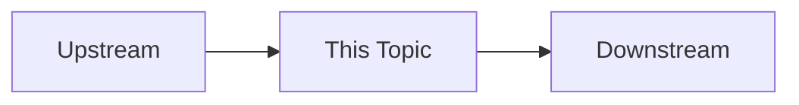
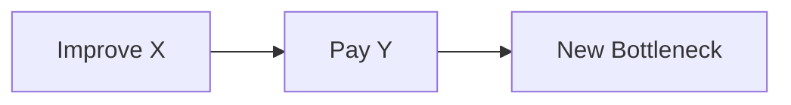

# [主题]

> 第一次阅读：Sections 1–8  
> 第二次阅读：Sections 9–18  
> 深入阅读：Sections 19–26

## 阅读前后

**I should understand before:**  
**I should understand after:**

## 1. 先告诉我为什么需要它

如果没有这项技术，会发生什么？

## 2. 一句话直觉

## 3. 它在整个系统哪里？

## 4. 前置知识

## 5. 从第一性原理理解

## 6. Follow the Data

## 7. Architecture

## 8. 关键 engineering parameters

| 参数 | 含义 | 单位 | 为什么重要 | 通常牺牲什么 |
|---|---|---:|---|---|

## 9. 关键 equations

写清变量、单位、假设、边界与 worked example。

## 10. Bottleneck

什么条件下它成为 bottleneck？如何测量？如何与相邻 bottleneck 区分？

## 11. Design Space

| 方案 | 优化目标 | 代价 | 适用条件 |
|---|---|---|---|

## 12. 为什么最终这么设计？

## 13. 为什么不……？

### 为什么不采用最直觉方案？
### 为什么不无限增加资源？
### 为什么不采用相邻技术完全替代？

## 14. Trade-offs

## 15. Second-order effects

## 16. Workload mapping

Training、Inference、Prefill、Decode、Recommendation、Database、HPC 分别讨论。

## 17. Real Product

事实状态与来源必须就近标记。

## 18. Product evolution

Old Bottleneck → Architecture Response → Improvement → New Bottleneck。

## 19. Engineers actually say

## 20. 听到这些话意味着什么？

## 21. 我应该追问工程师什么？

至少 5–10 个可验证问题。

## 22. Common misconceptions

至少三项。

## 23. Engineering → Strategy

| Engineering | System Effect | Product Effect | Business Effect | Strategic Implication |
|---|---|---|---|---|

## 24. 投资 / M&A Technical Diligence

Physics、Architecture、Silicon、Package、Software、Manufacturing、Customer、Economics、Competition、Moat。

## 25. 五个必须记住的 takeaway

## 26. 三个真正值得继续思考的问题

## Sources

使用 [Primary Source]、[Independent]、[Vendor Claim]、[Estimate]、[Inference]。
